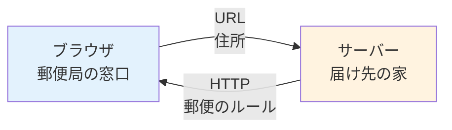
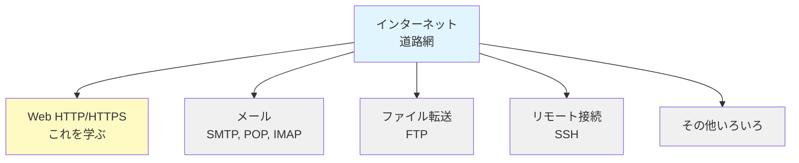
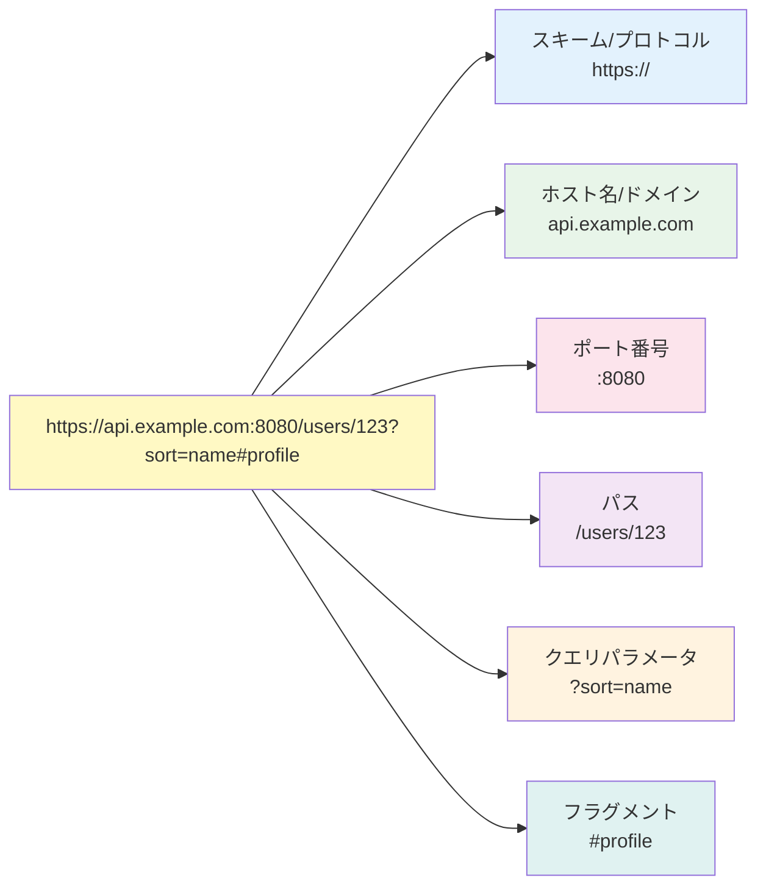
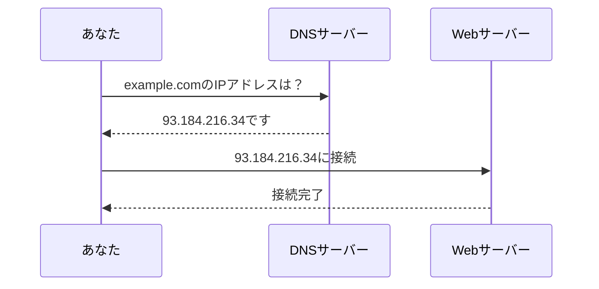
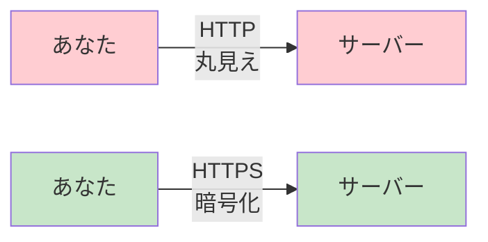

# 1-1. Webとは何か

## 例え話：郵便システムとして考える

<Callout type="info">
Webは「世界規模の郵便システム」だと考えてみてください。
</Callout>



- **URL** = 住所（どこに届けるか）
- **ブラウザ** = 郵便局の窓口（送りたいものを預ける場所）
- **サーバー** = 届け先の家（情報を持っている場所）
- **HTTP** = 郵便のルール（封筒の書き方、切手の貼り方）

あなたがブラウザに `https://example.com/hello` と入力するのは、「example.comという住所の、helloという部屋にあるものを送ってください」と郵便局に依頼するようなものです。

---

## 核心：インターネットとWebの違い

### インターネット = 道路網

インターネットは「コンピュータ同士をつなぐネットワーク」です。
道路網のようなもので、データが行き来するための**インフラ**です。

### Web = その道路を走る車の一つ

Webは「インターネット上で動く仕組みの一つ」です。
インターネットという道路の上を走るサービスの一種にすぎません。

<WhyButton title="なぜインターネットとWebは違うの？">
インターネットは通信の基盤（道路網）で、Webはその上で動くサービス（車）の一つです。メールやファイル転送など、他のサービスも同じインターネット上で動いています。
</WhyButton>



---

## URLの構造を理解する

URLを分解してみましょう：



<Callout type="tip">
各パートには役割があります：
- **スキーム**: どんなルールで通信するか（https）
- **ホスト名**: どのサーバーか（api.example.com）
- **ポート**: どの窓口か（8080）
- **パス**: 何を取得するか（/users/123）
- **クエリ**: 検索条件など（?sort=name）
- **フラグメント**: ページ内の位置（#profile）
</Callout>

### コードで確認

```javascript
// ブラウザのコンソールで実行してみよう
const url = new URL('https://api.example.com:8080/users/123?sort=name#profile');

console.log('プロトコル:', url.protocol);  // "https:"
console.log('ホスト:', url.host);          // "api.example.com:8080"
console.log('ホスト名:', url.hostname);    // "api.example.com"
console.log('ポート:', url.port);          // "8080"
console.log('パス:', url.pathname);        // "/users/123"
console.log('クエリ:', url.search);        // "?sort=name"
console.log('フラグメント:', url.hash);   // "#profile"
```

---

## DNSの役割：住所録

`example.com` と入力しただけでサーバーに届くのはなぜでしょうか？

<Callout type="warning">
実は、コンピュータは `example.com` という名前を理解できません。
コンピュータが理解できるのは **IPアドレス**（例：`93.184.216.34`）だけです。
</Callout>

**DNS（Domain Name System）** は「名前→IPアドレス」の変換を行う電話帳のような仕組みです。



### コードで確認（Node.js）

```javascript
// Node.jsで実行
const dns = require('dns');

dns.lookup('example.com', (err, address) => {
  console.log('example.comのIPアドレス:', address);
  // 例: "93.184.216.34"
});
```

---

## よくある誤解

### 「WebサイトとWebアプリは違う」？

厳密な定義はありませんが、一般的に：

| Webサイト | Webアプリ |
|----------|----------|
| 情報を**見る**のがメイン | 情報を**操作する**のがメイン |
| ニュースサイト、ブログ | Gmail、Slack、Notion |
| ページを見て回る | ログインして作業する |

技術的には同じ仕組みを使っています。違いは「何をさせるか」だけです。

### 「HTTPとHTTPSは別物」？

HTTPSは「HTTPに暗号化を追加したもの」です。
やり取りの内容は同じで、途中を暗号化しているかどうかの違いです。



<Callout type="error">
HTTPは通信内容が丸見えです。パスワードやクレジットカード情報を送る際は必ずHTTPSを使いましょう。
</Callout>

---

## まとめ

- **インターネット** = コンピュータをつなぐ道路網
- **Web** = その道路を使うサービスの一つ
- **URL** = 「どこの」「何を」取得するかを示す住所
- **DNS** = 名前をIPアドレスに変換する電話帳
- **HTTP/HTTPS** = Webでの通信ルール（HTTPSは暗号化付き）

