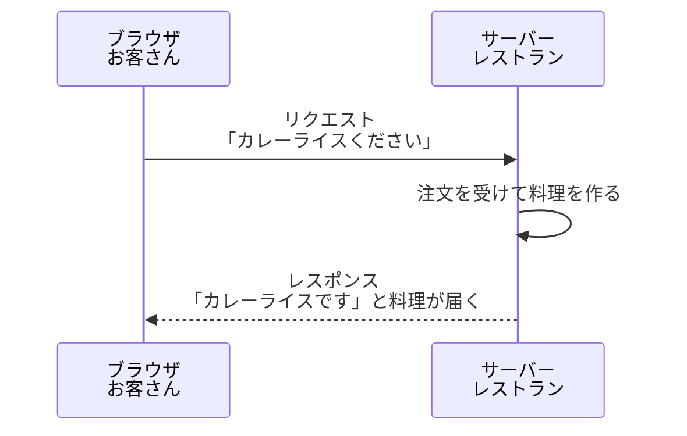
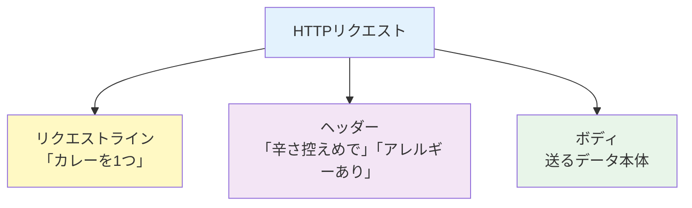
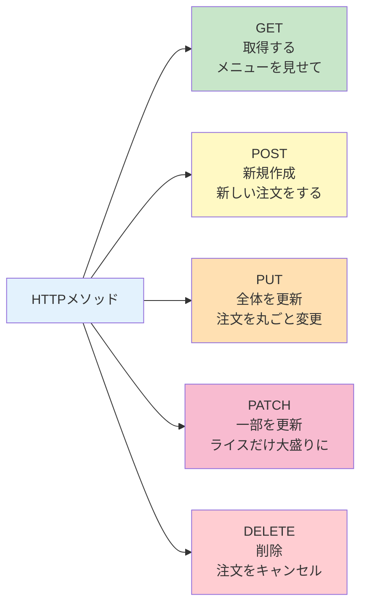
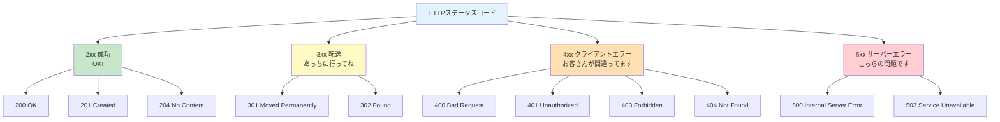
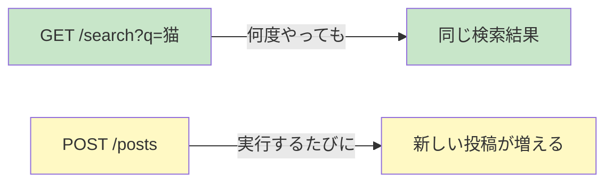
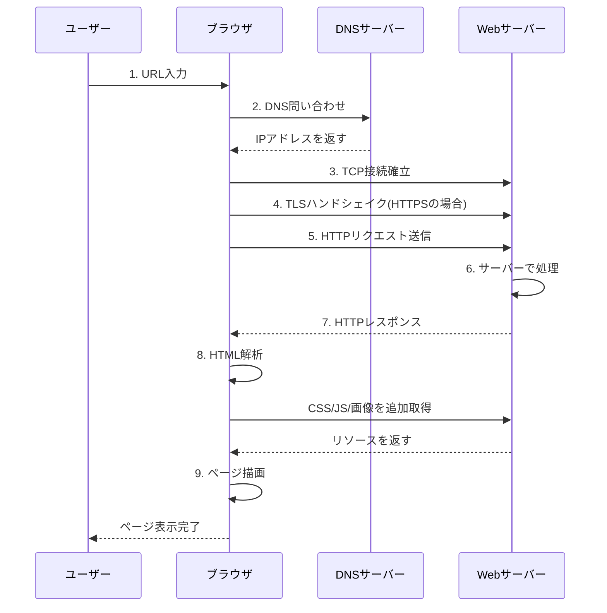

# 1-2. リクエストとレスポンス

## 例え話：レストランでの注文

<Callout type="info">
Webの通信は、レストランでの注文に似ています。
</Callout>



ブラウザ（お客さん）とサーバー（レストラン）は、この「注文→提供」のやり取りを繰り返しています。

---

## 核心：HTTPリクエストの構造

URLを入力してEnterを押すと、ブラウザは「HTTPリクエスト」を送ります。

### リクエストの3要素

<Callout type="tip">
HTTPリクエストは3つの要素で構成されています
</Callout>

```http
GET /users/123 HTTP/1.1          ← リクエストライン
Host: api.example.com            ← ヘッダー（メタ情報）
Accept: application/json
Authorization: Bearer xxx

                                 ← 空行
{"name": "田中"}                 ← ボディ（送りたいデータ）
```



### HTTPメソッド（動詞）

「何をしたいか」を表すのがHTTPメソッドです。



<WhyButton title="なぜGETとPOSTだけじゃないの？">
HTTPメソッドは操作の意図を明確にします。GETは「読む」、POSTは「作る」、PUTは「更新」、DELETEは「削除」と分けることで、APIの設計が分かりやすくなります。
</WhyButton>

---

## 核心：HTTPレスポンスの構造

サーバーは「HTTPレスポンス」を返します。

```http
HTTP/1.1 200 OK                  ← ステータスライン
Content-Type: application/json   ← ヘッダー
Content-Length: 42

                                 ← 空行
{"id": 123, "name": "田中"}      ← ボディ（返すデータ）
```

### ステータスコード（結果の番号）

レストランの店員が「承知しました」「品切れです」と答えるように、
サーバーは番号で結果を伝えます。



<Callout type="success">
**2xx系**: すべて成功です。200 OKが最も一般的。
</Callout>

<Callout type="warning">
**4xx系**: クライアント側のエラー。URLやパラメータを確認しましょう。
</Callout>

<Callout type="error">
**5xx系**: サーバー側のエラー。こちらでは直せません。時間をおいて試しましょう。
</Callout>

---

## コードで確認

### ブラウザの開発者ツールで見る

<StepByStep steps={[
  {
    title: "ブラウザで任意のサイトを開く",
    description: "どのサイトでも構いません"
  },
  {
    title: "開発者ツールを開く",
    description: "F12（または右クリック→検証）"
  },
  {
    title: "Networkタブを選択",
    description: "通信ログを確認できます"
  },
  {
    title: "ページを再読み込み",
    description: "F5キーを押す"
  },
  {
    title: "リクエストをクリック",
    description: "一覧から任意のリクエストを選択"
  }
]} />

<Callout type="tip">
ここで実際のリクエストとレスポンスを確認できます。
</Callout>

### JavaScriptで送ってみる

```javascript
// ブラウザのコンソールで実行
// （CORSの関係で動かないサイトもあります）

// GETリクエスト
fetch('https://jsonplaceholder.typicode.com/users/1')
  .then(response => {
    console.log('ステータス:', response.status);      // 200
    console.log('ステータステキスト:', response.statusText);  // "OK"
    return response.json();
  })
  .then(data => {
    console.log('取得したデータ:', data);
  });
```

```javascript
// POSTリクエスト
fetch('https://jsonplaceholder.typicode.com/posts', {
  method: 'POST',
  headers: {
    'Content-Type': 'application/json',
  },
  body: JSON.stringify({
    title: 'テスト投稿',
    body: '本文です',
    userId: 1,
  }),
})
  .then(response => response.json())
  .then(data => {
    console.log('作成されたデータ:', data);
  });
```

### Node.jsで詳しく見る

```javascript
// Node.js 18以降で実行可能
const response = await fetch('https://jsonplaceholder.typicode.com/users/1');

// レスポンスヘッダーを全部見る
console.log('=== レスポンスヘッダー ===');
for (const [key, value] of response.headers) {
  console.log(`${key}: ${value}`);
}

console.log('\n=== ボディ ===');
const data = await response.json();
console.log(data);
```

---

## よくある誤解

### 「GETとPOSTの違いは、データを送るかどうか」？

<Callout type="warning">
違います。GETでもクエリパラメータでデータを送れます。
</Callout>

本当の違い：
- **GET**: 取得のため。何度実行しても結果が同じ（べき等性）
- **POST**: 作成のため。実行するたびに新しいものが作られる



### 「404はサーバーが落ちている」？

違います。404は「サーバーは動いているけど、そのページがない」です。

- **404**: サーバー「探したけどそんなページないよ」
- **500**: サーバー「エラーが起きて処理できない」
- **接続できない**: サーバー自体が落ちている

---

## 通信の流れ（全体像）

URLを入力してからページが表示されるまで：



これを数百ミリ秒〜数秒で行っています。

---

## まとめ

- **リクエスト** = ブラウザ→サーバーへの「お願い」
- **レスポンス** = サーバー→ブラウザへの「回答」
- **HTTPメソッド** = 何をしたいか（GET=取得、POST=作成、など）
- **ステータスコード** = 結果を表す番号（2xx=成功、4xx=クライアントエラー、5xx=サーバーエラー）
- **ヘッダー** = 補足情報（認証情報、データ形式、など）
- **ボディ** = 送受信するデータ本体

