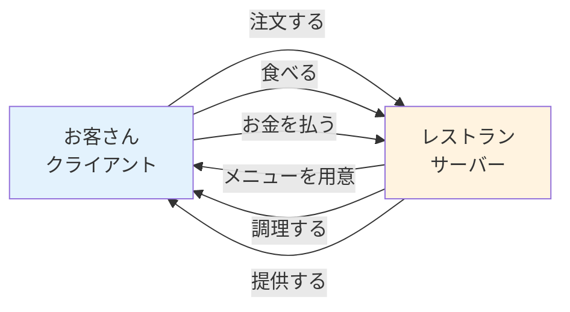
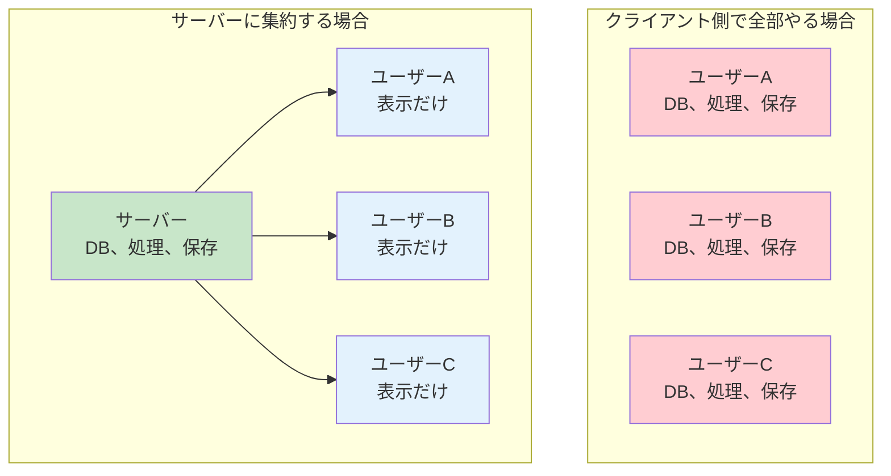
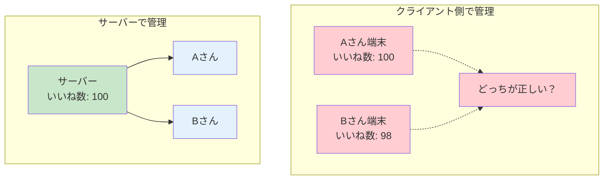
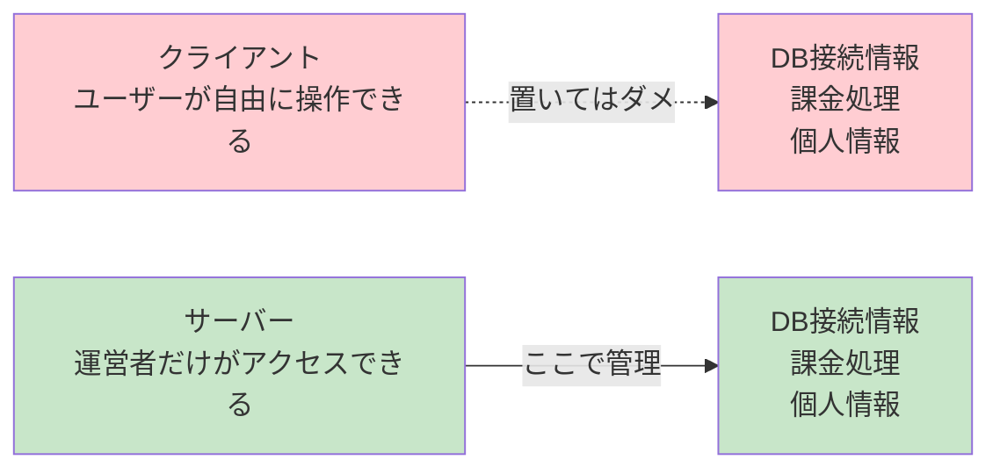
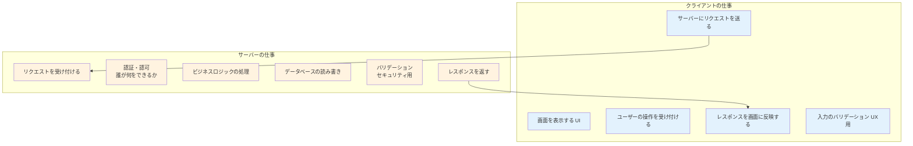
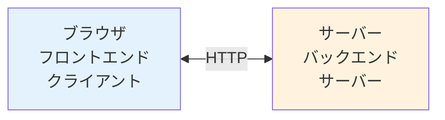

# 1-3. サーバーとクライアント

## 例え話：レストランの役割分担

<Callout type="info">
レストランには役割分担があります
</Callout>



<WhyButton title="なぜ分けるの？">
- お客さん全員が厨房で料理するのは非効率
- 調理器具や食材を各自が持つのは無駄
- プロが作った方がおいしい

Webも同じ理由で「クライアント」と「サーバー」に分かれています。
</WhyButton>

---

## 核心：なぜ分けるのか

### 1. リソースの効率化



<Callout type="success">
サーバーに集約することで、データは1箇所で管理され、各PCは軽い処理だけで済みます。
</Callout>

### 2. データの一貫性



<Callout type="info">
Twitterのいいね数のように、全員が同じ値を見る必要がある場合、サーバーで一元管理します。
</Callout>

### 3. セキュリティ



<Callout type="error">
クライアント側のコードは誰でも見られます。機密情報は絶対にクライアント側に置いてはいけません。
</Callout>

---

## クライアントとサーバーの責務



---

## コードで確認

### クライアント側（ブラウザ）

```html
<!-- index.html -->
<!DOCTYPE html>
<html>
<head>
  <title>クライアントの例</title>
</head>
<body>
  <h1>ユーザー一覧</h1>
  <ul id="user-list"></ul>

  <script>
    // クライアントの仕事：
    // 1. サーバーにリクエストを送る
    // 2. レスポンスを画面に表示する

    async function loadUsers() {
      // サーバーにGETリクエスト
      const response = await fetch('https://jsonplaceholder.typicode.com/users');
      const users = await response.json();

      // 画面に表示
      const list = document.getElementById('user-list');
      users.forEach(user => {
        const li = document.createElement('li');
        li.textContent = user.name;
        list.appendChild(li);
      });
    }

    loadUsers();
  </script>
</body>
</html>
```

### サーバー側（Node.js）

```javascript
// server.js
const http = require('http');

// 仮のデータベース
const users = [
  { id: 1, name: '田中太郎' },
  { id: 2, name: '山田花子' },
];

const server = http.createServer((req, res) => {
  // サーバーの仕事：
  // 1. リクエストを受け付ける
  // 2. 処理する
  // 3. レスポンスを返す

  if (req.url === '/users' && req.method === 'GET') {
    res.writeHead(200, { 'Content-Type': 'application/json' });
    res.end(JSON.stringify(users));
  } else {
    res.writeHead(404);
    res.end('Not Found');
  }
});

server.listen(3000, () => {
  console.log('サーバー起動: http://localhost:3000');
});
```

実行方法：
```bash
node server.js
```

---

## 境界線はどこに引く？

### フロントエンドとバックエンドの境界



### 判断基準

<Callout type="tip">
「改ざんされたら困るか？」で判断しましょう
</Callout>

| 処理内容 | どこでやる？ | 理由 |
|---------|------------|------|
| 画面の表示 | クライアント | ユーザーの端末で見せる必要がある |
| 入力チェック（UX） | クライアント | 即座にフィードバックしたい |
| 入力チェック（セキュリティ） | **両方** | クライアントは改ざんできるから |
| データの保存 | サーバー | 永続化、一貫性のため |
| 認証 | サーバー | セキュリティのため |
| 決済処理 | サーバー | 絶対に改ざんさせないため |
| 重い計算 | 場合による | ユーザー体験とサーバー負荷のバランス |

### よくある間違い

```javascript
// ダメな例：クライアント側で認証
const isAdmin = localStorage.getItem('isAdmin');
if (isAdmin === 'true') {
  // 管理者画面を表示
}
// → ブラウザの開発者ツールで簡単に書き換えられる

// 正しくは：サーバー側で認証
// クライアントは「リクエスト」するだけ
// サーバーが「この人は管理者か」を判断してレスポンスを返す
```

---

## よくある誤解

### 「クライアントとフロントエンドは同じ」？

ほぼ同じ意味で使われますが、厳密には：

- **クライアント**: サーバーにリクエストを送る側（ブラウザ、スマホアプリ、別のサーバーなど）
- **フロントエンド**: ユーザーが直接触る部分（UI/UX）

例：サーバーAがサーバーBにリクエストを送る場合
→ サーバーAは「クライアント」だが、「フロントエンド」ではない

### 「サーバーは特別なコンピュータ」？

サーバーは「役割」であって、特別なコンピュータではありません。

```bash
# あなたのPCでこれを実行すれば、あなたのPCがサーバーになる
node server.js
```

ただし、本番環境では以下の理由で専用のコンピュータを使います：
- 24時間稼働させたい
- 大量のリクエストを処理したい
- 安定したネットワーク接続が必要

---

## まとめ

- **クライアント** = リクエストを送る側。画面表示とユーザー操作を担当
- **サーバー** = リクエストを受ける側。データ管理とビジネスロジックを担当
- **分ける理由** = 効率化、データの一貫性、セキュリティ
- **境界の判断** = 「改ざんされたら困るか？」で考える
- **サーバーは役割** = 特別なコンピュータではない

