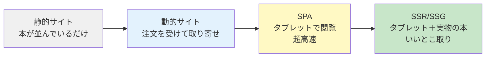
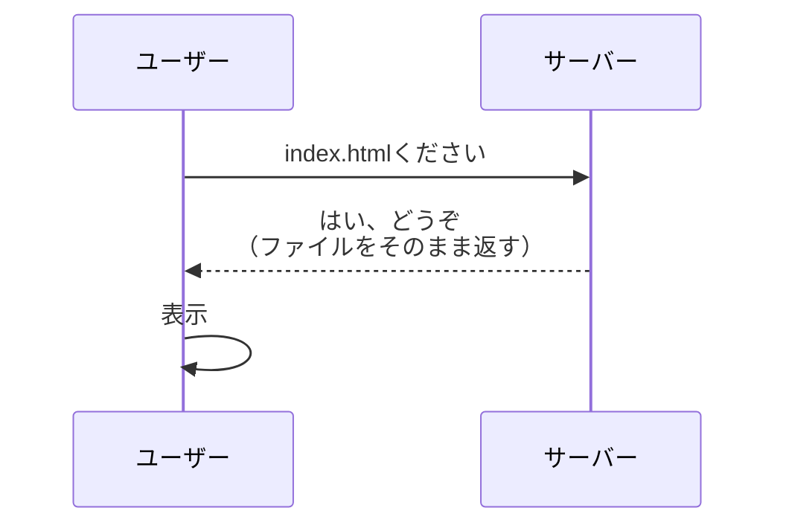
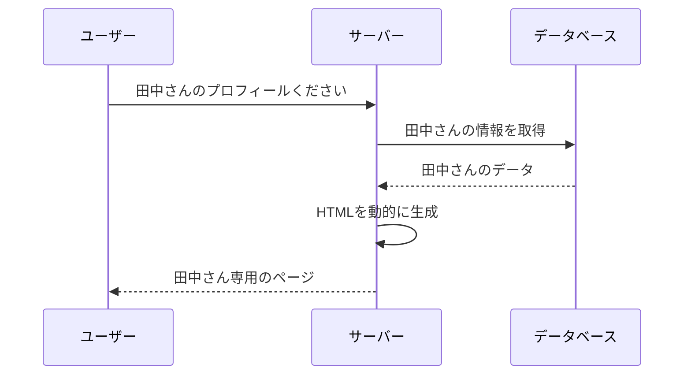
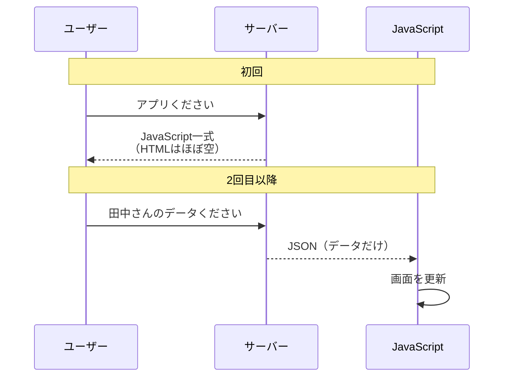
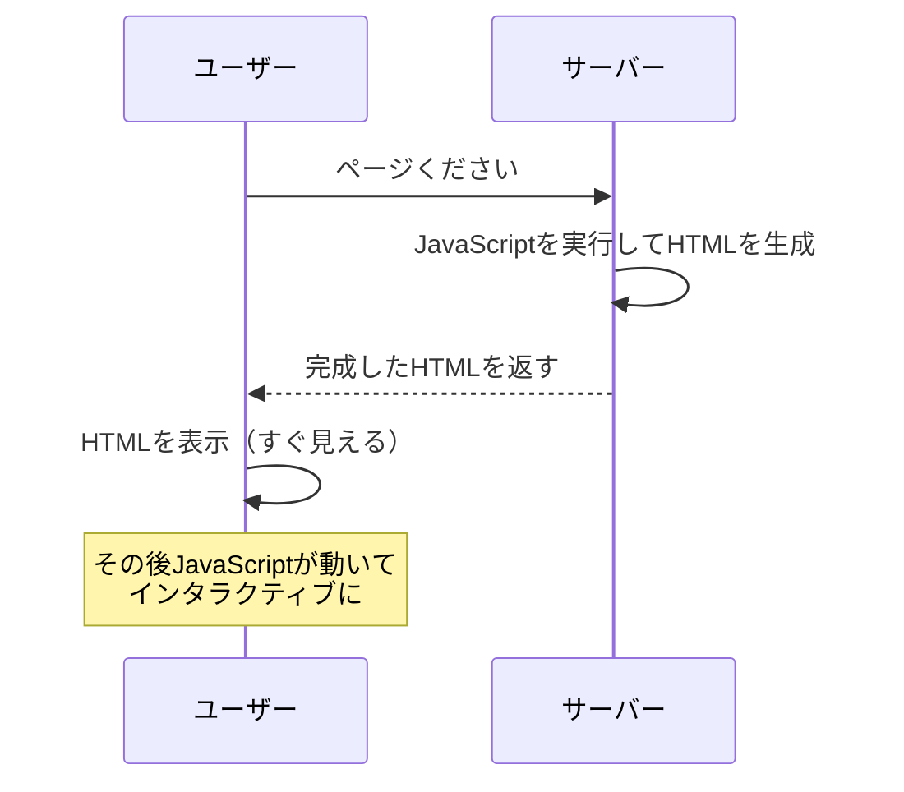
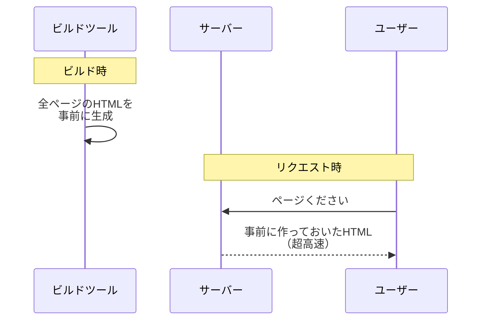
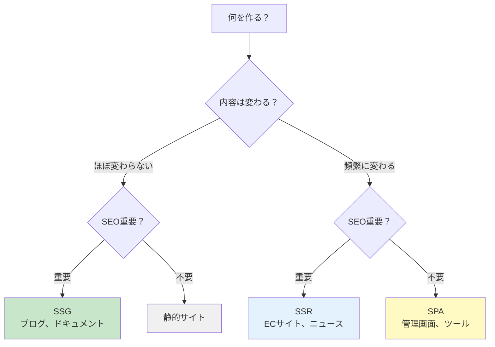
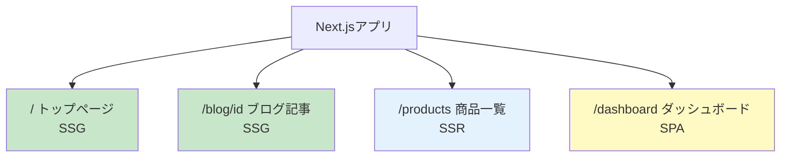
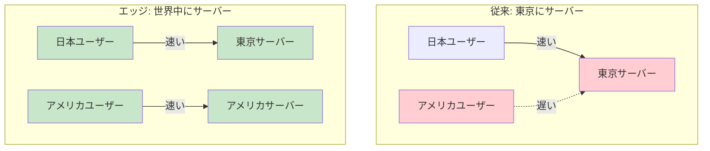

# 1-4. Webアプリの歴史

## 例え話：本屋の進化

<Callout type="info">
Webの歴史は、本屋の進化に例えられます。
</Callout>



---

## 1. 静的サイト時代（1990年代〜）

### 仕組み



### 特徴

<Callout type="info">
- HTMLファイルがそのまま表示される
- 全ユーザーに同じ内容
- サーバーは「ファイルを返すだけ」の簡単な仕事
</Callout>

### コード例

```html
<!-- index.html（これがそのまま表示される）-->
<!DOCTYPE html>
<html>
<head>
  <title>私のホームページ</title>
</head>
<body>
  <h1>ようこそ！</h1>
  <p>最終更新: 2024年1月1日</p>
  <a href="profile.html">プロフィール</a>
  <a href="diary.html">日記</a>
</body>
</html>
```

### 限界

<Callout type="warning">
- 内容を変えたければHTMLファイルを手動で編集
- ユーザーごとに違う内容を見せられない
- 「ログイン」という概念がない
</Callout>

---

## 2. 動的サイト時代（2000年代〜）

### 仕組み



### 特徴

<Callout type="success">
- サーバーがHTMLを「作る」
- データベースと連携
- ユーザーごとに違う内容
- PHP、Ruby、Pythonなどの「サーバーサイド言語」
</Callout>

### コード例（PHP）

```php
<?php
// profile.php
// サーバー側でHTMLを生成

$userId = $_GET['id'];

// DBから取得（実際はもっと複雑）
$user = getUser($userId);
?>

<!DOCTYPE html>
<html>
<head>
  <title><?php echo $user['name']; ?>のプロフィール</title>
</head>
<body>
  <h1><?php echo $user['name']; ?>さんのページ</h1>
  <p>メール: <?php echo $user['email']; ?></p>
  <p>自己紹介: <?php echo $user['bio']; ?></p>
</body>
</html>
```

### 限界

<Callout type="warning">
- ページ遷移のたびに**全体**を読み込み直す
- 「いいね」を押すだけでページ全体がリロード
- 「アプリっぽい」操作感が出せない
</Callout>

---

## 3. SPA時代（2010年代〜）

### 仕組み



### 特徴

<Callout type="success">
- ページ遷移なしで画面が変わる
- ネイティブアプリのような操作感
- React、Vue、Angularなどのフレームワーク
</Callout>

<Callout type="warning">
- フロントエンドが複雑化
</Callout>

### コード例（React）

```jsx
// App.jsx
// ブラウザ側でUIを構築

function App() {
  const [user, setUser] = useState(null);

  const loadUser = async (id) => {
    // ページ遷移なしでデータ取得
    const res = await fetch(`/api/users/${id}`);
    const data = await res.json();
    setUser(data);
  };

  return (
    <div>
      <button onClick={() => loadUser(1)}>田中さん</button>
      <button onClick={() => loadUser(2)}>山田さん</button>

      {user && (
        <div>
          <h1>{user.name}さんのページ</h1>
          <p>メール: {user.email}</p>
        </div>
      )}
    </div>
  );
}
```

```html
<!-- index.html（ほぼ空のHTML）-->
<!DOCTYPE html>
<html>
<head>
  <title>アプリ</title>
</head>
<body>
  <div id="root"></div>
  <script src="/bundle.js"></script> <!-- ここにアプリ全部入ってる -->
</body>
</html>
```

### 限界

<Callout type="error">
- 初回読み込みが遅い（JavaScript全部読む）
- SEO（検索エンジン対策）が難しい
- JavaScriptが動かないと何も見えない
</Callout>

---

## 4. SSR/SSG時代（2020年代〜）

### SSR（Server Side Rendering）



### SSG（Static Site Generation）



### 特徴

<Callout type="success">
- SPAのいいところ + 初回表示の速さ
- SEOに強い
- Next.js、Nuxt.js、Remixなどのフレームワーク
</Callout>

### コード例（Next.js）

```jsx
// pages/users/[id].jsx
// サーバーでデータ取得 → HTMLを生成 → クライアントに返す

// この関数はサーバーで実行される
export async function getServerSideProps({ params }) {
  const res = await fetch(`https://api.example.com/users/${params.id}`);
  const user = await res.json();

  return {
    props: { user }
  };
}

// このコンポーネントは最初サーバーでHTML化される
// その後クライアントでも動く
export default function UserPage({ user }) {
  return (
    <div>
      <h1>{user.name}さんのページ</h1>
      <p>メール: {user.email}</p>
    </div>
  );
}
```

---

## 比較まとめ

<ComparisonTable
  title="Webアプリ方式の比較"
  items={['静的サイト', '動的サイト', 'SPA', 'SSR', 'SSG']}
  criteria={['初回表示', 'ページ遷移', 'SEO', '実装の複雑さ']}
  data={{
    '初回表示': { '静的サイト': 'good', '動的サイト': 'fair', 'SPA': 'poor', 'SSR': 'good', 'SSG': 'excellent' },
    'ページ遷移': { '静的サイト': 'poor', '動的サイト': 'poor', 'SPA': 'excellent', 'SSR': 'excellent', 'SSG': 'excellent' },
    'SEO': { '静的サイト': 'excellent', '動的サイト': 'excellent', 'SPA': 'poor', 'SSR': 'excellent', 'SSG': 'excellent' },
    '実装の複雑さ': { '静的サイト': 'excellent', '動的サイト': 'good', 'SPA': 'poor', 'SSR': 'poor', 'SSG': 'fair' }
  }}
/>

### 何を選ぶべきか？



<WhyButton title="どう選べばいい？">
- **内容がほぼ変わらない + SEO重要** → SSG（ブログ、ドキュメントサイト）
- **リアルタイムでデータが変わる + SEO重要** → SSR（ECサイト、ニュースサイト）
- **ログイン後のダッシュボード + SEO不要** → SPA（管理画面、ツール系）
- **複雑なことはしない + 情報を載せるだけ** → 静的サイト or SSG
</WhyButton>

---

## 現在のトレンド

### ハイブリッドアプローチ

現代のフレームワーク（Next.js、Nuxtなど）は、ページごとに方式を選べます：



<Callout type="tip">
ページごとに最適な方式を選べるのが現代のフレームワークの強みです。
</Callout>

### エッジコンピューティング

サーバーを「世界中の拠点」に分散させて、ユーザーに近い場所で処理する。



<Callout type="success">
エッジコンピューティングにより、世界中のユーザーに高速なレスポンスを提供できます。
</Callout>

---

## よくある誤解

### 「SPAは古い」？

違います。用途によって最適解が違うだけです。

- 管理画面やダッシュボードはSPAで十分
- 全部SSRにする必要はない
- 「何を作るか」で選ぶ

### 「Next.jsを使えば全部解決」？

Next.jsは強力ですが、銀の弾丸ではありません。

- シンプルなサイトには過剰
- 学習コストがある
- ホスティングに制約がある場合も

---

## まとめ

- **静的サイト**: ファイルをそのまま返す。シンプルで高速
- **動的サイト**: サーバーでHTMLを生成。DBと連携
- **SPA**: ブラウザでUIを構築。アプリのような体験
- **SSR**: サーバーでReactなどを実行。初回が速い
- **SSG**: ビルド時にHTML生成。最速

歴史を知ることで「なぜ今の技術があるのか」がわかります。

