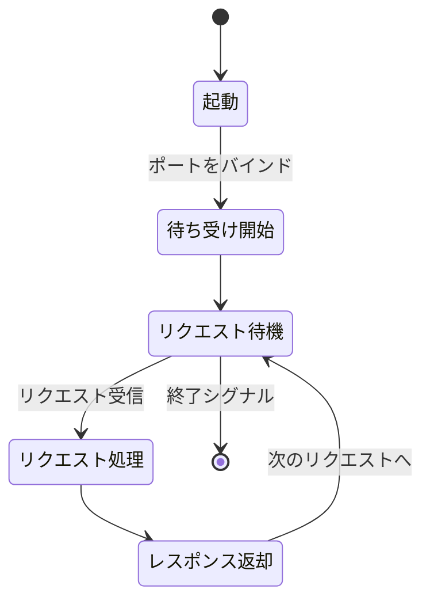
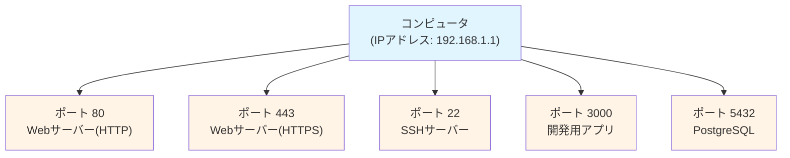
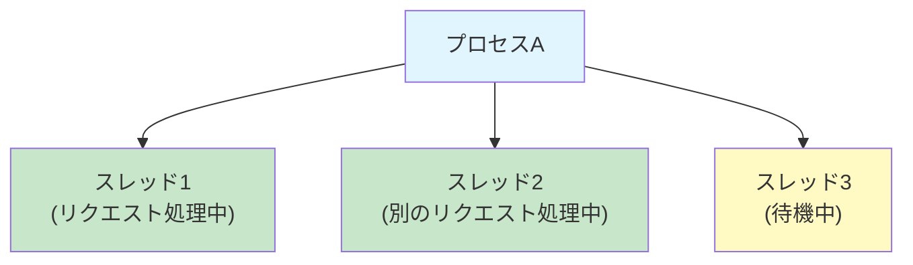

# 2-1. サーバーとは何か

## 例え話：24時間営業のコンビニ

サーバーは「24時間営業のコンビニ」のようなものです。

- **店舗（サーバー）**: いつでも開いていて、客の要望に応える
- **店員（プロセス）**: 実際に接客をする人
- **レジ（ポート）**: 客が並ぶ窓口。レジが複数あれば同時に対応できる
- **商品（データ）**: 店が持っている在庫

お客さん（クライアント）がコンビニに来たら、レジで注文し、店員が対応します。

---

## 核心：サーバーは「プログラム」

### サーバーの正体

「サーバー」という言葉は2つの意味で使われます：

```
1. ハードウェアとしてのサーバー
   = サーバー用途で使われるコンピュータ（物理マシン、VM、コンテナ）

2. ソフトウェアとしてのサーバー
   = リクエストを待ち受けるプログラム ← 今回の話題
```

つまり、あなたのPCでサーバープログラムを動かせば、あなたのPCがサーバーになります。

### サーバープログラムがやること



---

## ポート番号：窓口の番号

### ポートとは

1台のコンピュータで複数のサービスを動かすための「窓口番号」です。



<Callout type="info">
URLの `https://example.com:8080` の `:8080` がポート番号です。
省略すると、HTTPは80、HTTPSは443が使われます。
</Callout>

### コードで確認

```javascript
// Node.jsで実行
const http = require('http');

// ポート3000で待ち受けるサーバー
const server = http.createServer((req, res) => {
  res.end('Hello from port 3000!');
});

server.listen(3000, () => {
  console.log('サーバー起動: http://localhost:3000');
});

// このプログラムが動いている間、
// http://localhost:3000 にアクセスすると応答が返る
```

### よく使うポート番号

| ポート | 用途 |
|--------|------|
| 80 | HTTP（Web） |
| 443 | HTTPS（暗号化Web） |
| 22 | SSH（リモート接続） |
| 3000 | 開発用（Node.jsなど） |
| 8080 | 開発用（代替HTTP） |
| 5432 | PostgreSQL |
| 3306 | MySQL |
| 27017 | MongoDB |
| 6379 | Redis |

---

## プロセスとスレッド

### プロセス = プログラムの実行単位

```bash
# 今動いているプロセスを見る（Mac/Linux）
ps aux | head -20

# Node.jsサーバーを起動すると、1つのプロセスが作られる
node server.js
# → このプロセスがリクエストを処理する
```

### なぜ重要か

<Callout type="warning">
**プロセスが死ぬ = サーバーが止まる**

プロセスが停止する原因：
- エラーでクラッシュ
- メモリ不足で強制終了
- 手動で停止
</Callout>

<Callout type="tip">
本番環境では「プロセスが死んだら自動で再起動」する仕組み（PM2、systemdなど）を導入します。
</Callout>

### スレッド = プロセス内の実行単位



マルチスレッドなら、1プロセスで複数のリクエストを同時に処理できます。

<WhyButton title="Node.jsはなぜシングルスレッドでも高速？">
Node.jsは「シングルスレッド + 非同期I/O」という仕組みで、1スレッドでも多くのリクエストを効率的に処理します。

I/O操作（ファイル読み込み、DB問い合わせなど）の待ち時間を他の処理に充てることで、1スレッドでも高いスループットを実現しています。
</WhyButton>

---

## コードで確認：最小のサーバー

### Node.js（標準ライブラリ）

```javascript
// minimal-server.js
const http = require('http');

const server = http.createServer((req, res) => {
  console.log(`${req.method} ${req.url}`);

  // ルーティング（URLに応じて処理を分岐）
  if (req.url === '/') {
    res.writeHead(200, { 'Content-Type': 'text/html; charset=utf-8' });
    res.end('<h1>トップページ</h1>');
  } else if (req.url === '/about') {
    res.writeHead(200, { 'Content-Type': 'text/html; charset=utf-8' });
    res.end('<h1>このサイトについて</h1>');
  } else if (req.url === '/api/users') {
    res.writeHead(200, { 'Content-Type': 'application/json' });
    res.end(JSON.stringify([
      { id: 1, name: '田中' },
      { id: 2, name: '山田' }
    ]));
  } else {
    res.writeHead(404, { 'Content-Type': 'text/html; charset=utf-8' });
    res.end('<h1>404 - ページが見つかりません</h1>');
  }
});

const PORT = 3000;
server.listen(PORT, () => {
  console.log(`サーバー起動: http://localhost:${PORT}`);
});
```

実行方法：

```bash
node minimal-server.js

# 別のターミナルで確認
curl http://localhost:3000/
curl http://localhost:3000/about
curl http://localhost:3000/api/users
curl http://localhost:3000/notfound
```

---

## サーバーの「聞き耳」を立てる

### ListenとBind

サーバーは起動時に「このポートで待ちます」と宣言します。

```javascript
server.listen(3000, '0.0.0.0', () => {
  console.log('起動しました');
});
```

- `3000` = ポート番号
- `0.0.0.0` = どのネットワークインターフェースで受け付けるか
  - `0.0.0.0` = すべてのインターフェース（外部からもアクセス可）
  - `127.0.0.1` = ローカルホストのみ（外部からはアクセス不可）
  - `localhost` = 通常は127.0.0.1と同じ

### ポートの競合

```bash
# 同じポートで2つのサーバーは動かせない
node server.js  # ポート3000で起動

# 別のターミナルで
node server.js  # エラー: "port already in use"
```

---

## よくある誤解

### 「サーバーは難しい」？

サーバーは単なるプログラムです。上のコードを見ればわかるように、
数十行で基本的なサーバーは作れます。

難しいのは：
- 大量のリクエストを処理すること
- 24時間安定して動かすこと
- セキュリティを確保すること

これらは追加の知識と経験が必要です。

### 「サーバーは常に動いている」？

<Callout type="info">
プログラムなので、起動しなければ動きません。

```bash
# サーバーを起動
node server.js

# Ctrl+C で停止
# → もうアクセスできない
```

本番環境では「自動起動」「死んだら再起動」の設定をします。
</Callout>

---

## まとめ

- **サーバー** = リクエストを待ち受けて応答するプログラム
- **ポート** = 1台のコンピュータで複数サービスを区別する窓口番号
- **プロセス** = プログラムの実行単位。死んだらサーバーが止まる
- **Listen** = 特定のポートで待ち受けを開始すること
- **サーバーは難しくない**。難しいのは運用

