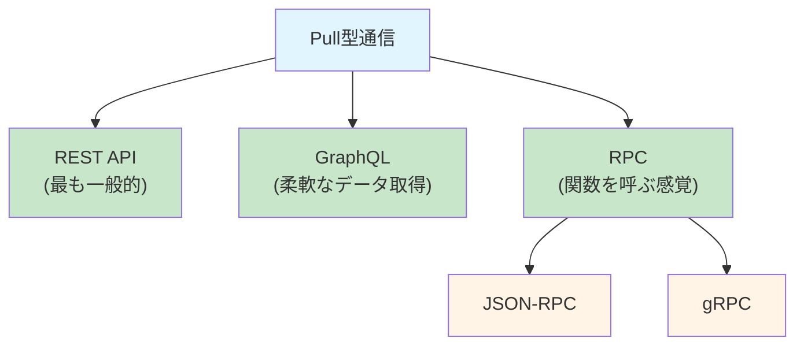
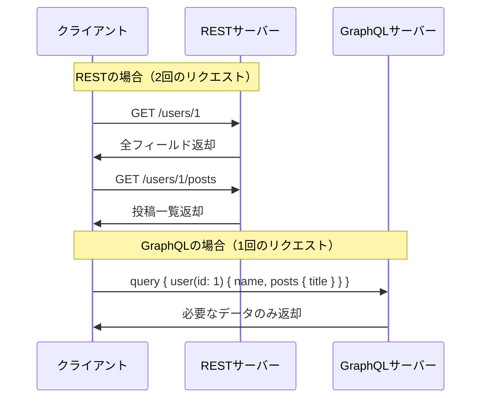
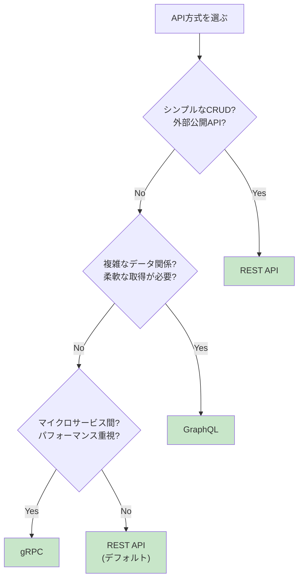

# 2-3. サーバー間の通信（Pull型）

## 例え話：問い合わせ窓口

Pull型通信は「問い合わせ窓口」のようなものです。

- あなた（クライアント）が窓口（サーバー）に行く
- 「これを教えてください」と聞く
- 窓口が答える

**あなたから動く**のがPull型の特徴です。

対して、Push型は「向こうから連絡が来る」パターンです（次の章で解説）。

---

## 核心：Pull型の種類



---

## REST API

### 考え方

「リソース」に対して「操作」を行う。

```
リソース: /users（ユーザー一覧）
├── GET     → 取得
├── POST    → 作成

リソース: /users/123（特定のユーザー）
├── GET     → 取得
├── PUT     → 更新
├── DELETE  → 削除
```

URLが「何を」、HTTPメソッドが「どうする」を表します。

### 設計のルール（RESTful）

<Callout type="success">
**良い例：RESTfulなAPI設計**

```
GET    /users          ユーザー一覧を取得
GET    /users/123      ID:123のユーザーを取得
POST   /users          ユーザーを作成
PUT    /users/123      ID:123のユーザーを更新
DELETE /users/123      ID:123のユーザーを削除
```

URLは「名詞」（リソース）、HTTPメソッドは「動詞」（操作）を表現します。
</Callout>

<Callout type="error">
**悪い例：RESTfulでない設計**

```
GET    /getUsers         ← 動詞をURLに入れない
POST   /createUser       ← メソッドで表現する
GET    /users/delete/123 ← DELETEメソッドを使う
```

URLに動詞を含めるのはRESTfulではありません。
</Callout>

### コードで確認

```javascript
// サーバー側（Express）
const express = require('express');
const app = express();
app.use(express.json());

let posts = [
  { id: 1, title: '最初の投稿', authorId: 1 },
  { id: 2, title: '2番目の投稿', authorId: 2 },
];

// 一覧取得（フィルタ対応）
app.get('/api/posts', (req, res) => {
  const { authorId } = req.query;
  let result = posts;
  if (authorId) {
    result = posts.filter(p => p.authorId === parseInt(authorId));
  }
  res.json(result);
});

// 1件取得
app.get('/api/posts/:id', (req, res) => {
  const post = posts.find(p => p.id === parseInt(req.params.id));
  if (!post) {
    return res.status(404).json({ error: 'Not found' });
  }
  res.json(post);
});

app.listen(3000);
```

```javascript
// クライアント側
// 一覧取得
const posts = await fetch('/api/posts').then(r => r.json());

// フィルタ付き取得
const myPosts = await fetch('/api/posts?authorId=1').then(r => r.json());

// 1件取得
const post = await fetch('/api/posts/1').then(r => r.json());

// 作成
const newPost = await fetch('/api/posts', {
  method: 'POST',
  headers: { 'Content-Type': 'application/json' },
  body: JSON.stringify({ title: '新しい投稿', authorId: 1 })
}).then(r => r.json());
```

### RESTの問題点

<Callout type="warning">
**問題1: オーバーフェッチ**

「ユーザー名だけ欲しい」のに、全フィールドが返ってくる

```
GET /users/1
→ { id: 1, name: "田中", email: "...", phone: "...", address: "...", ... }
```

名前だけでいいのに全部来る - 無駄な通信が発生
</Callout>

<Callout type="warning">
**問題2: アンダーフェッチ**

「投稿と、その著者の名前」を取るのに2回リクエストが必要

```
GET /posts/1       → { id: 1, title: "...", authorId: 5 }
GET /users/5       → { id: 5, name: "田中" }
```

1回で取りたいのに複数回の通信が必要
</Callout>

---

## GraphQL

### 考え方

「欲しいものを指定して、欲しい形で受け取る」

```graphql
# クライアントが「これが欲しい」と指定
query {
  user(id: 1) {
    name          # 名前だけ欲しい
    posts {       # この人の投稿も一緒に
      title
    }
  }
}

# サーバーがその形で返す
{
  "data": {
    "user": {
      "name": "田中",
      "posts": [
        { "title": "最初の投稿" },
        { "title": "2番目の投稿" }
      ]
    }
  }
}
```

### RESTとの比較



<Callout type="info">
GraphQLは1リクエストで必要なデータだけを柔軟に取得できます。
</Callout>

### コードで確認

```javascript
// サーバー側（apollo-server）
const { ApolloServer, gql } = require('apollo-server');

// スキーマ定義（どんなデータがあるか）
const typeDefs = gql`
  type User {
    id: ID!
    name: String!
    posts: [Post!]!
  }

  type Post {
    id: ID!
    title: String!
    author: User!
  }

  type Query {
    user(id: ID!): User
    users: [User!]!
    post(id: ID!): Post
  }
`;

// リゾルバ（どうやってデータを取るか）
const resolvers = {
  Query: {
    user: (_, { id }) => users.find(u => u.id === parseInt(id)),
    users: () => users,
    post: (_, { id }) => posts.find(p => p.id === parseInt(id)),
  },
  User: {
    posts: (user) => posts.filter(p => p.authorId === user.id),
  },
  Post: {
    author: (post) => users.find(u => u.id === post.authorId),
  },
};

const server = new ApolloServer({ typeDefs, resolvers });
server.listen().then(({ url }) => {
  console.log(`GraphQL server at ${url}`);
});
```

```javascript
// クライアント側
const query = `
  query GetUser($id: ID!) {
    user(id: $id) {
      name
      posts {
        title
      }
    }
  }
`;

const response = await fetch('/graphql', {
  method: 'POST',
  headers: { 'Content-Type': 'application/json' },
  body: JSON.stringify({
    query,
    variables: { id: '1' }
  })
}).then(r => r.json());
```

### GraphQLの問題点

<AccordionSingle title="GraphQLの注意点を詳しく見る">

**学習コストが高い**
- スキーマ定義言語を学ぶ必要がある
- リゾルバの概念を理解する必要がある
- RESTより複雑な設定が必要

**キャッシュが難しい**
- URLベースのキャッシュ（CDN、ブラウザキャッシュ）が使えない
- すべて同じエンドポイント（/graphql）に対するPOSTリクエスト
- クライアント側で専用のキャッシュライブラリが必要

**シンプルなAPIには過剰**
- 単純なCRUD操作だけならRESTで十分
- 小規模プロジェクトでは複雑さが増すだけ

**N+1問題に注意が必要**
- ユーザー一覧と各ユーザーの投稿を取得する場合
- ユーザーごとにDB問い合わせが発生（N+1回のクエリ）
- DataLoaderなどで対策が必要

</AccordionSingle>

---

## RPC（Remote Procedure Call）

### 考え方

「リモートの関数を呼ぶ」感覚。

```
ローカル関数:
const result = calculateTotal(items);

RPC:
const result = await rpc.call('calculateTotal', items);
```

RESTが「リソース指向」なのに対し、RPCは「アクション指向」。

### JSON-RPC

```javascript
// リクエスト
{
  "jsonrpc": "2.0",
  "method": "getUser",
  "params": { "id": 1 },
  "id": 1
}

// レスポンス
{
  "jsonrpc": "2.0",
  "result": { "id": 1, "name": "田中" },
  "id": 1
}
```

### gRPC

Googleが開発したRPCフレームワーク。

- Protocol Buffersでスキーマを定義
- バイナリ形式で高速
- 型安全
- ストリーミング対応

```protobuf
// user.proto
service UserService {
  rpc GetUser(GetUserRequest) returns (User);
  rpc ListUsers(ListUsersRequest) returns (stream User);
}

message GetUserRequest {
  int32 id = 1;
}

message User {
  int32 id = 1;
  string name = 2;
  string email = 3;
}
```

### いつRPCを使う？

- マイクロサービス間の通信（gRPC）
- パフォーマンスが重要な場面
- アクション指向のAPI（例：`sendEmail`, `processPayment`）

---

## 比較まとめ

<ComparisonTable
  title="API方式の比較"
  items={['REST', 'GraphQL', 'gRPC']}
  criteria={['設計思想', 'データ形式', 'オーバーフェッチ', '学習コスト', 'キャッシュ', 'ブラウザ対応']}
  data={{
    '設計思想': { 'REST': 'リソース指向', 'GraphQL': 'クエリ指向', 'gRPC': 'アクション指向' },
    'データ形式': { 'REST': 'JSON', 'GraphQL': 'JSON', 'gRPC': 'Protocol Buffers' },
    'オーバーフェッチ': { 'REST': 'fair', 'GraphQL': 'excellent', 'gRPC': 'excellent' },
    '学習コスト': { 'REST': 'excellent', 'GraphQL': 'good', 'gRPC': 'fair' },
    'キャッシュ': { 'REST': 'excellent', 'GraphQL': 'fair', 'gRPC': 'fair' },
    'ブラウザ対応': { 'REST': 'excellent', 'GraphQL': 'excellent', 'gRPC': 'poor' }
  }}
/>

**主な用途:**
- **REST**: 一般的なAPI（外部公開、シンプルなCRUD）
- **GraphQL**: 複雑なデータ取得（関連データを柔軟に取得）
- **gRPC**: サービス間通信（マイクロサービス、パフォーマンス重視）

### 選び方



---

## よくある誤解

### 「RESTは古い、GraphQLが新しい」？

用途が違うだけです。

- シンプルなAPIにGraphQLは過剰
- RESTで十分なケースが多い
- 「新しい＝良い」ではない

### 「全部のAPIをgRPCにすべき」？

ブラウザから直接gRPCを呼ぶのは複雑です。

一般的なパターン：
- ブラウザ ↔ BFF（Backend for Frontend）: REST or GraphQL
- BFF ↔ マイクロサービス: gRPC

---

## まとめ

- **Pull型** = クライアントから問い合わせる通信方式
- **REST** = リソース指向。シンプルで広く使われる
- **GraphQL** = クエリ指向。柔軟なデータ取得
- **RPC** = アクション指向。関数呼び出しの感覚
- **選び方** = 用途に合わせて選ぶ。「これが正解」はない

