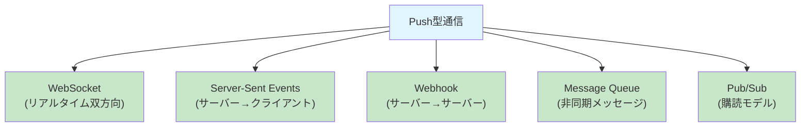
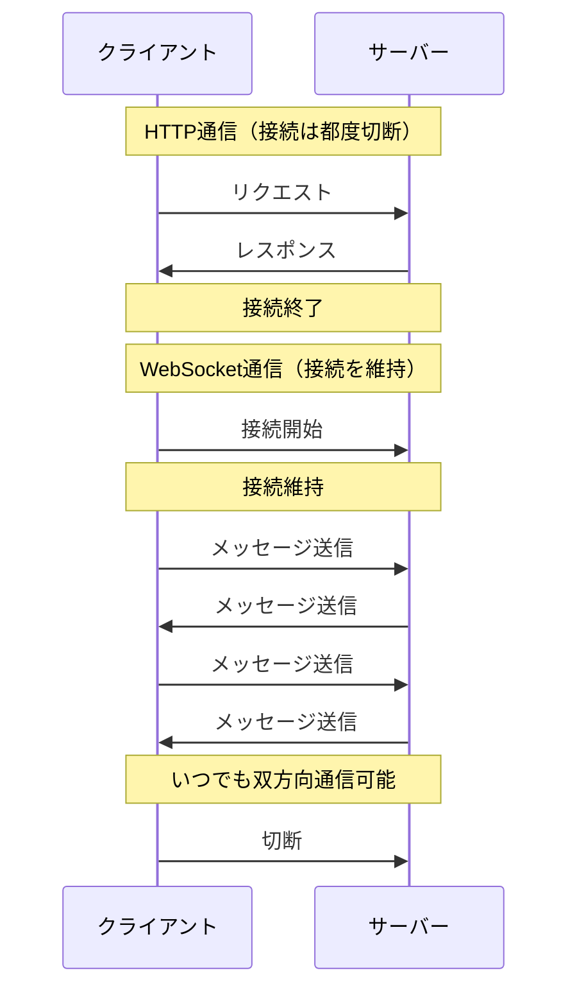
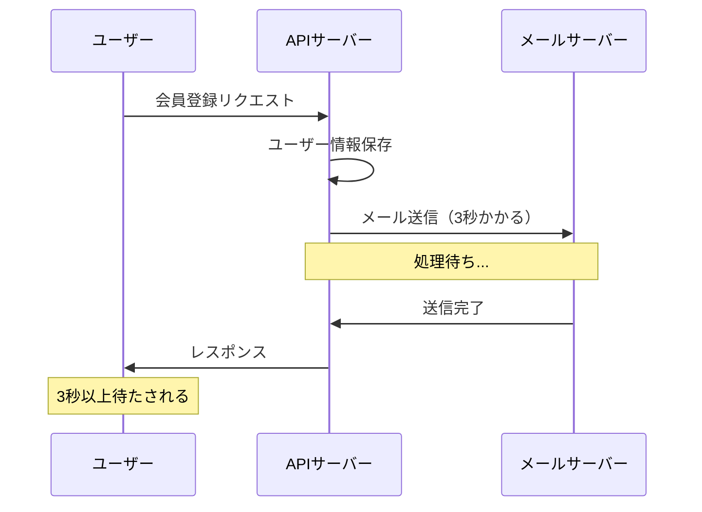
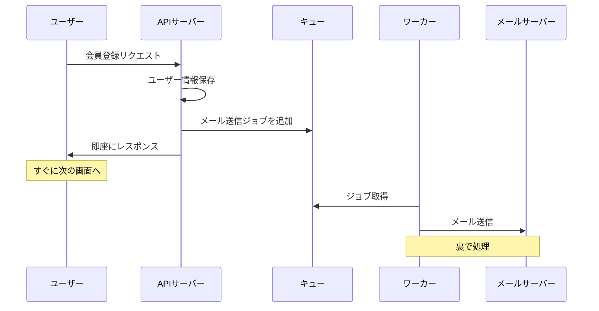
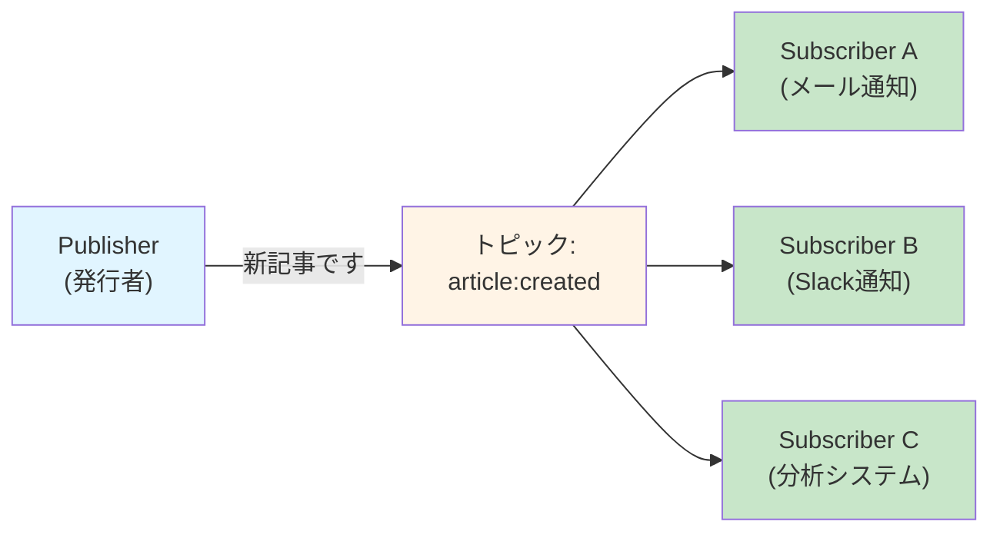

# 2-4. サーバー間の通信（Push型）

## 例え話：通知サービス

Pull型が「自分から聞きに行く」なら、Push型は「向こうから教えてくれる」です。

- **Pull型** = 毎日新聞を買いに行く
- **Push型** = 新聞が家に届く（購読）

---

## 核心：なぜPush型が必要か

### Pull型の限界

```javascript
// ユーザーが新着メッセージを確認したい場合

// Pull型（ポーリング）
setInterval(async () => {
  const messages = await fetch('/api/messages/new');
  // 新着があれば表示
}, 5000);  // 5秒ごとにチェック

// 問題点：
// - 新着がなくても5秒ごとに通信（無駄）
// - 5秒の遅延が発生（リアルタイムじゃない）
// - サーバーへの負荷が高い
```

### Push型なら

```javascript
// Push型（WebSocket）
const ws = new WebSocket('wss://example.com/messages');

ws.onmessage = (event) => {
  const message = JSON.parse(event.data);
  // 新着が来たときだけ処理
  displayMessage(message);
};

// メリット：
// - 新着があったときだけ通知
// - リアルタイム
// - 無駄な通信がない
```

---

## Push型の種類



---

## WebSocket

### 仕組み

通常のHTTPは「1リクエスト→1レスポンス」で接続が切れます。
WebSocketは「接続を維持」して、双方向に通信します。



### コードで確認

```javascript
// サーバー側（ws ライブラリ）
const WebSocket = require('ws');
const wss = new WebSocket.Server({ port: 8080 });

// 接続中のクライアントを管理
const clients = new Set();

wss.on('connection', (ws) => {
  console.log('新しい接続');
  clients.add(ws);

  // クライアントからメッセージを受信
  ws.on('message', (message) => {
    console.log('受信:', message.toString());

    // 全クライアントに配信（ブロードキャスト）
    clients.forEach(client => {
      if (client.readyState === WebSocket.OPEN) {
        client.send(message.toString());
      }
    });
  });

  ws.on('close', () => {
    console.log('接続終了');
    clients.delete(ws);
  });
});

console.log('WebSocket server on ws://localhost:8080');
```

```javascript
// クライアント側（ブラウザ）
const ws = new WebSocket('ws://localhost:8080');

ws.onopen = () => {
  console.log('接続成功');
  ws.send('こんにちは！');
};

ws.onmessage = (event) => {
  console.log('受信:', event.data);
};

ws.onclose = () => {
  console.log('接続終了');
};

// メッセージを送信
ws.send('新しいメッセージ');
```

### 使いどころ

<Callout type="info">
WebSocketが適している場面：

- **チャットアプリ**: メッセージの送受信が双方向
- **リアルタイム通知**: サーバーから即座に通知が必要
- **共同編集**: Google Docsのような複数ユーザーでの同時編集
- **オンラインゲーム**: プレイヤー間のリアルタイム通信
- **株価・暗号通貨のティッカー**: リアルタイムの価格更新
</Callout>

---

## Server-Sent Events (SSE)

### 仕組み

サーバーからクライアントへの**一方向**のストリーム。

```
WebSocket: クライアント ↔ サーバー（双方向）
SSE:       クライアント ← サーバー（一方向）
```

### コードで確認

```javascript
// サーバー側（Express）
app.get('/events', (req, res) => {
  // SSE用のヘッダー
  res.setHeader('Content-Type', 'text/event-stream');
  res.setHeader('Cache-Control', 'no-cache');
  res.setHeader('Connection', 'keep-alive');

  // 定期的にイベントを送信
  const interval = setInterval(() => {
    const data = { time: new Date().toISOString() };
    res.write(`data: ${JSON.stringify(data)}\n\n`);
  }, 1000);

  // 接続が切れたらクリーンアップ
  req.on('close', () => {
    clearInterval(interval);
  });
});
```

```javascript
// クライアント側（ブラウザ）
const eventSource = new EventSource('/events');

eventSource.onmessage = (event) => {
  const data = JSON.parse(event.data);
  console.log('受信:', data);
};

eventSource.onerror = (error) => {
  console.error('エラー:', error);
};
```

### WebSocketとの使い分け

<SimpleComparison
  title="WebSocket vs SSE"
  itemA="WebSocket"
  itemB="SSE"
  comparisons={[
    { aspect: '通信方向', a: '双方向', b: 'サーバー→クライアント' },
    { aspect: 'プロトコル', a: '独自プロトコル', b: 'HTTP' },
    { aspect: '再接続', a: '手動実装が必要', b: '自動再接続' },
    { aspect: 'バイナリデータ', a: '対応', b: 'テキストのみ' },
    { aspect: '主な用途', a: 'チャット、ゲーム', b: '通知、ダッシュボード' }
  ]}
/>

---

## Webhook

### 仕組み

「イベントが起きたらURLに通知する」サーバー間通信。

```
例：Stripeでの決済完了

1. ユーザーが決済
2. Stripeのサーバーで処理完了
3. Stripeがあなたのサーバーに「決済完了したよ」とPOST
4. あなたのサーバーが受け取って処理
```

### コードで確認

```javascript
// Webhookを受け取るサーバー
app.post('/webhook/stripe', express.raw({ type: 'application/json' }), (req, res) => {
  const event = JSON.parse(req.body);

  switch (event.type) {
    case 'payment_intent.succeeded':
      const paymentIntent = event.data.object;
      console.log('決済成功:', paymentIntent.id);
      // データベース更新など
      break;
    case 'payment_intent.payment_failed':
      console.log('決済失敗');
      break;
    default:
      console.log('未知のイベント:', event.type);
  }

  res.json({ received: true });
});
```

### セキュリティ

<Callout type="warning">
Webhookは「誰かが偽のリクエストを送る」リスクがあります。署名検証で本物のリクエストか確認しましょう。
</Callout>

<AccordionSingle title="署名検証の実装例（Stripe）">

```javascript
const stripe = require('stripe')(process.env.STRIPE_SECRET_KEY);
const endpointSecret = process.env.STRIPE_WEBHOOK_SECRET;

app.post('/webhook/stripe', express.raw({ type: 'application/json' }), (req, res) => {
  const sig = req.headers['stripe-signature'];

  try {
    // 署名を検証（Stripeからの本物のリクエストか確認）
    const event = stripe.webhooks.constructEvent(req.body, sig, endpointSecret);
    // 処理...
  } catch (err) {
    console.log('署名検証失敗:', err.message);
    return res.status(400).send(`Webhook Error: ${err.message}`);
  }
});
```

署名検証により、正規のサービスからのリクエストであることを保証します。

</AccordionSingle>

---

## Message Queue

### 仕組み

「メッセージを一旦キューに入れて、後で処理する」仕組み。

```
同期処理：
ユーザー →リクエスト→ サーバーA →同期呼び出し→ サーバーB
         （Bの処理が終わるまで待つ）

非同期処理（Message Queue）：
ユーザー →リクエスト→ サーバーA →キューに追加→ 即レスポンス
                                      ↓
                               サーバーB が後で処理
```

### なぜ必要か

<Callout type="warning">
**同期処理の問題点**

例：会員登録時にウェルカムメールを送る


</Callout>

<Callout type="success">
**非同期処理（Message Queue）の利点**


</Callout>

### 代表的なサービス

- **Redis Queue (BullMQ)**: シンプル、Node.jsと相性良い
- **RabbitMQ**: 高機能、複雑なルーティング
- **Amazon SQS**: AWSのマネージドサービス
- **Apache Kafka**: 大規模データストリーミング

### コードで確認（BullMQ）

```javascript
// キューに追加（プロデューサー）
const { Queue } = require('bullmq');
const emailQueue = new Queue('email');

app.post('/register', async (req, res) => {
  // ユーザー作成
  const user = await createUser(req.body);

  // メール送信をキューに追加（即座に返る）
  await emailQueue.add('welcome', {
    to: user.email,
    subject: 'ようこそ！',
    body: 'アカウント作成ありがとうございます。'
  });

  res.json({ success: true });
});
```

```javascript
// キューを処理（ワーカー）
const { Worker } = require('bullmq');

const worker = new Worker('email', async (job) => {
  console.log('メール送信中...', job.data);
  await sendEmail(job.data);
  console.log('メール送信完了');
});

worker.on('completed', (job) => {
  console.log(`ジョブ ${job.id} 完了`);
});

worker.on('failed', (job, err) => {
  console.error(`ジョブ ${job.id} 失敗:`, err);
});
```

---

## Pub/Sub（Publish/Subscribe）

### 仕組み

「発行者」がメッセージを出し、「購読者」が受け取るモデル。



<WhyButton title="Message QueueとPub/Subの違いは？">
**Message Queue（キュー）:**
- 1つのメッセージは1つのワーカーだけが処理
- 「仕事を分散させる」用途

**Pub/Sub（パブサブ）:**
- 1つのメッセージを複数の購読者が受け取れる
- 「イベントを複数のシステムに通知する」用途

例：ユーザー登録イベント
- Queue: 登録メール送信（1つのワーカーが処理）
- Pub/Sub: メール送信、Slack通知、分析システムに記録（全員が受け取る）
</WhyButton>

### 代表的なサービス

- **Redis Pub/Sub**: シンプル
- **Google Cloud Pub/Sub**: スケーラブル
- **Amazon SNS**: AWSのサービス

### コードで確認（Redis Pub/Sub）

```javascript
// 発行者（Publisher）
const Redis = require('ioredis');
const publisher = new Redis();

// 記事が作成されたとき
app.post('/articles', async (req, res) => {
  const article = await createArticle(req.body);

  // 「新記事」イベントを発行
  await publisher.publish('article:created', JSON.stringify(article));

  res.json(article);
});
```

```javascript
// 購読者A：メール通知
const Redis = require('ioredis');
const subscriber = new Redis();

subscriber.subscribe('article:created');

subscriber.on('message', (channel, message) => {
  if (channel === 'article:created') {
    const article = JSON.parse(message);
    sendNewArticleEmail(article);
  }
});
```

```javascript
// 購読者B：Slack通知（別プロセス）
subscriber.on('message', (channel, message) => {
  if (channel === 'article:created') {
    const article = JSON.parse(message);
    sendSlackNotification(`新記事: ${article.title}`);
  }
});
```

---

## 比較まとめ

<ComparisonTable
  title="Push型通信の比較"
  items={['WebSocket', 'SSE', 'Webhook', 'Message Queue', 'Pub/Sub']}
  criteria={['通信方向', '主な用途', 'リアルタイム性']}
  data={{
    '通信方向': { 'WebSocket': '双方向', 'SSE': 'サーバー→クライアント', 'Webhook': 'サーバー→サーバー', 'Message Queue': '非同期', 'Pub/Sub': '1対多' },
    '主な用途': { 'WebSocket': 'チャット、ゲーム', 'SSE': '通知、更新', 'Webhook': '外部連携', 'Message Queue': '重い処理', 'Pub/Sub': 'イベント配信' },
    'リアルタイム性': { 'WebSocket': 'excellent', 'SSE': 'excellent', 'Webhook': 'good', 'Message Queue': 'fair', 'Pub/Sub': 'good' }
  }}
/>

---

## よくある誤解

### 「全部WebSocketにすればいい」？

<Callout type="warning">
接続を維持するコストがあります。

- サーバーのメモリを消費
- 接続数に制限がある
- 一方向で十分ならSSEの方が軽い

リアルタイム双方向通信が本当に必要か検討しましょう。
</Callout>

---

## まとめ

- **Push型** = サーバーから能動的に通知する方式
- **WebSocket** = 双方向リアルタイム通信
- **SSE** = サーバーからの一方向ストリーム
- **Webhook** = イベント発生時にURLを叩く
- **Message Queue** = 非同期処理のためのキュー
- **Pub/Sub** = 1対多のメッセージ配信

---

## サンプルコード

この章の内容を実際に動かして試せるサンプルコードを用意しています。

- [Push型通信サンプル](https://github.com/minaaaa3/study-memo/tree/main/samples/server/07-push-communication) - Polling / SSE / WebSocket の比較実装

