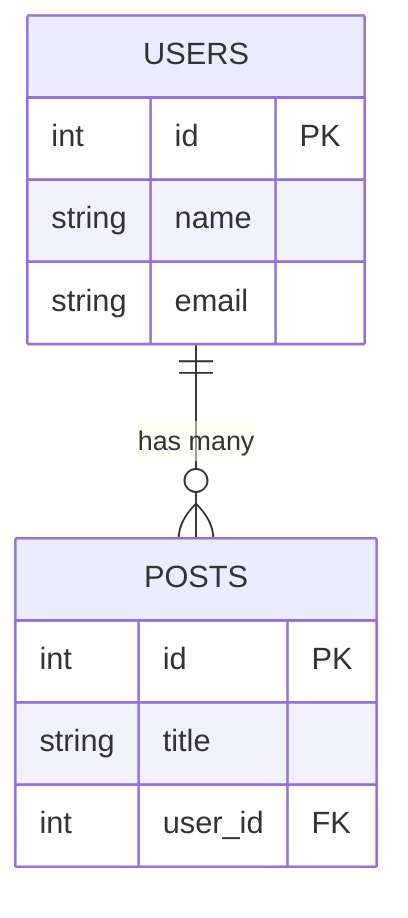
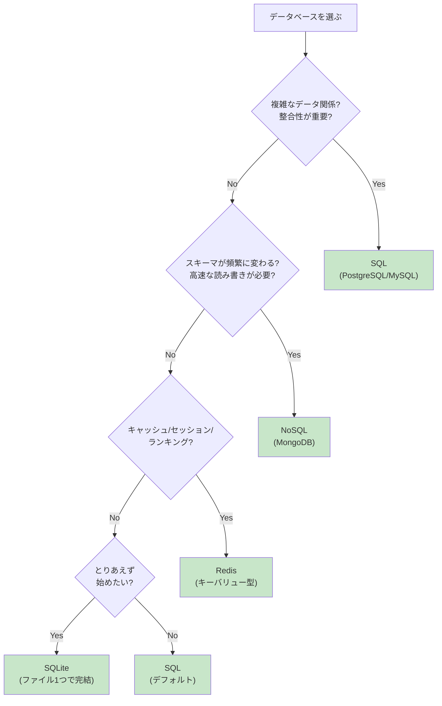

# 2-5. データベースとの連携

## 例え話：整理された書庫

データベースは「整理された書庫」のようなものです。

- **変数** = 机の上のメモ（プログラム終了で消える）
- **ファイル** = 引き出しの書類（残るけど検索しにくい）
- **データベース** = 整理された書庫（残る＋検索できる＋同時アクセス可能）

---

## 核心：なぜデータベースが必要か

<WhyButton title="なぜ変数やファイルではダメなのか？">

**データの永続性と同時アクセス**が問題になります。

変数に保存すると：
- サーバー再起動で全データ消失
- メモリ容量が限界

ファイルに保存すると：
- 同時書き込みでデータ破損
- 検索に全件読み込みが必要（遅い）

データベースなら：
- 電源が切れてもデータは残る
- 複数のリクエストを安全に処理
- インデックスで高速検索

これが「ちゃんとしたアプリにはDB必須」と言われる理由です。

</WhyButton>

### データ保存方法の比較

<Callout type="error">
**変数に保存：本番では使えない**

```javascript
let users = []; // サーバーのメモリに保存

app.post('/users', (req, res) => {
  users.push(req.body);
  res.json({ success: true });
});
```

問題点：
- サーバー再起動で全部消える
- サーバーが複数台あると同期できない
- メモリに収まる量しか保存できない
</Callout>

<Callout type="warning">
**ファイルに保存：小規模なら可能だが限界がある**

```javascript
const fs = require('fs');

app.post('/users', (req, res) => {
  const users = JSON.parse(fs.readFileSync('users.json'));
  users.push(req.body);
  fs.writeFileSync('users.json', JSON.stringify(users));
  res.json({ success: true });
});
```

問題点：
- 同時アクセスで壊れる可能性
- 検索が遅い（全データ読んでfilterする）
- データが増えると扱いにくい
</Callout>

<Callout type="success">
**データベース：本番環境に適している**

- データが永続化される
- 複数のリクエストを同時に処理できる
- 高速に検索できる（インデックス）
- 複数サーバーから同じデータにアクセス
</Callout>

---

## SQL vs NoSQL

### SQL（リレーショナルDB）

データを「テーブル」に格納。行と列で構成。



テーブル例：
```
users テーブル
+----+--------+------------------+
| id | name   | email            |
+----+--------+------------------+
| 1  | 田中   | tanaka@test.com  |
| 2  | 山田   | yamada@test.com  |
+----+--------+------------------+

posts テーブル
+----+----------+---------+
| id | title    | user_id |
+----+----------+---------+
| 1  | 最初の記事| 1       |
| 2  | 2番目   | 1       |
+----+----------+---------+
```

**特徴：**
- スキーマ（構造）が固定
- テーブル間の関係を表現できる（リレーション）
- 複雑なクエリが書ける
- ACID特性（データの整合性を保証）

**代表的なDB：** PostgreSQL、MySQL、SQLite

### NoSQL

「テーブル」以外の形式でデータを格納。

```javascript
// ドキュメント型（MongoDBなど）
{
  "_id": "507f1f77bcf86cd799439011",
  "name": "田中",
  "email": "tanaka@test.com",
  "posts": [
    { "title": "最初の記事", "createdAt": "2024-01-01" },
    { "title": "2番目", "createdAt": "2024-01-02" }
  ]
}
```

**特徴：**
- スキーマが柔軟（フィールドを自由に追加）
- 関連データを1つのドキュメントに含められる
- 水平スケーリングしやすい
- JOINが苦手

**代表的なDB：** MongoDB、DynamoDB、Firestore、Redis

### 選び方



---

## コードで確認：SQLite

SQLiteは「ファイル1つで動くSQL DB」。開発やプロトタイプに最適。

```javascript
// better-sqlite3 を使用
const Database = require('better-sqlite3');
const db = new Database('myapp.db');

// テーブル作成
db.exec(`
  CREATE TABLE IF NOT EXISTS users (
    id INTEGER PRIMARY KEY AUTOINCREMENT,
    name TEXT NOT NULL,
    email TEXT UNIQUE NOT NULL,
    created_at DATETIME DEFAULT CURRENT_TIMESTAMP
  )
`);

// データ挿入
const insert = db.prepare('INSERT INTO users (name, email) VALUES (?, ?)');
insert.run('田中', 'tanaka@test.com');

// データ取得
const selectAll = db.prepare('SELECT * FROM users');
const users = selectAll.all();
console.log(users);

// 条件付き取得
const selectOne = db.prepare('SELECT * FROM users WHERE id = ?');
const user = selectOne.get(1);
console.log(user);

// 更新
const update = db.prepare('UPDATE users SET name = ? WHERE id = ?');
update.run('田中太郎', 1);

// 削除
const remove = db.prepare('DELETE FROM users WHERE id = ?');
remove.run(1);
```

### Expressと組み合わせる

```javascript
const express = require('express');
const Database = require('better-sqlite3');

const app = express();
app.use(express.json());

const db = new Database('myapp.db');

// 初期化
db.exec(`
  CREATE TABLE IF NOT EXISTS users (
    id INTEGER PRIMARY KEY AUTOINCREMENT,
    name TEXT NOT NULL,
    email TEXT UNIQUE NOT NULL
  )
`);

// CRUD API
app.get('/api/users', (req, res) => {
  const users = db.prepare('SELECT * FROM users').all();
  res.json(users);
});

app.get('/api/users/:id', (req, res) => {
  const user = db.prepare('SELECT * FROM users WHERE id = ?').get(req.params.id);
  if (!user) return res.status(404).json({ error: 'Not found' });
  res.json(user);
});

app.post('/api/users', (req, res) => {
  const { name, email } = req.body;
  try {
    const result = db.prepare('INSERT INTO users (name, email) VALUES (?, ?)').run(name, email);
    res.status(201).json({ id: result.lastInsertRowid, name, email });
  } catch (err) {
    res.status(400).json({ error: err.message });
  }
});

app.delete('/api/users/:id', (req, res) => {
  const result = db.prepare('DELETE FROM users WHERE id = ?').run(req.params.id);
  if (result.changes === 0) return res.status(404).json({ error: 'Not found' });
  res.status(204).end();
});

app.listen(3000);
```

---

## ORM（Object-Relational Mapping）

<WhyButton title="なぜORMを使うのか？">

**開発効率と安全性**のためです。

生SQLの問題：
- 文字列でクエリを書くのでタイポしやすい
- SQLインジェクションのリスク
- テーブル変更時に影響範囲がわかりにくい

ORMのメリット：
- TypeScriptで型安全にDB操作
- リレーションを直感的に扱える
- DBの種類（PostgreSQL/MySQL等）を切り替えやすい

ただし、複雑なクエリやパフォーマンス最適化では生SQLが必要になることも。「基本はORM、必要なときだけ生SQL」がバランスの良い使い方です。

</WhyButton>

### なぜORMを使うか

```javascript
// 生のSQLを書く
const user = db.prepare('SELECT * FROM users WHERE id = ?').get(1);
const posts = db.prepare('SELECT * FROM posts WHERE user_id = ?').all(1);

// ORMを使う（Prismaの例）
const user = await prisma.user.findUnique({
  where: { id: 1 },
  include: { posts: true }
});
```

**ORMのメリット：**
- SQLを直接書かなくていい
- 型安全（TypeScriptとの相性が良い）
- リレーションを簡単に扱える
- DBの違いを吸収

**代表的なORM：** Prisma、TypeORM、Drizzle、Sequelize

### Prismaの例

```prisma
// schema.prisma
model User {
  id    Int     @id @default(autoincrement())
  name  String
  email String  @unique
  posts Post[]
}

model Post {
  id       Int    @id @default(autoincrement())
  title    String
  author   User   @relation(fields: [authorId], references: [id])
  authorId Int
}
```

```javascript
// 使用例
const { PrismaClient } = require('@prisma/client');
const prisma = new PrismaClient();

// 作成
const user = await prisma.user.create({
  data: {
    name: '田中',
    email: 'tanaka@test.com',
    posts: {
      create: [
        { title: '最初の記事' },
        { title: '2番目の記事' }
      ]
    }
  }
});

// 取得（リレーション含む）
const userWithPosts = await prisma.user.findUnique({
  where: { id: 1 },
  include: { posts: true }
});

// 条件付き取得
const users = await prisma.user.findMany({
  where: {
    email: { contains: 'test.com' }
  },
  orderBy: { name: 'asc' }
});
```

---

## トランザクション

<WhyButton title="なぜトランザクションが必要？">

**データの整合性を守る**ためです。

例えば銀行送金で「Aから1000円引く」と「Bに1000円足す」の間でエラーが起きたら？
- Aからは引かれた
- でもBには入っていない
- 1000円が消えた！

トランザクションは「全部成功するか、全部なかったことにするか」を保証します。これを**原子性（Atomicity）**と呼びます。

「処理Aと処理Bは必ずセットで成功/失敗させたい」という場面で使います。

</WhyButton>

### なぜ必要か

<Callout type="error">
**トランザクションなしの危険性**

銀行送金の例：AさんからBさんに1000円送金

```javascript
db.run('UPDATE accounts SET balance = balance - 1000 WHERE user = "A"');
// ← ここでサーバーがクラッシュしたら？
db.run('UPDATE accounts SET balance = balance + 1000 WHERE user = "B"');
```

Aからは引かれたけど、Bには入ってない状態に！1000円が消失！
</Callout>

<Callout type="success">
**トランザクションで安全に**

```javascript
db.transaction(() => {
  db.run('UPDATE accounts SET balance = balance - 1000 WHERE user = "A"');
  db.run('UPDATE accounts SET balance = balance + 1000 WHERE user = "B"');
})();
```

両方成功するか、両方失敗するか（中途半端な状態にならない）
</Callout>

### Prismaでのトランザクション

```javascript
// 複数の操作をまとめて実行
await prisma.$transaction([
  prisma.account.update({
    where: { userId: 'A' },
    data: { balance: { decrement: 1000 } }
  }),
  prisma.account.update({
    where: { userId: 'B' },
    data: { balance: { increment: 1000 } }
  })
]);
```

---

## マイグレーション

<WhyButton title="なぜマイグレーションが必要？">

**チームでのDB変更を安全に管理する**ためです。

手動でALTER TABLEを実行する問題：
- 開発環境では変更したけど本番を忘れた
- チームメンバーのローカルDBが古いまま
- 「いつ何を変えたか」が追えない

マイグレーションファイルにすると：
- 変更履歴がコードとして残る
- `migrate deploy`コマンド1つで適用
- ロールバック（取り消し）も可能

「コードはGitで管理するのに、DBスキーマは手動」では事故が起きます。

</WhyButton>

### なぜ必要か

<Callout type="warning">
**手動でスキーマを変更する問題点**

開発中にスキーマを変更したい：「usersテーブルにageカラムを追加」

- 開発環境で ALTER TABLE を実行
- 本番環境でも同じことを忘れずに実行
- チームメンバーにも伝える

ミスが起きやすく、環境ごとにDBの状態が異なってしまう！
</Callout>

<Callout type="success">
**マイグレーションで安全に管理**

- 変更を「マイグレーションファイル」として記録
- コマンド1つで適用
- バージョン管理できる
- 変更履歴が残る

チーム全員が同じDB状態を維持できます。
</Callout>

### Prismaのマイグレーション

```bash
# スキーマを変更したら
npx prisma migrate dev --name add_age_to_user

# 本番環境で適用
npx prisma migrate deploy
```

---

## よくある誤解

### 「NoSQLの方が速い」？

場合によります。

- 読み取りが単純なら NoSQL が速いことも
- 複雑なクエリ（JOIN、集計）は SQL が得意
- 適切にインデックスを張れば SQL も高速

### 「ORMは遅い」？

<Callout type="info">
適切に使えば問題ありません。

パフォーマンス最適化のポイント：
- N+1問題を避ける（eager loading）
- 必要なカラムだけ取得（select文で指定）
- 大量データは生のSQLも検討
- インデックスを適切に張る
</Callout>

### 「SQLite は本番で使えない」？

規模によります。

- 小規模なら十分実用的
- 書き込みが多いとボトルネック
- Tursoなど、SQLiteベースの分散DBも登場

---

## まとめ

- **データベースが必要な理由** = 永続化、同時アクセス、高速検索
- **SQL** = テーブル形式、リレーション、整合性重視
- **NoSQL** = 柔軟なスキーマ、水平スケーリング
- **ORM** = オブジェクト指向でDBを操作
- **トランザクション** = 複数操作をまとめて成功/失敗
- **マイグレーション** = スキーマ変更の管理

---

## サンプルコード

この章の内容を実際に動かして試せるサンプルコードを用意しています。

- [データベース連携サンプル](https://github.com/minaaaa3/study-memo/tree/main/samples/server/06-database) - 生SQL / Prisma基本 / リレーション / CRUD API

