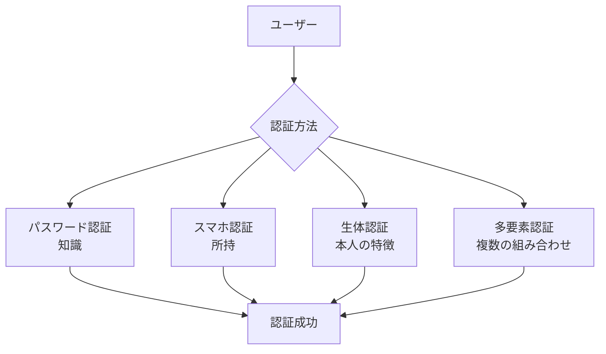
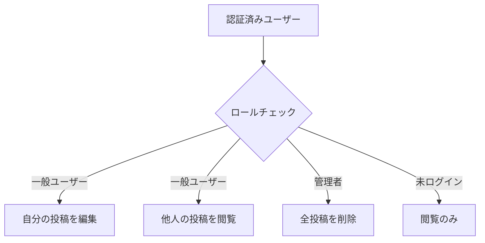
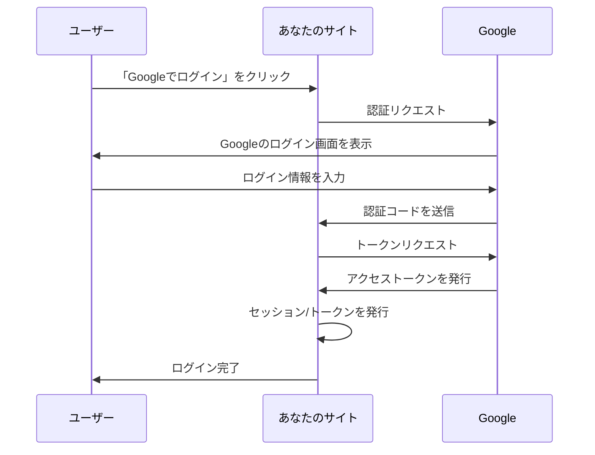

# 3-1. 認証と認可

## 例え話：会社のセキュリティ

認証と認可は、会社のセキュリティに似ています。

- **認証（Authentication）**: 「あなたは誰？」= 社員証を見せる
- **認可（Authorization）**: 「何ができる？」= 入れる部屋が決まっている

```
認証: 社員証を見せて「私は田中です」と証明
認可: 田中さんは「一般フロアは入れるけど、サーバールームは入れない」
```

この2つは**別の概念**です。認証が通っても、認可されなければできないことがあります。

---

## 核心：認証と認可の違い

<Callout type="info">
認証と認可は別の概念です。認証は「あなたは誰？」、認可は「何ができる？」を決定します。
</Callout>

### 認証（Authentication）



「この人は本当に田中さんか？」を確認します。

### 認可（Authorization）



「田中さんは何をしていいか？」を決定します。

### コードで見る違い

```javascript
// 認証ミドルウェア
const authenticate = (req, res, next) => {
  const token = req.headers.authorization?.split(' ')[1];
  if (!token) {
    return res.status(401).json({ error: 'ログインが必要です' });
  }
  try {
    const user = verifyToken(token);  // トークンを検証
    req.user = user;  // 「この人は田中さん」を確定
    next();
  } catch {
    return res.status(401).json({ error: '無効なトークンです' });
  }
};

// 認可ミドルウェア
const authorize = (...roles) => {
  return (req, res, next) => {
    // 認証済みのユーザー情報を使って
    if (!roles.includes(req.user.role)) {
      return res.status(403).json({ error: '権限がありません' });
    }
    next();
  };
};

// 使用例
app.get('/admin/users',
  authenticate,           // まず「誰か」を確認
  authorize('admin'),     // 次に「adminか」を確認
  (req, res) => {
    // 管理者だけがここに来れる
  }
);
```

---

## HTTPステータスコードの使い分け

<Callout type="tip">
ステータスコードを正しく使い分けることで、クライアント側で適切なエラーハンドリングができます。
</Callout>

<Tabs items={[
  {
    label: "401 Unauthorized",
    content: `**認証失敗**

- 「ログインしてください」
- トークンがない、無効、期限切れ
- ユーザーを認証できない状態`
  },
  {
    label: "403 Forbidden",
    content: `**認可失敗**

- 「あなたにその権限はありません」
- ログインはしているが、やろうとしていることは禁止
- 認証は成功しているが権限がない状態`
  }
]} />

---

## 認証の実装パターン

### 1. パスワード認証

```javascript
const bcrypt = require('bcrypt');

// 登録時：パスワードをハッシュ化して保存
app.post('/register', async (req, res) => {
  const { email, password } = req.body;

  // パスワードをハッシュ化（元に戻せない形に変換）
  const hashedPassword = await bcrypt.hash(password, 10);

  // DBに保存するのはハッシュ化されたパスワード
  await db.user.create({
    email,
    password: hashedPassword  // "password123" ではなく "$2b$10$..." のような文字列
  });

  res.json({ success: true });
});

// ログイン時：入力されたパスワードとハッシュを比較
app.post('/login', async (req, res) => {
  const { email, password } = req.body;

  const user = await db.user.findByEmail(email);
  if (!user) {
    return res.status(401).json({ error: 'メールアドレスまたはパスワードが違います' });
  }

  // ハッシュと入力パスワードを比較
  const isValid = await bcrypt.compare(password, user.password);
  if (!isValid) {
    return res.status(401).json({ error: 'メールアドレスまたはパスワードが違います' });
  }

  // 認証成功 → セッションかトークンを発行
  const token = generateToken(user);
  res.json({ token });
});
```

<WhyButton title="なぜ曖昧なエラーメッセージを返すのか？">

**情報漏洩を防ぐため**です。

「メールアドレスが存在しません」と返すと：
- 攻撃者が「このメールは登録されてないな」とわかる
- 存在するメールアドレスを特定できてしまう（ユーザー列挙攻撃）
- 特定したアドレスに対してパスワード総当たり攻撃が可能に

曖昧に返すことで、**アカウントの存在自体を隠す**ことができます。

</WhyButton>

### 2. OAuth（ソーシャルログイン）

「Googleでログイン」「GitHubでログイン」など。



<Callout type="tip">
自分でパスワードを管理しなくていいのがメリット。ユーザーにとっても新しいパスワードを作る必要がありません。
</Callout>

### 3. 多要素認証（MFA）

```
知識（パスワード） + 所持（スマホ） = より安全

1. パスワードを入力
2. スマホに届いた6桁コードを入力
3. 両方正しければログイン成功
```

---

## 認可の実装パターン

### 1. ロールベース（RBAC）

```javascript
// ユーザーにロールを割り当て
const user = {
  id: 1,
  name: '田中',
  role: 'editor'  // 'admin', 'editor', 'viewer' など
};

// ロールで権限チェック
const canEdit = (user) => ['admin', 'editor'].includes(user.role);
const canDelete = (user) => user.role === 'admin';

app.delete('/posts/:id', authenticate, (req, res) => {
  if (!canDelete(req.user)) {
    return res.status(403).json({ error: '削除権限がありません' });
  }
  // 削除処理
});
```

### 2. リソースベース

```javascript
// 「自分の投稿だけ編集できる」
app.put('/posts/:id', authenticate, async (req, res) => {
  const post = await db.post.findById(req.params.id);

  // この投稿の作者か？
  if (post.authorId !== req.user.id) {
    return res.status(403).json({ error: '他人の投稿は編集できません' });
  }

  // 編集処理
});
```

### 3. 属性ベース（ABAC）

より複雑な条件を組み合わせる。

```javascript
// 「平日の9-17時だけアクセス可能」
const canAccess = (user, resource, context) => {
  const hour = new Date().getHours();
  const day = new Date().getDay();

  if (day === 0 || day === 6) return false;  // 土日はダメ
  if (hour < 9 || hour >= 17) return false;  // 営業時間外はダメ
  if (user.department !== resource.department) return false;

  return true;
};
```

---

## よくある脆弱性

<Callout type="warning">
認証・認可の実装ミスは、システム全体のセキュリティを脅かす重大な脆弱性につながります。
</Callout>

### 1. 認証バイパス

```javascript
// ダメな例
app.get('/admin', (req, res) => {
  // クエリパラメータでチェック（改ざん可能）
  if (req.query.isAdmin === 'true') {
    // 管理者画面
  }
});
// → URLに ?isAdmin=true をつけるだけで突破できる

// 良い例
app.get('/admin', authenticate, authorize('admin'), (req, res) => {
  // サーバー側でちゃんと検証
});
```

### 2. 認可漏れ（IDOR）

```javascript
// ダメな例
app.get('/users/:id/profile', authenticate, (req, res) => {
  // IDを信用してそのまま取得
  const profile = await db.profile.findByUserId(req.params.id);
  res.json(profile);
});
// → /users/999/profile で他人の情報が見れてしまう

// 良い例
app.get('/users/:id/profile', authenticate, (req, res) => {
  // 自分のプロフィールか確認
  if (req.params.id !== String(req.user.id)) {
    return res.status(403).json({ error: '権限がありません' });
  }
  const profile = await db.profile.findByUserId(req.params.id);
  res.json(profile);
});
```

---

## よくある誤解

### 「認証すれば安全」？

認証は「入口」です。中で何ができるかは認可で決まります。

```
認証だけ：家に入れる
認可あり：家に入れるけど、金庫は開けられない
```

### 「フロントエンドで認可チェックすればいい」？

<Callout type="warning">
フロントエンドのチェックだけでは不十分です。必ずサーバー側でもチェックしてください。
</Callout>

```javascript
// フロントエンドでのチェック（これだけでは不十分）
if (user.role === 'admin') {
  showDeleteButton();
}

// サーバー側でもチェックが必要（必須）
app.delete('/posts/:id', authenticate, authorize('admin'), ...);
```

<Callout type="tip">
**役割の違い**

- フロントエンドのチェック = UXのため（不要なボタンを隠す）
- サーバーのチェック = セキュリティのため（不正なリクエストを防ぐ）
</Callout>

---

## まとめ

- **認証** = 「あなたは誰？」を確認する
- **認可** = 「何ができる？」を制御する
- **401** = 認証エラー（誰かわからない）
- **403** = 認可エラー（権限がない）
- **サーバー側で必ずチェック** = フロントエンドだけでは不十分

