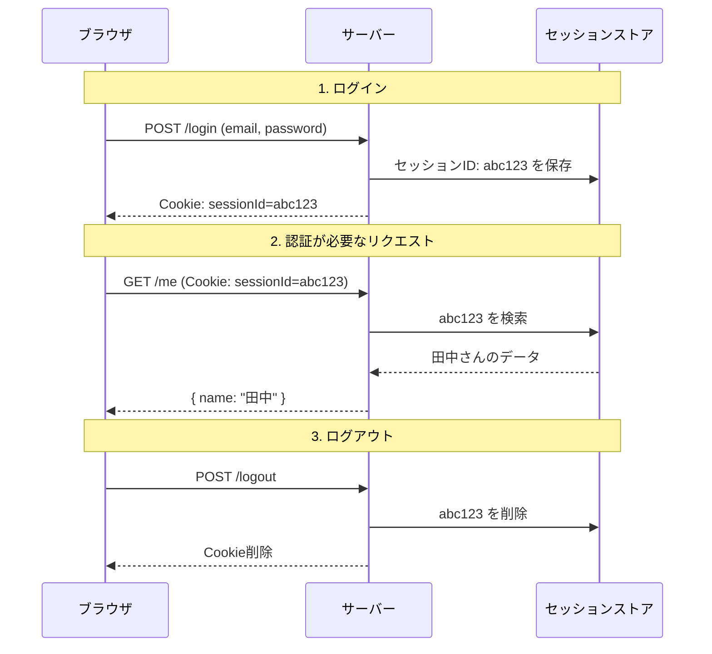

# 3-2. セッション管理

## 例え話：スーパーのポイントカード

HTTPは「記憶喪失」のプロトコルです。毎回のリクエストは独立していて、前回のことを覚えていません。

でも「ログイン状態を維持したい」ですよね。

これは、スーパーのポイントカードに似ています：
- あなたは毎回「客」として来店（HTTPリクエスト）
- ポイントカードを見せると「あ、田中さんですね」とわかる
- カードを忘れると「どちら様ですか？」となる

この「カード」がセッションIDです。

---

## 核心：セッションの仕組み

<WhyButton title="なぜセッションが必要なのか？">

**HTTPは「記憶喪失」のプロトコル**だからです。

HTTPの仕様上：
- 各リクエストは完全に独立
- 前回のリクエストを覚えていない
- 毎回「初めまして」の状態

でも「ログイン状態を維持したい」ですよね。そのためにセッションが必要です。

セッションIDは「あなたは田中さんですね」とサーバーが識別するための**印**です。ブラウザが毎回この印を送ることで、ログイン状態を維持できます。

</WhyButton>

### 基本の流れ



### データの保存場所

```
セッションデータ（「田中さん」の情報）
├── サーバーのメモリ（単純だが、再起動で消える）
├── データベース（永続化される）
├── Redis（高速、期限付きに適している）
└── ファイル（シンプル、小規模向け）

クライアント側
└── CookieにはセッションIDだけ（データ自体は保存しない）
```

---

## コードで確認

### 自前で実装する場合

```javascript
const express = require('express');
const crypto = require('crypto');
const cookieParser = require('cookie-parser');

const app = express();
app.use(express.json());
app.use(cookieParser());

// セッションをメモリに保存（本番ではRedisなどを使う）
const sessions = new Map();

// セッションIDを生成
function generateSessionId() {
  return crypto.randomBytes(32).toString('hex');
}

// ログイン
app.post('/login', (req, res) => {
  const { email, password } = req.body;

  // 認証（省略：実際はDBで検証）
  if (email !== 'test@test.com' || password !== 'password') {
    return res.status(401).json({ error: 'Invalid credentials' });
  }

  // セッション作成
  const sessionId = generateSessionId();
  sessions.set(sessionId, {
    userId: 1,
    email: email,
    createdAt: Date.now()
  });

  // CookieにセッションIDを保存
  res.cookie('sessionId', sessionId, {
    httpOnly: true,      // JavaScriptからアクセス不可
    secure: true,        // HTTPSのみ
    sameSite: 'strict',  // CSRF対策
    maxAge: 24 * 60 * 60 * 1000  // 24時間
  });

  res.json({ success: true });
});

// 認証が必要なエンドポイント
app.get('/me', (req, res) => {
  const sessionId = req.cookies.sessionId;

  if (!sessionId || !sessions.has(sessionId)) {
    return res.status(401).json({ error: 'Not logged in' });
  }

  const session = sessions.get(sessionId);
  res.json({ email: session.email });
});

// ログアウト
app.post('/logout', (req, res) => {
  const sessionId = req.cookies.sessionId;

  if (sessionId) {
    sessions.delete(sessionId);
  }

  res.clearCookie('sessionId');
  res.json({ success: true });
});

app.listen(3000);
```

### express-session を使う場合

```javascript
const express = require('express');
const session = require('express-session');
const RedisStore = require('connect-redis').default;
const { createClient } = require('redis');

const app = express();

// Redis接続
const redisClient = createClient();
redisClient.connect();

// セッションの設定
app.use(session({
  store: new RedisStore({ client: redisClient }),
  secret: process.env.SESSION_SECRET,  // 署名に使う秘密鍵
  resave: false,
  saveUninitialized: false,
  cookie: {
    httpOnly: true,
    secure: process.env.NODE_ENV === 'production',
    sameSite: 'strict',
    maxAge: 24 * 60 * 60 * 1000
  }
}));

// ログイン
app.post('/login', (req, res) => {
  // 認証処理...

  // セッションにユーザー情報を保存
  req.session.userId = user.id;
  req.session.email = user.email;

  res.json({ success: true });
});

// 認証が必要なエンドポイント
app.get('/me', (req, res) => {
  if (!req.session.userId) {
    return res.status(401).json({ error: 'Not logged in' });
  }

  res.json({ email: req.session.email });
});

// ログアウト
app.post('/logout', (req, res) => {
  req.session.destroy();
  res.json({ success: true });
});
```

---

## Cookieの重要な設定

```javascript
res.cookie('sessionId', value, {
  httpOnly: true,      // 必須：XSS対策
  secure: true,        // 本番では必須：HTTPSのみ
  sameSite: 'strict',  // CSRF対策
  maxAge: 86400000,    // 有効期限（ミリ秒）
  path: '/',           // どのパスで送信するか
  domain: 'example.com' // どのドメインで有効か
});
```

### httpOnly

```javascript
// httpOnly: false の場合
document.cookie  // JavaScriptでCookieにアクセスできる
// → XSS攻撃でセッションIDを盗まれる可能性

// httpOnly: true の場合
document.cookie  // セッションIDは見えない
// → 盗まれにくい
```

### secure

```javascript
// secure: false の場合
// HTTP通信でもCookieが送られる → 盗聴される可能性

// secure: true の場合
// HTTPSのみCookieが送られる → 暗号化されているので安全
```

### sameSite

```javascript
// sameSite: 'none' の場合
// 他サイトからのリクエストでもCookieが送られる → CSRF攻撃に脆弱

// sameSite: 'strict' の場合
// 同じサイトからのリクエストのみCookieが送られる → 安全

// sameSite: 'lax' の場合
// GETのみ他サイトからも許可（リンククリックなど）
```

---

## セッションハイジャック対策

### セッションIDの推測対策

```javascript
// ダメな例
const sessionId = `session_${Date.now()}`;
// → 推測可能（時刻から推測できる）

// 良い例
const sessionId = crypto.randomBytes(32).toString('hex');
// → 推測不可能（暗号学的に安全な乱数）
```

### セッション固定攻撃対策

```javascript
// ログイン成功時にセッションIDを再生成
app.post('/login', (req, res) => {
  // 認証成功後
  req.session.regenerate((err) => {
    // 新しいセッションIDで再開
    req.session.userId = user.id;
    res.json({ success: true });
  });
});
```

### セッションの有効期限

```javascript
// 適切な有効期限を設定
cookie: {
  maxAge: 24 * 60 * 60 * 1000  // 24時間
}

// アクティビティに応じて延長（スライディングウィンドウ）
app.use((req, res, next) => {
  if (req.session.userId) {
    req.session.touch();  // 期限をリセット
  }
  next();
});
```

---

## セッション vs トークン

次の章でJWTを扱いますが、先に比較しておきます：

<SimpleComparison
  title="セッション vs JWT"
  itemA="セッション"
  itemB="JWT"
  comparisons={[
    { aspect: 'データの場所', a: 'サーバー側', b: 'クライアント側' },
    { aspect: 'スケーラビリティ', a: 'ストア共有が必要', b: 'ステートレスで容易' },
    { aspect: '即座の無効化', a: '可能', b: '困難' },
    { aspect: 'データサイズ', a: '小さい（IDのみ）', b: '大きい（情報含む）' },
    { aspect: '実装の複雑さ', a: 'ストア管理が必要', b: '署名検証のみ' }
  ]}
/>

### いつどちらを使う？

```
「サーバーがステートフルでOK」「即座にログアウトさせたい」
  → セッション

「サーバーをステートレスにしたい」「マイクロサービス」
  → JWT

「どちらでもいい」
  → セッションの方がシンプルで安全
```

---

## よくある誤解

### 「Cookieは危険」？

Cookie自体は危険ではありません。**適切に設定すれば安全**です。

危険なのは：
- `httpOnly: false` でXSSに脆弱
- `secure: false` で盗聴に脆弱
- `sameSite: 'none'` でCSRFに脆弱

### 「localStorageに保存すればいい」？

```javascript
// セッションIDをlocalStorageに保存（非推奨）
localStorage.setItem('sessionId', '...');

// 問題点：
// - JavaScriptでアクセス可能 → XSSで盗まれる
// - 自動送信されない → 毎回手動で送る必要がある
```

セッションIDは**httpOnly Cookie**に保存するのが最も安全です。

---

## まとめ

- **セッション** = HTTPの「記憶喪失」を補う仕組み
- **セッションID** = サーバーとクライアントを紐づけるキー
- **Cookieの設定** = httpOnly, secure, sameSiteを正しく設定
- **セッションデータ** = サーバー側（メモリ、Redis、DB）に保存
- **ストレージの選択** = 小規模ならメモリ、大規模ならRedis

---

## サンプルコード

この章の内容を実際に動かして試せるサンプルコードを用意しています。

- [セッション認証サーバー](https://github.com/minaaaa3/study-memo/tree/main/samples/server/04-session-auth) - 登録・ログイン・ログアウトの完全な実装

