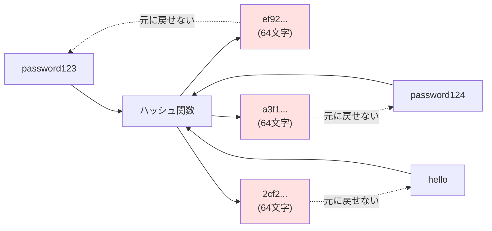
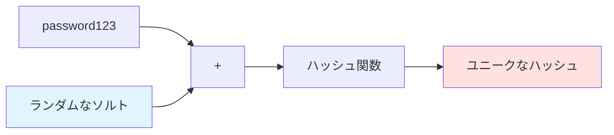
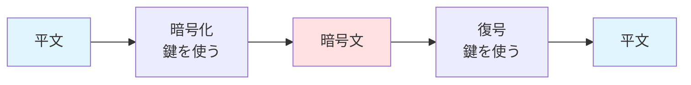
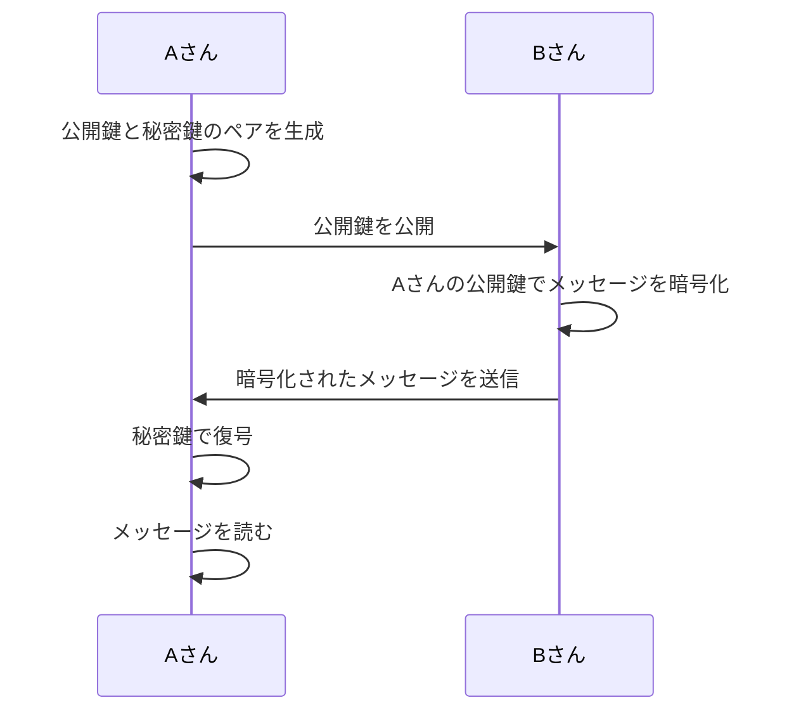

# 3-4. ハッシュと暗号化

## 例え話：ミキサーと金庫

- **ハッシュ** = ミキサー。果物を入れるとジュースになる。**元に戻せない**
- **暗号化** = 金庫。鍵があれば開けられる。**元に戻せる**

パスワードは「元に戻す必要がない」からハッシュを使います。
メッセージは「受け取った人が読みたい」から暗号化を使います。

---

## 核心：ハッシュとは

### 一方向の変換



<Callout type="info">
**ハッシュの4つの特徴**

1. 同じ入力からは常に同じ出力
2. 出力から入力を逆算できない（一方向）
3. 少しでも入力が違うと出力が全く違う
4. 出力は固定長
</Callout>

### コードで確認

```javascript
const crypto = require('crypto');

// SHA-256ハッシュ
function sha256(input) {
  return crypto.createHash('sha256').update(input).digest('hex');
}

console.log(sha256('password123'));
// → "ef92b778bafe771e89245b89ecbc08a44a4e166c06659911881f383d4473e94f"

console.log(sha256('password123'));
// → 同じ値（再現性がある）

console.log(sha256('password124'));
// → 全然違う値
```

---

## パスワードのハッシュ化

<WhyButton title="なぜハッシュ化が必要？">

**DBが漏洩した場合のリスク**を考えてみましょう。

パスワードをそのまま保存していると：
- 攻撃者がDBを入手 → 全ユーザーのパスワードが丸見え
- 同じパスワードを他サービスでも使っていたら、そこも被害に

ハッシュ化していると：
- 攻撃者がDBを入手 → ハッシュ値しか見えない
- 元のパスワードを知るには「総当たり」が必要（時間がかかる）

**なぜ暗号化ではなくハッシュ化？**

暗号化は「復号できる」のが問題です。
- 暗号化キーが漏洩したら、全パスワードが復元される
- パスワード照合には「元に戻す」必要がない
- 「同じ入力から同じハッシュが出る」性質で照合できる

</WhyButton>

### DBが漏洩した場合の比較

```
パスワードをそのまま保存:
+----+------------------+--------------+
| id | email            | password     |
+----+------------------+--------------+
| 1  | tanaka@test.com  | password123  |  ← 丸見え！
+----+------------------+--------------+

ハッシュ化して保存:
+----+------------------+------------------+
| id | email            | password_hash    |
+----+------------------+------------------+
| 1  | tanaka@test.com  | ef92b778bafe...  |  ← 元のパスワードはわからない
+----+------------------+------------------+
```

### 単純なハッシュの問題点

<Callout type="warning">
単純なハッシュだけでは、レインボーテーブル攻撃などの手法で破られる可能性があります。
</Callout>

<Tabs items={[
  {
    label: "問題1: 同じハッシュ",
    content: `\`\`\`javascript
// ダメな例：単純なハッシュ
const hash = sha256(password);

// 同じパスワードは同じハッシュ
sha256('password123') → "ef92..."
sha256('password123') → "ef92..."
// → 「ef92...」を見つけたら全員同じパスワードとバレる
\`\`\`

同じパスワードを使っているユーザーが複数いた場合、ハッシュ値も同じになるため、パスワードが同じだとバレてしまいます。`
  },
  {
    label: "問題2: レインボーテーブル",
    content: `\`\`\`javascript
// レインボーテーブル攻撃
// 事前に「よく使われるパスワード→ハッシュ」の対応表を作っておく
// "password123" → "ef92..."
// "123456" → "8d96..."
// ... これを検索するだけでパスワードがわかる
\`\`\`

攻撃者は事前に計算した対応表を使って、ハッシュ値から元のパスワードを特定できます。`
  }
]} />

### ソルト（Salt）



```javascript
// ソルト = ランダムな文字列を追加
const salt = crypto.randomBytes(16).toString('hex');
const hash = sha256(salt + password);

// 同じパスワードでも、ソルトが違えばハッシュが違う
salt1 + "password123" → "abc..."
salt2 + "password123" → "xyz..."

// レインボーテーブルが使えなくなる
```

<Callout type="tip">
ソルトを使うことで、同じパスワードでも異なるハッシュ値が生成され、レインボーテーブル攻撃を防ぐことができます。
</Callout>

### bcrypt を使う（推奨）

```javascript
const bcrypt = require('bcrypt');

// ハッシュ化（ソルトは自動生成される）
const hash = await bcrypt.hash('password123', 10);
// → "$2b$10$N9qo8uLOickgx2ZMRZoMy.Mrq4L0P0v5j6rl5W7dZ1W8..."
//    ↑ アルゴリズム、コスト、ソルト、ハッシュが全部入ってる

// 検証
const isValid = await bcrypt.compare('password123', hash);
// → true
```

**bcryptの特徴：**
- ソルトを自動で付けてくれる
- 意図的に遅い（総当たり攻撃に強い）
- コスト（計算量）を調整できる

---

## 暗号化とは

### 双方向の変換



暗号化は「鍵があれば元に戻せる」点がハッシュと異なります。

### 共通鍵暗号（対称暗号）

暗号化と復号に**同じ鍵**を使う。

```javascript
const crypto = require('crypto');

const KEY = crypto.randomBytes(32);  // 256ビット
const IV = crypto.randomBytes(16);   // 初期化ベクトル

// 暗号化
function encrypt(text) {
  const cipher = crypto.createCipheriv('aes-256-cbc', KEY, IV);
  let encrypted = cipher.update(text, 'utf8', 'hex');
  encrypted += cipher.final('hex');
  return encrypted;
}

// 復号
function decrypt(encrypted) {
  const decipher = crypto.createDecipheriv('aes-256-cbc', KEY, IV);
  let decrypted = decipher.update(encrypted, 'hex', 'utf8');
  decrypted += decipher.final('utf8');
  return decrypted;
}

const encrypted = encrypt('秘密のメッセージ');
console.log(encrypted);  // "a3f2c..."

const decrypted = decrypt(encrypted);
console.log(decrypted);  // "秘密のメッセージ"
```

### 公開鍵暗号（非対称暗号）

**公開鍵**で暗号化、**秘密鍵**で復号。



<Callout type="info">
公開鍵暗号はHTTPSの「鍵交換」に使われます。安全に共通鍵を交換するための仕組みです。
</Callout>

---

## 比較まとめ

<SimpleComparison
  title="ハッシュ vs 暗号化"
  itemA="ハッシュ"
  itemB="暗号化"
  comparisons={[
    { aspect: '変換方向', a: '一方向（戻せない）', b: '双方向（鍵で戻せる）' },
    { aspect: '出力サイズ', a: '固定長', b: '入力に依存' },
    { aspect: '用途', a: 'パスワード保存、改ざん検知', b: '通信の秘匿、データ保護' },
    { aspect: '代表的なアルゴリズム', a: 'bcrypt, SHA-256', b: 'AES, RSA' }
  ]}
/>

### 使い分け

<Tabs items={[
  {
    label: "パスワード保存",
    content: `**ハッシュ（bcrypt）を使う**

「ユーザーが入力したものと一致するか」だけわかればいい。元のパスワードを知る必要はない。`
  },
  {
    label: "クレジットカード番号",
    content: `**暗号化を使う**

「後で元の番号を使う」必要がある。決済処理時に復号して使用する。`
  },
  {
    label: "改ざん検知",
    content: `**ハッシュを使う**

「内容が変わっていないか」確認する。ファイルのチェックサムなど。`
  },
  {
    label: "通信内容の保護",
    content: `**暗号化（HTTPS）を使う**

「途中で読まれないように」する。受信側は復号して読む必要がある。`
  }
]} />

---

## よくある間違い

### 「ハッシュ化=暗号化」？

<Callout type="warning">
ハッシュ化と暗号化は全く異なる概念です。混同しないように注意してください。
</Callout>

```
ハッシュ化: password123 → ef92... → ??? （元に戻せない）
暗号化:    password123 → a3f2... → password123 （鍵で戻せる）
```

「パスワードを暗号化して保存」は間違い。**ハッシュ化**して保存します。

### 「MD5やSHA1を使う」？

<Callout type="warning">
MD5やSHA1は古いアルゴリズムで、パスワードのハッシュ化には使用しないでください。
</Callout>

```javascript
// ダメな例（古い、高速すぎる）
crypto.createHash('md5').update(password).digest('hex');
crypto.createHash('sha1').update(password).digest('hex');

// 良い例（パスワード用に設計された）
bcrypt.hash(password, 10);
```

<WhyButton title="なぜMD5やSHA1はダメなのか？">

**2つの理由があります**

1. **衝突が見つかっている**: 異なる入力から同じ出力を作ることができてしまう
2. **高速すぎる**: 総当たり攻撃で1秒間に数十億回試行できてしまう

bcryptは意図的に遅く設計されており、総当たり攻撃に強いです。

</WhyButton>

### 「自前で暗号化アルゴリズムを作る」？

<Callout type="warning">
絶対にダメです。暗号化アルゴリズムは数学的に証明された安全なものを使用してください。
</Callout>

```javascript
// ダメな例：自前の「暗号化」
function myEncrypt(text) {
  return text.split('').map(c => String.fromCharCode(c.charCodeAt(0) + 1)).join('');
}

// 「hello」 → 「ifmmp」
// これは暗号化ではなく「難読化」。すぐ解読される。
```

<Callout type="tip">
必ず実績のあるライブラリ（bcrypt、crypto、など）を使いましょう。自作は脆弱性の原因になります。
</Callout>

---

## 実践例：機密情報の保存

```javascript
const crypto = require('crypto');

// 環境変数から暗号化キーを取得
const ENCRYPTION_KEY = Buffer.from(process.env.ENCRYPTION_KEY, 'hex');

// 暗号化
function encryptSensitiveData(data) {
  const iv = crypto.randomBytes(16);
  const cipher = crypto.createCipheriv('aes-256-gcm', ENCRYPTION_KEY, iv);

  let encrypted = cipher.update(JSON.stringify(data), 'utf8', 'hex');
  encrypted += cipher.final('hex');

  const authTag = cipher.getAuthTag();

  return {
    iv: iv.toString('hex'),
    encrypted,
    authTag: authTag.toString('hex')
  };
}

// 復号
function decryptSensitiveData(encryptedData) {
  const decipher = crypto.createDecipheriv(
    'aes-256-gcm',
    ENCRYPTION_KEY,
    Buffer.from(encryptedData.iv, 'hex')
  );

  decipher.setAuthTag(Buffer.from(encryptedData.authTag, 'hex'));

  let decrypted = decipher.update(encryptedData.encrypted, 'hex', 'utf8');
  decrypted += decipher.final('utf8');

  return JSON.parse(decrypted);
}

// 使用例
const creditCard = { number: '4111111111111111', cvv: '123' };
const encrypted = encryptSensitiveData(creditCard);
// DBに保存

const decrypted = decryptSensitiveData(encrypted);
// 必要なときだけ復号
```

---

## まとめ

- **ハッシュ** = 一方向変換。元に戻せない
- **暗号化** = 双方向変換。鍵があれば戻せる
- **パスワードはハッシュ化** = bcryptを使う
- **機密データは暗号化** = AES-256などを使う
- **自作禁止** = 必ず実績のあるライブラリを使う

---

## サンプルコード

この章の内容を実際に動かして試せるサンプルコードを用意しています。

- [ハッシュと暗号化サンプル](/samples/server/09-hash-encryption) - SHA-256 / bcryptパスワード / AES暗号化

