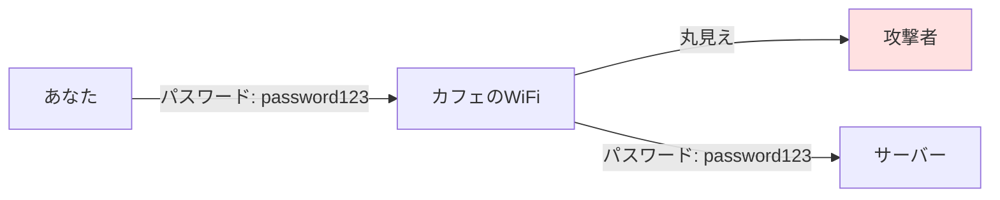
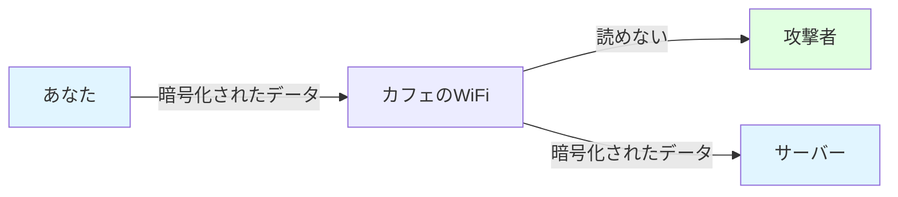
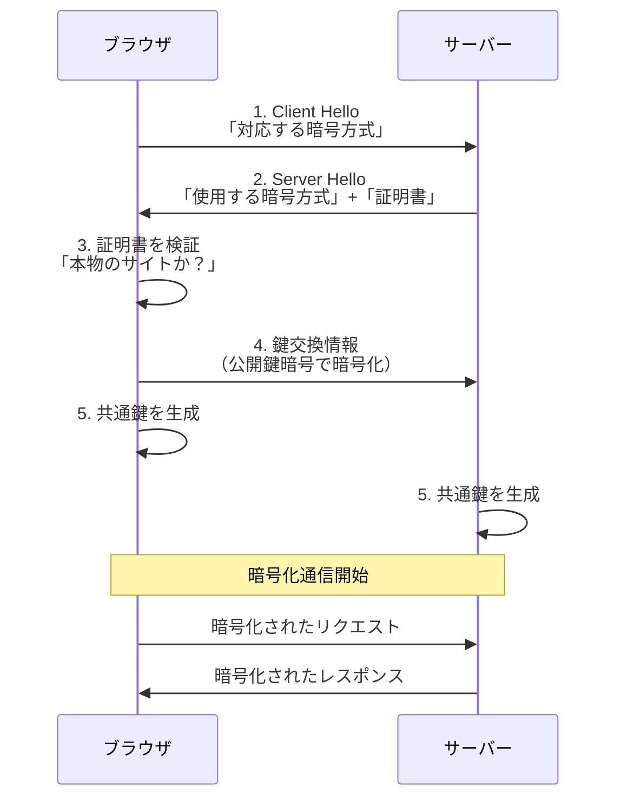
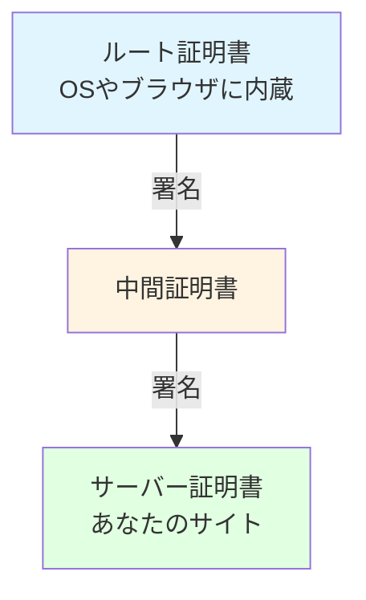

# 3-5. HTTPSと証明書

## 例え話：鍵付きの手紙

HTTPは「はがき」、HTTPSは「鍵付きの封筒」です。

- **HTTP**: 配達員も途中の人も読める
- **HTTPS**: 受取人だけが開けられる封筒

さらに、HTTPSには「差出人の身元確認」もついています。

---

## 核心：なぜHTTPSが必要か

<WhyButton title="なぜHTTPではダメなのか？">

**HTTPは「丸見え」だからです。**

カフェのWiFiでログインすると：
- 隣の人がパスワードを見れる
- 偽のログインページに差し替えられる
- 送金先の口座番号を書き換えられる

HTTPSなら：
- 通信内容が暗号化される（読めない）
- 改ざんを検知できる
- 接続先が本物か証明される

「HTTP=はがき」「HTTPS=封印された封筒」と覚えてください。今日では**HTTPは使うべきでない**というのが常識です。

</WhyButton>

### HTTPの問題点



<Callout type="warning">
**HTTPの3つのリスク**

- カフェのWiFiで通信を見られる（盗聴）
- 途中のルーターで傍受される（中間者攻撃）
- 内容を改ざんされる可能性
</Callout>

### HTTPSで解決



<Callout type="info">
**HTTPSが守る3つのこと**

- **盗聴防止**: 途中で読まれない
- **改ざん防止**: 途中で書き換えられない
- **なりすまし防止**: 相手が本物か確認できる
</Callout>

---

## HTTPSの仕組み

### TLSハンドシェイク

ブラウザとサーバーが「暗号化の準備」をする過程です。



<Callout type="info">
このハンドシェイクは接続の最初に1回だけ行われます。その後は高速な共通鍵暗号で通信します。
</Callout>

### 公開鍵と共通鍵の組み合わせ

<WhyButton title="なぜ2種類の暗号を使い分けるのか？">

**それぞれの長所・短所を補完するため**です。

**公開鍵暗号（非対称）**:
- 安全に鍵を交換できる
- でも遅い（計算コストが高い）

**共通鍵暗号（対称）**:
- 高速（大量のデータを暗号化できる）
- でも鍵をどうやって安全に渡す？

**解決策**:
1. 最初だけ公開鍵暗号で「共通鍵」を安全に交換
2. その後は高速な共通鍵暗号で通信

</WhyButton>

---

## 証明書とは

### 役割

証明書は「このサーバーは本物のexample.comです」を証明するもの。

```
証明書の中身:
├── ドメイン名（example.com）
├── サーバーの公開鍵
├── 有効期限
├── 発行者（認証局）
└── 発行者の署名
```

### 認証局（CA）の役割

```
1. あなた: 「example.comの証明書をください」
2. 認証局: 「本当にexample.comの所有者？」（ドメイン確認）
3. 認証局: 「確認OK。署名入りの証明書です」

ブラウザには「信頼できる認証局リスト」が入っている
→ そのリストにある認証局が署名した証明書は信頼される
```

### 証明書チェーン



<Callout type="info">
ブラウザはこのチェーンをたどって検証します。ルート証明書まで信頼できれば、サーバー証明書も信頼できると判断します。
</Callout>

---

## 証明書を取得する

<Callout type="tip">
Let's Encryptを使えば、無料でSSL/TLS証明書を取得できます。
</Callout>

### Let's Encrypt（無料）

<StepByStep>

#### ステップ1: Certbotのインストール

```bash
# Ubuntu/Debianの例
sudo apt install certbot
```

#### ステップ2: 証明書の取得

```bash
# Nginx用
sudo certbot --nginx -d example.com -d www.example.com

# Apache用
sudo certbot --apache -d example.com -d www.example.com
```

#### ステップ3: 自動更新の設定

```bash
# 証明書は90日で期限切れ、自動更新を設定
sudo certbot renew --dry-run  # テスト

# cronで自動更新（既に設定されている場合が多い）
sudo crontab -e
# 以下を追加（毎日2回チェック）
0 0,12 * * * certbot renew --quiet
```

</StepByStep>

### Cloudflareなどのサービス

<StepByStep>

#### ステップ1: Cloudflareにドメインを登録

ドメインのネームサーバーをCloudflareに変更

#### ステップ2: SSL/TLSを設定

SSL/TLS設定で「Full」または「Full (strict)」を選択

#### ステップ3: 自動管理

証明書の取得・更新は全てCloudflareが自動で行う

</StepByStep>

---

## コードで確認

### Node.jsでHTTPSサーバー

```javascript
const https = require('https');
const fs = require('fs');
const express = require('express');

const app = express();

app.get('/', (req, res) => {
  res.send('Hello HTTPS!');
});

// 証明書と秘密鍵を読み込み
const options = {
  key: fs.readFileSync('/etc/letsencrypt/live/example.com/privkey.pem'),
  cert: fs.readFileSync('/etc/letsencrypt/live/example.com/fullchain.pem')
};

https.createServer(options, app).listen(443, () => {
  console.log('HTTPS server running on port 443');
});

// HTTPからHTTPSへリダイレクト
const http = require('http');
http.createServer((req, res) => {
  res.writeHead(301, { Location: `https://${req.headers.host}${req.url}` });
  res.end();
}).listen(80);
```

### 開発環境での自己署名証明書

```bash
# 自己署名証明書を作成（開発用）
openssl req -x509 -newkey rsa:4096 -keyout key.pem -out cert.pem -days 365 -nodes

# 質問に適当に答える（開発用なので）
```

```javascript
// 開発サーバー
const options = {
  key: fs.readFileSync('key.pem'),
  cert: fs.readFileSync('cert.pem')
};

// ブラウザで警告が出るが、開発では問題ない
```

---

## HTTPSの確認方法

### ブラウザで確認

```
1. URLバーの鍵アイコンをクリック
2. 「証明書」を選択
3. 有効期限、発行者などを確認
```

### コマンドで確認

```bash
# 証明書の情報を表示
openssl s_client -connect example.com:443 -servername example.com </dev/null 2>/dev/null | openssl x509 -text -noout

# 有効期限だけ確認
echo | openssl s_client -connect example.com:443 2>/dev/null | openssl x509 -noout -dates
```

### curlで確認

```bash
# 詳細な情報
curl -v https://example.com

# 証明書の検証をスキップ（開発時）
curl -k https://localhost:3000
```

---

## よくある問題

### 「この接続は安全ではありません」

<Callout type="warning">
このエラーが出る場合、証明書に問題がある可能性があります。
</Callout>

<Tabs items={[
  {
    label: "証明書の期限切れ",
    content: `**原因**: 証明書の有効期限が過ぎている

**対策**: 証明書を更新する

\`\`\`bash
# Let's Encryptの場合
sudo certbot renew
\`\`\``
  },
  {
    label: "ドメイン不一致",
    content: `**原因**: 証明書のドメインとアクセス先のドメインが一致しない

**対策**: 正しいドメインで証明書を取得する

例: example.com の証明書で www.example.com にアクセスしている`
  },
  {
    label: "認証局が信頼されていない",
    content: `**原因**: 自己署名証明書や不明な認証局を使用している

**対策**: 信頼できる認証局（Let's Encryptなど）を使う

開発環境では警告を無視してもOKですが、本番環境では必ず信頼できる証明書を使用してください。`
  },
  {
    label: "中間証明書が欠けている",
    content: `**原因**: 証明書チェーンが不完全

**対策**: fullchain.pem を使う（中間証明書を含む）

\`\`\`javascript
const options = {
  key: fs.readFileSync('privkey.pem'),
  cert: fs.readFileSync('fullchain.pem')  // cert.pem ではなく fullchain.pem
};
\`\`\``
  }
]} />

### Mixed Content

```html
<!-- HTTPSのページでHTTPのリソースを読み込む -->
  <!-- ブロックされる -->

<!-- すべてHTTPSにする -->
  <!-- OK -->

<!-- または相対パス/プロトコル相対URL -->
  <!-- ページと同じプロトコル -->
```

### HSTS（HTTP Strict Transport Security）

```javascript
// 「このサイトは常にHTTPSでアクセスしてね」とブラウザに伝える
app.use((req, res, next) => {
  res.setHeader('Strict-Transport-Security', 'max-age=31536000; includeSubDomains');
  next();
});
```

---

## よくある誤解

### 「HTTPSなら完全に安全」？

<Callout type="warning">
HTTPSが守るのは「通信経路」だけです。アプリケーションレベルの脆弱性は別途対策が必要です。
</Callout>

<Tabs items={[
  {
    label: "守れるもの",
    content: `✓ 途中で盗聴されない
✓ 途中で改ざんされない
✓ 相手が本物か確認

HTTPSは通信路を暗号化し、通信相手を認証します。`
  },
  {
    label: "守れないもの",
    content: `✗ サーバーがハッキングされた
✗ SQLインジェクション
✗ XSS
✗ パスワードが弱い
✗ アプリケーションのバグ

これらはHTTPSとは別に対策が必要です。`
  }
]} />

### 「HTTPSは遅い」？

<Callout type="info">
昔の話です。現在はHTTPSの方が速いこともあります。
</Callout>

**現在の状況**:
- ハードウェアアクセラレーション（暗号化処理が高速化）
- HTTP/2（HTTPSでのみ使える高速プロトコル）
- TLS 1.3（高速なハンドシェイク）
- CDNがHTTPSを最適化

<Callout type="tip">
パフォーマンスを理由にHTTPSを避ける必要はありません。セキュリティを優先してHTTPSを使いましょう。
</Callout>

---

## まとめ

- **HTTPS** = HTTP + TLSによる暗号化
- **守るもの** = 盗聴、改ざん、なりすまし
- **証明書** = サーバーの身元を証明
- **Let's Encrypt** = 無料で証明書を取得できる
- **本番では必須** = HTTPは使わない

