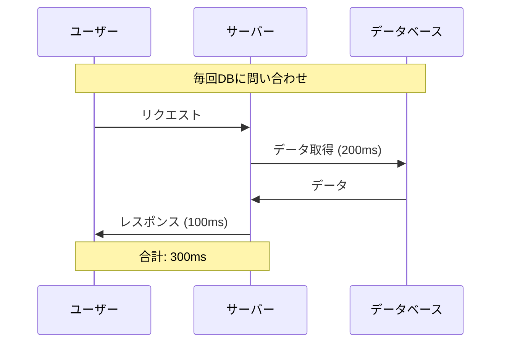
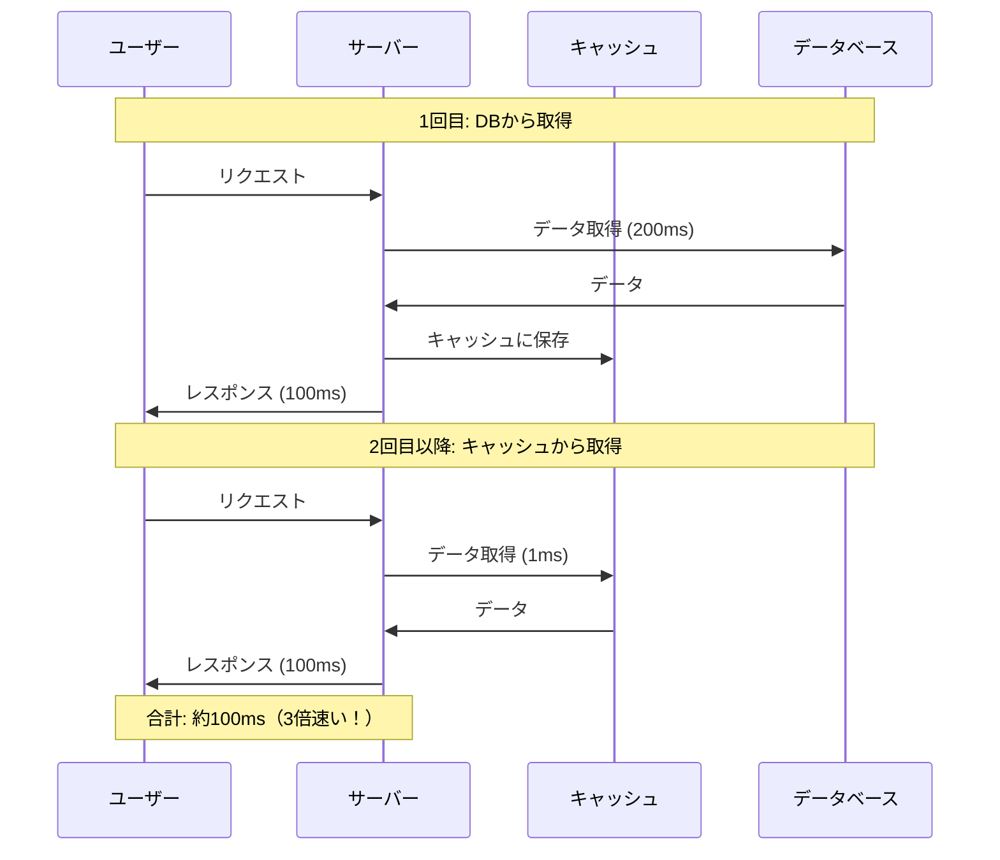
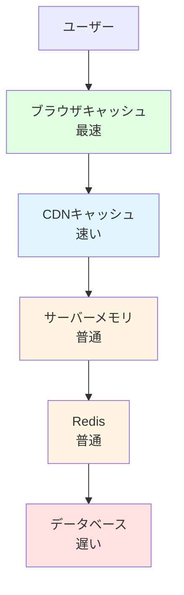

# 3-6. キャッシュ

## 例え話：冷蔵庫の作り置き

キャッシュは「料理の作り置き」のようなものです。

- **キャッシュなし**: 毎回材料から料理を作る → 時間がかかる
- **キャッシュあり**: 作り置きを冷蔵庫から出す → すぐ食べられる

ただし、作り置きには「賞味期限」があります。古くなったら捨てて、新しく作り直す必要があります。

Webの世界でも同じです。一度取得したデータを保存しておけば、次は速く取り出せます。

---

## 核心：なぜキャッシュが必要か

### キャッシュがないと何が起きる？



<Callout type="warning">
同じデータを100人が見に来たら、100回データベースに問い合わせることになります。サーバーとDBの負荷が高くなります。
</Callout>

### キャッシュがあると



<Callout type="tip">
一度取得したデータを覚えておけば、データベースに問い合わせなくて済みます。
</Callout>

---

## キャッシュの種類

キャッシュは「どこに保存するか」で種類が分かれます。



<Callout type="info">
**ユーザーに近いほど速い**です。ブラウザキャッシュが最速で、データベースが最も遅くなります。
</Callout>

<Tabs items={[
  {
    label: "ブラウザキャッシュ",
    content: `**ユーザーのPC/スマホに保存**

- 速度: 最速
- 用途: 画像、CSS、JS
- 制御: Cache-Controlヘッダー`
  },
  {
    label: "CDN",
    content: `**世界中のサーバーに保存**

- 速度: 速い
- 用途: 静的ファイル、API応答
- 制御: s-maxageヘッダー`
  },
  {
    label: "サーバーメモリ",
    content: `**アプリのメモリに保存**

- 速度: 普通
- 用途: よく使うデータ
- 欠点: 再起動で消える`
  },
  {
    label: "Redis",
    content: `**専用のキャッシュサーバー**

- 速度: 普通
- 用途: セッション、DB結果
- 利点: 永続化、複数サーバーで共有可能`
  }
]} />

---

## ブラウザキャッシュ

ブラウザは一度ダウンロードしたファイルを自動で保存します。サーバーが「このファイルは○○秒キャッシュしていいよ」と指示を出します。

### Cache-Control ヘッダー

サーバーからブラウザへの「キャッシュの指示書」です。

```javascript
// Express.js でキャッシュを設定
app.get("/api/products", (req, res) => {
  // 「1時間キャッシュしていいよ」という指示
  res.set("Cache-Control", "public, max-age=3600");
  res.json(products);
});
```

### よく使う設定

<Tabs items={[
  {
    label: "max-age",
    content: `**キャッシュの有効期限（秒）**

\`\`\`javascript
res.set("Cache-Control", "max-age=3600"); // 1時間
\`\`\`

**使いどころ**: 更新が少ないデータ（商品一覧など）`
  },
  {
    label: "no-store",
    content: `**キャッシュしない**

\`\`\`javascript
res.set("Cache-Control", "no-store");
\`\`\`

**使いどころ**: 個人情報、リアルタイムデータ`
  },
  {
    label: "no-cache",
    content: `**キャッシュするが毎回サーバーに確認**

\`\`\`javascript
res.set("Cache-Control", "no-cache");
\`\`\`

**使いどころ**: 更新頻度が読めないデータ`
  },
  {
    label: "public / private",
    content: `**キャッシュの共有範囲**

\`\`\`javascript
// public: CDNなどでもキャッシュ可
res.set("Cache-Control", "public, max-age=3600");

// private: ブラウザだけキャッシュ可
res.set("Cache-Control", "private, max-age=3600");
\`\`\`

**public**: 全員に同じ内容を返すAPI
**private**: ユーザー固有のデータ`
  }
]} />

### 実際の設定例

```javascript
// 商品一覧（みんな同じ内容）→ 長めにキャッシュ
app.get("/api/products", (req, res) => {
  res.set("Cache-Control", "public, max-age=3600"); // 1時間
  res.json(products);
});

// ユーザー情報（個人データ）→ キャッシュしない
app.get("/api/me", (req, res) => {
  res.set("Cache-Control", "private, no-store");
  res.json(user);
});

// ニュース（更新頻度が高い）→ 短めにキャッシュ
app.get("/api/news", (req, res) => {
  res.set("Cache-Control", "public, max-age=60"); // 1分
  res.json(news);
});
```

---

## CDN キャッシュ

### CDN とは？

CDN（Content Delivery Network）は「世界中に配置されたキャッシュサーバー」です。

```text
日本のユーザー → 日本のCDNサーバー → キャッシュがあれば即返す
アメリカのユーザー → アメリカのCDNサーバー → キャッシュがあれば即返す
```

ユーザーに近いサーバーから返すので、とても速いです。

### 代表的な CDN

- **Cloudflare**: 無料プランあり、設定が簡単
- **Vercel**: Next.js と相性抜群
- **AWS CloudFront**: AWS ユーザー向け

### CDN 向けの設定

```javascript
// s-maxage は CDN 用の設定
res.set("Cache-Control", "public, max-age=60, s-maxage=86400");

// ブラウザ: 60秒キャッシュ
// CDN: 86400秒（1日）キャッシュ
```

---

## サーバーサイドキャッシュ

データベースの結果をサーバーのメモリに保存しておく方法です。

### シンプルな例

```javascript
// メモリにキャッシュを保存
const cache = new Map();

async function getPopularPosts() {
  // キャッシュを確認
  const cached = cache.get("popular-posts");
  if (cached) {
    console.log("キャッシュから取得");
    return cached;
  }

  // キャッシュがなければDBから取得
  console.log("DBから取得");
  const posts = await db.posts.findMany({
    orderBy: { views: "desc" },
    take: 10,
  });

  // キャッシュに保存（5分後に削除）
  cache.set("popular-posts", posts);
  setTimeout(() => cache.delete("popular-posts"), 5 * 60 * 1000);

  return posts;
}
```

### 問題点

このシンプルな方法には問題があります：

- サーバーを再起動するとキャッシュが消える
- サーバーが複数台あると、キャッシュがバラバラになる

これを解決するのが **Redis** です。

---

## Redis

### Redis とは？

Redis（レディス）は「キャッシュ専用のデータベース」です。

- とても速い（データをメモリに保存）
- サーバーが複数台でもキャッシュを共有できる
- 有効期限を簡単に設定できる

### 基本的な使い方

```bash
# Redis をインストール（Docker）
docker run -d -p 6379:6379 redis
```

```bash
# Node.js のライブラリをインストール
npm install ioredis
```

```javascript
import Redis from "ioredis";

// Redis に接続
const redis = new Redis();

// データを保存
await redis.set("greeting", "こんにちは");

// データを取得
const value = await redis.get("greeting");
console.log(value); // "こんにちは"

// 有効期限付きで保存（60秒後に自動削除）
await redis.setex("temporary", 60, "一時的なデータ");

// データを削除
await redis.del("greeting");
```

### 実践的な例：DBの結果をキャッシュ

```javascript
async function getUserById(id) {
  const cacheKey = `user:${id}`;

  // 1. まずキャッシュを確認
  const cached = await redis.get(cacheKey);
  if (cached) {
    return JSON.parse(cached); // キャッシュから返す
  }

  // 2. キャッシュがなければDBから取得
  const user = await db.users.findUnique({ where: { id } });

  // 3. キャッシュに保存（1時間）
  if (user) {
    await redis.setex(cacheKey, 3600, JSON.stringify(user));
  }

  return user;
}

// ユーザー情報が更新されたらキャッシュを削除
async function updateUser(id, data) {
  await db.users.update({ where: { id }, data });
  await redis.del(`user:${id}`); // キャッシュを消す
}
```

---

## キャッシュの削除（無効化）

<Callout type="warning">
キャッシュで一番難しいのは「いつ削除するか」です。削除タイミングを誤ると、古いデータを返し続けてしまいます。
</Callout>

<Tabs items={[
  {
    label: "時間で自動削除（TTL）",
    content: `**有効期限を設定して自動削除**

\`\`\`javascript
// 1時間後に自動で消える
await redis.setex("key", 3600, "value");
\`\`\`

**使いどころ**: 多少古くてもいいデータ（ランキング、統計など）

**メリット**: シンプル、実装が簡単
**デメリット**: 期限内は古いデータが返される可能性`
  },
  {
    label: "データ更新時に削除",
    content: `**データを更新したらキャッシュも削除**

\`\`\`javascript
// ユーザーを更新したら、キャッシュも消す
async function updateUser(id, data) {
  await db.users.update({ where: { id }, data });
  await redis.del(\`user:\${id}\`);
}
\`\`\`

**使いどころ**: 常に最新を表示したいデータ（プロフィールなど）

**メリット**: 常に最新データを保証
**デメリット**: 実装が複雑、削除漏れのリスク`
  },
  {
    label: "まとめて削除",
    content: `**パターンに一致するキャッシュを全削除**

\`\`\`javascript
// 「user:」で始まるキャッシュをすべて削除
// ※ 本番では scan を使う（keys は遅い）
const keys = await redis.keys("user:*");
if (keys.length > 0) {
  await redis.del(...keys);
}
\`\`\`

**使いどころ**: 大きな変更があったとき（マスターデータ更新など）

**メリット**: 一括で無効化できる
**デメリット**: keys コマンドは本番環境では遅い（scan を使う）`
  }
]} />

---

## Next.js のキャッシュ

Next.js には便利なキャッシュ機能が組み込まれています。

### fetch のキャッシュ

```typescript
// デフォルトでキャッシュされる
const data = await fetch("https://api.example.com/products");

// キャッシュしない
const data = await fetch("https://api.example.com/products", {
  cache: "no-store",
});

// 60秒ごとに再取得
const data = await fetch("https://api.example.com/products", {
  next: { revalidate: 60 },
});
```

### revalidateTag（タグで一括削除）

```typescript
// 取得時にタグを付ける
const posts = await fetch("https://api.example.com/posts", {
  next: { tags: ["posts"] },
});

// 投稿を追加したら、タグを指定して再取得をトリガー
import { revalidateTag } from "next/cache";
revalidateTag("posts");
```

---

## よくある誤解

### 「キャッシュすれば必ず速くなる」？

<Callout type="warning">
そうとは限りません。キャッシュが効かないケースもあります。
</Callout>

**キャッシュが効かないケース**:
- 毎回違うデータを取得する（ユニークなリクエスト）
- キャッシュの有効期限が短すぎる
- キャッシュの管理コストがメリットを上回る

### 「キャッシュ時間は長いほど良い」？

<Callout type="info">
**データの性質に合わせる**必要があります。長ければ良いというわけではありません。
</Callout>

<Tabs items={[
  {
    label: "商品マスター",
    content: `**めったに変わらない → 長め**

\`\`\`javascript
await redis.setex("products", 86400, data); // 1日
\`\`\``
  },
  {
    label: "タイムライン",
    content: `**よく変わる → 短め**

\`\`\`javascript
await redis.setex("timeline", 60, data); // 1分
\`\`\``
  },
  {
    label: "在庫数",
    content: `**リアルタイム性が重要 → キャッシュしない**

\`\`\`javascript
// await redis.set("stock", data); // ← やらない
\`\`\`

在庫数は常に最新である必要があるため、キャッシュは不適切です。`
  }
]} />

### 「Redis を入れれば解決」？

<Callout type="tip">
**段階的に導入**するのがおすすめです。いきなりRedisを入れる必要はありません。
</Callout>

<StepByStep>

#### Step 1: HTTPキャッシュヘッダーを設定

まずはCache-Controlヘッダーを設定。これだけで十分なことも多い。

#### Step 2: 問題があればRedisを導入

本当に必要なデータだけキャッシュする。全てをキャッシュする必要はない。

#### Step 3: 戦略を見直す

問題が起きたらキャッシュの削除タイミングを調整。無効化戦略を改善する。

</StepByStep>

---

## キャッシュを使うべき場面

| 場面 | キャッシュ | 理由 |
|------|----------|------|
| 商品一覧 | する | 全員に同じ内容、更新頻度低い |
| 人気ランキング | する | 計算コストが高い、多少古くてもOK |
| ユーザープロフィール | する | 本人以外は更新しない |
| 検索結果 | 場合による | 同じ検索が多いならする |
| 在庫数 | しない | リアルタイム性が重要 |
| 決済情報 | しない | 常に最新でなければ危険 |

---

## まとめ

- **キャッシュ** = 一度取得したデータを保存して再利用
- **ブラウザキャッシュ** = `Cache-Control` ヘッダーで制御
- **CDN** = 世界中のサーバーにキャッシュを配置
- **Redis** = サーバー間で共有できるキャッシュ
- **有効期限** = データの性質に合わせて設定
- **削除** = データ更新時に忘れずに削除
- **段階的に** = まず HTTP キャッシュから始める

---

## セットアップ

```bash
# Redis（Docker で起動）
docker run -d -p 6379:6379 redis

# Node.js のライブラリ
npm install ioredis
```

```javascript
// 接続確認
import Redis from "ioredis";

const redis = new Redis();

redis.on("connect", () => console.log("Redis に接続しました"));
redis.on("error", (err) => console.error("Redis エラー:", err));

// テスト
await redis.set("test", "Hello Redis!");
console.log(await redis.get("test")); // "Hello Redis!"
```

---

## サンプルコード

この章の内容を実際に動かして試せるサンプルコードを用意しています。

- [キャッシュ戦略サンプル](/samples/server/08-cache) - インメモリ / Redis / HTTPキャッシュヘッダー
