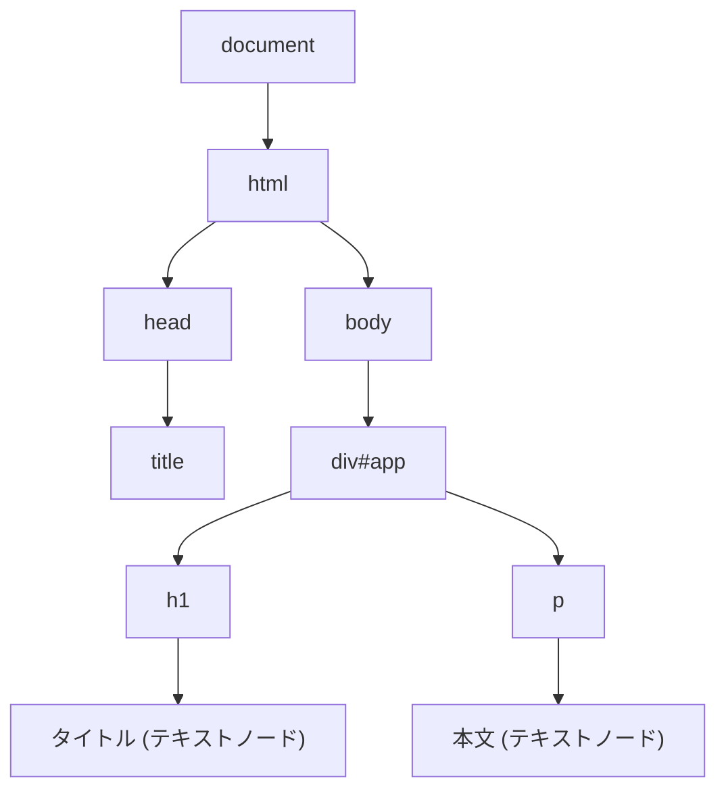
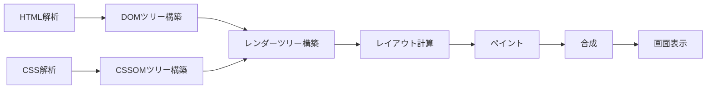
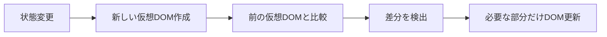

# 4-1. DOMとレンダリング

## 例え話：設計図と模型

- **HTML** = 設計図（文字で書かれた構造）
- **DOM** = 設計図を元に作った模型（操作可能なオブジェクト）
- **レンダリング** = 模型を写真に撮って見せる（画面に描画）

ブラウザは「設計図を読んで模型を作り、それを画面に描く」という作業をしています。

---

## 核心：DOMとは

### HTMLとDOMの違い

```html
<!-- HTML（ただの文字列）-->
<div id="app">
  <h1>タイトル</h1>
  <p>本文</p>
</div>
```

```javascript
// DOM（JavaScriptで操作できるオブジェクト）
document.getElementById('app')
// → HTMLElement オブジェクト

document.querySelector('h1')
// → HTMLHeadingElement オブジェクト

document.querySelector('h1').textContent = '新しいタイトル';
// → 画面が更新される
```

### DOMツリー



---

## レンダリングの流れ

ブラウザがHTMLを受け取ってから画面に表示するまで：



<StepByStep>
1. **HTML解析** - HTMLをパースしてDOMツリーを構築
2. **CSS解析** - CSSをパースしてCSSOMツリーを構築
3. **レンダーツリー構築** - DOMとCSSOMを組み合わせる
4. **レイアウト** - 各要素の位置とサイズを計算
5. **ペイント** - 実際に画面に描画
6. **合成** - レイヤーを重ねて最終的な画面を作成
</StepByStep>

### コードで確認

```html
<!DOCTYPE html>
<html>
<head>
  <style>
    .box { width: 100px; height: 100px; background: red; }
  </style>
</head>
<body>
  <div class="box"></div>

  <script>
    // DOMが構築された後に実行される
    const box = document.querySelector('.box');

    // スタイルを変更 → 再レンダリングが発生
    box.style.background = 'blue';

    // 要素を追加 → 再レンダリングが発生
    const newBox = document.createElement('div');
    newBox.className = 'box';
    newBox.style.background = 'green';
    document.body.appendChild(newBox);
  </script>
</body>
</html>
```

---

## DOM操作の基本

### 要素の取得

```javascript
// ID
const el = document.getElementById('app');

// CSSセレクタ（最初の1つ）
const el = document.querySelector('.item');

// CSSセレクタ（全部）
const els = document.querySelectorAll('.item');

// 関係で取得
el.parentElement    // 親
el.children         // 子要素（HTMLCollectionで返る）
el.firstElementChild // 最初の子
el.nextElementSibling // 次の兄弟
```

### 要素の作成・追加

```javascript
// 作成
const div = document.createElement('div');
div.textContent = 'Hello';
div.className = 'greeting';

// 追加
document.body.appendChild(div);        // 末尾に追加
parent.insertBefore(div, reference);   // referenceの前に追加

// 削除
div.remove();
// または
parent.removeChild(div);
```

### 属性・スタイルの操作

```javascript
// 属性
el.setAttribute('data-id', '123');
el.getAttribute('data-id');  // "123"
el.dataset.id;               // "123"（data-* 属性用）

// クラス
el.classList.add('active');
el.classList.remove('active');
el.classList.toggle('active');
el.classList.contains('active');  // true/false

// スタイル
el.style.backgroundColor = 'red';
el.style.display = 'none';

// 計算済みスタイル（実際に適用されている値）
getComputedStyle(el).backgroundColor;
```

---

## なぜReactを使うのか

<Callout type="info">
**重要な問い**: なぜ素のDOM操作ではなく、Reactのようなライブラリを使うのか？
</Callout>

### 素のDOM操作の問題

```javascript
// TODOリストを表示する
function renderTodos(todos) {
  const list = document.getElementById('todo-list');
  list.innerHTML = '';  // 全部消す

  todos.forEach(todo => {
    const li = document.createElement('li');
    li.textContent = todo.text;
    if (todo.done) {
      li.classList.add('done');
    }
    li.addEventListener('click', () => {
      todo.done = !todo.done;
      renderTodos(todos);  // 全部再描画
    });
    list.appendChild(li);
  });
}

// 問題点：
// - データが変わるたびに全部作り直し → 遅い
// - データとUIの同期を手動で管理 → バグりやすい
// - コードが手続き的で読みにくい
```

### Reactなら

```jsx
function TodoList({ todos, onToggle }) {
  return (
    <ul>
      {todos.map(todo => (
        <li
          key={todo.id}
          className={todo.done ? 'done' : ''}
          onClick={() => onToggle(todo.id)}
        >
          {todo.text}
        </li>
      ))}
    </ul>
  );
}

// メリット：
// - 宣言的（「この状態のときこう見える」を書くだけ）
// - 差分だけ更新（仮想DOM）
// - データとUIが自動で同期
```

---

## 仮想DOM（Virtual DOM）

<WhyButton>
**なぜ仮想DOMを使うのか？**

DOM操作は非常に重いです。特にブラウザのレンダリングを引き起こす操作は遅いため、必要最小限のDOM操作にすることでパフォーマンスを向上させます。
</WhyButton>

### 仕組み



<StepByStep>
1. **状態が変わる** - useStateなどで状態が更新される
2. **新しい仮想DOMを作る** - JavaScriptオブジェクトとして軽量に作成
3. **前の仮想DOMと比較** - 差分検出アルゴリズムを実行
4. **差分だけ実際のDOMに適用** - 変更された部分のみを更新
</StepByStep>

```javascript
// 仮想DOMのイメージ（実際はもっと複雑）
const vdom = {
  type: 'div',
  props: { className: 'app' },
  children: [
    { type: 'h1', props: {}, children: ['タイトル'] },
    { type: 'p', props: {}, children: ['本文'] }
  ]
};
```

### なぜ速いか

```
全部書き換え:
DOM操作 100回 × 遅い = とても遅い

仮想DOM:
JS操作 100回 × 速い + DOM操作 3回 × 遅い = まあまあ速い

※ DOM操作は「ブラウザのレンダリング」を引き起こすので遅い
※ JS操作は「メモリ内のオブジェクト操作」なので速い
```

---

## パフォーマンスの考慮

<Callout type="warning">
**パフォーマンスの注意点**: リフローとリペイントは重い処理です。特にリフローは要素の位置・サイズを再計算するため、できるだけ回数を減らしましょう。
</Callout>

### リフロー（レイアウト再計算）を避ける

```javascript
// 悪い例：何度もリフローが発生
for (let i = 0; i < 100; i++) {
  const div = document.createElement('div');
  document.body.appendChild(div);  // 毎回リフロー
}

// 良い例：一度にまとめる
const fragment = document.createDocumentFragment();
for (let i = 0; i < 100; i++) {
  const div = document.createElement('div');
  fragment.appendChild(div);
}
document.body.appendChild(fragment);  // 1回だけリフロー
```

### レイアウトスラッシング

```javascript
// 悪い例：読み取りと書き込みが交互
elements.forEach(el => {
  const height = el.offsetHeight;  // 読み取り → リフロー
  el.style.height = height + 10 + 'px';  // 書き込み
});

// 良い例：読み取りをまとめてから書き込み
const heights = elements.map(el => el.offsetHeight);
elements.forEach((el, i) => {
  el.style.height = heights[i] + 10 + 'px';
});
```

---

## よくある誤解

<Accordion title="「innerHTMLは悪」は本当？">
場合によります。セキュリティに注意すれば問題ありません。

```javascript
// XSSに注意（ユーザー入力を直接入れない）
el.innerHTML = userInput;  // 危険！

// 信頼できる文字列なら問題ない
el.innerHTML = '<span>固定テキスト</span>';  // OK

// ユーザー入力はtextContentを使う
el.textContent = userInput;  // 安全（HTMLとして解釈されない）
```
</Accordion>

<Accordion title="「仮想DOMは常に速い」は本当？">
オーバーヘッドがあるので、単純なケースでは素のDOM操作の方が速いこともあります。

仮想DOMが有利なのは：
- 複雑なUI
- 頻繁な更新
- 差分が少ない更新
</Accordion>

---

## まとめ

- **DOM** = HTMLを元にブラウザが作るオブジェクトツリー
- **レンダリング** = DOM + CSS → 画面に描画
- **DOM操作は遅い** = 特にリフローを引き起こす操作
- **仮想DOM** = 差分だけDOMを更新する仕組み
- **Reactなどを使う理由** = データとUIの同期を自動化

