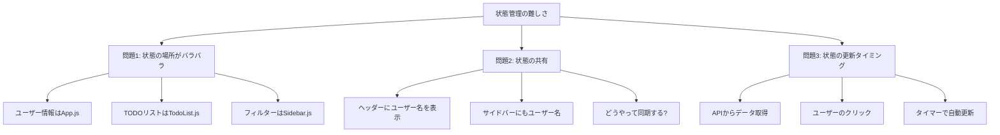
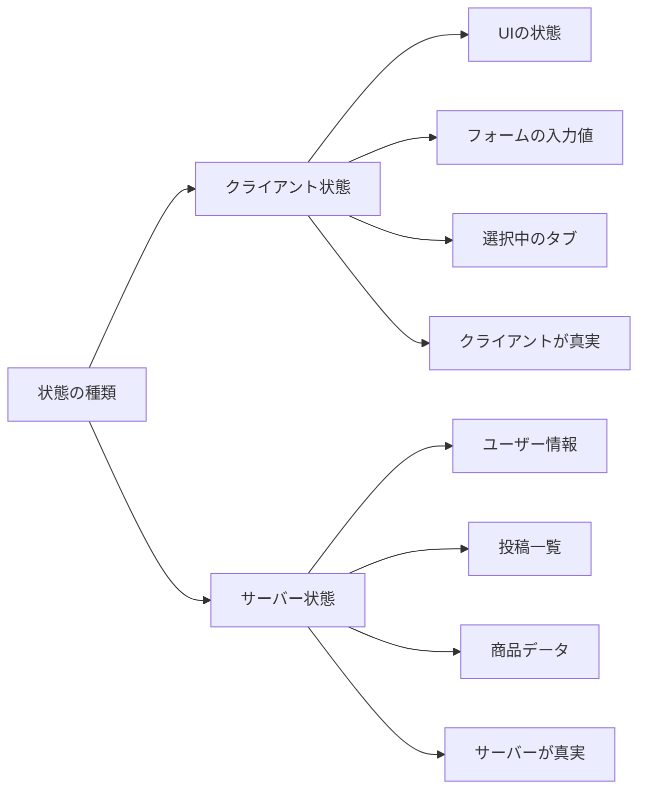
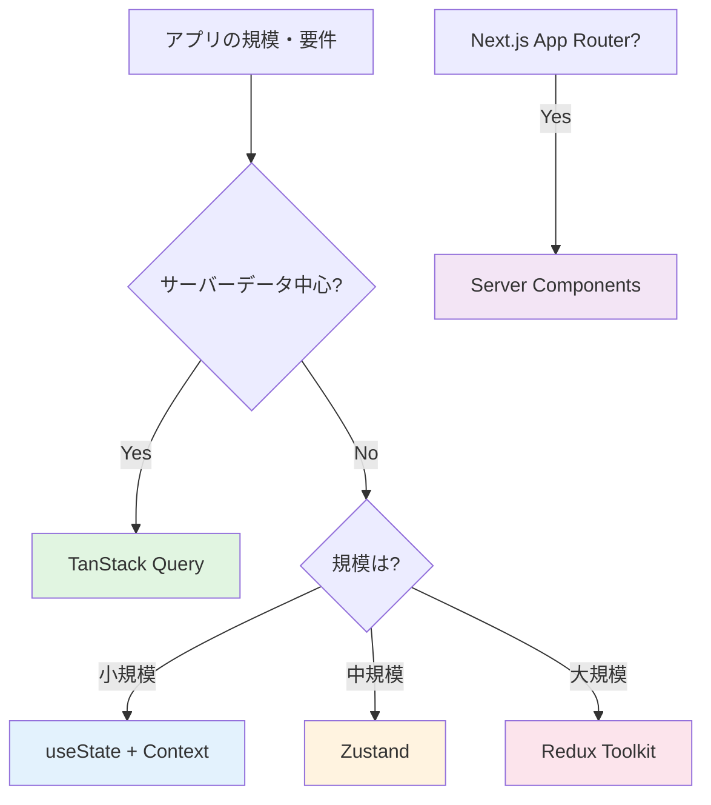

# 4-2. 状態管理

## 例え話：レストランの注文管理

レストランで複数のテーブルの注文を管理することを考えてください。

- **状態（State）**: 今の注文状況（テーブル1はカレー、テーブル2はラーメン）
- **状態変更**: 新しい注文、キャンセル、配膳完了
- **状態管理の難しさ**: 「テーブル1の注文はどこに記録する？誰が更新する？」

小さなレストランなら店員の頭で覚えられますが、大規模になると「注文管理システム」が必要になります。

---

## 核心：なぜ状態管理が難しいのか

### 状態とは

```javascript
// アプリの「今の状態」
const state = {
  user: { id: 1, name: '田中' },
  todos: [
    { id: 1, text: '買い物', done: false },
    { id: 2, text: '掃除', done: true }
  ],
  filter: 'all',  // 'all' | 'active' | 'completed'
  isLoading: false
};
```

### 何が難しいか



<Callout type="warning">
**状態管理が複雑になる3つの理由**:
1. 状態がアプリ全体に散らばる
2. 複数のコンポーネントで同じデータを使いたい
3. 状態の更新が予測不可能になる
</Callout>

---

## Reactでの状態管理

<Tabs>
<TabItem value="useState" label="Level 1: useState">

### ローカル状態

1つのコンポーネント内でだけ使う状態。

```jsx
function Counter() {
  const [count, setCount] = useState(0);

  return (
    <div>
      <p>カウント: {count}</p>
      <button onClick={() => setCount(count + 1)}>+1</button>
    </div>
  );
}

// 良いケース: このコンポーネントでしか使わない状態
// 悪いケース: 他のコンポーネントでも使いたい状態
```

<Callout type="tip">
**使いどころ**: フォームの入力値、モーダルの開閉状態など、そのコンポーネント内だけで完結する状態に使います。
</Callout>

</TabItem>
<TabItem value="props" label="Level 2: Props Drilling">

### Props drilling（バケツリレー）

親から子へ、子から孫へ、状態を渡していく。

```jsx
function App() {
  const [user, setUser] = useState(null);

  return (
    <Layout user={user}>
      <Header user={user} />
      <Main user={user} setUser={setUser} />
      <Footer user={user} />
    </Layout>
  );
}

function Main({ user, setUser }) {
  return (
    <div>
      <Sidebar user={user} />
      <Content user={user} setUser={setUser} />
    </div>
  );
}

function Content({ user, setUser }) {
  return (
    <div>
      <Profile user={user} setUser={setUser} />
    </div>
  );
}

// 問題: MainやContentはuserを「通過させてるだけ」
// → コードが冗長、どこで使ってるかわかりにくい
```

<Callout type="warning">
**Props Drillingの問題点**: 中間のコンポーネントが関係ないpropsを受け渡すだけになり、コードが複雑化します。
</Callout>

</TabItem>
<TabItem value="context" label="Level 3: Context API">

### Context API（グローバル状態）

「どこからでもアクセスできる」状態を作る。

```jsx
// 1. Contextを作成
const UserContext = createContext(null);

// 2. Providerで囲む
function App() {
  const [user, setUser] = useState(null);

  return (
    <UserContext.Provider value={{ user, setUser }}>
      <Layout>
        <Header />
        <Main />
        <Footer />
      </Layout>
    </UserContext.Provider>
  );
}

// 3. 使いたい場所で取り出す
function Profile() {
  const { user, setUser } = useContext(UserContext);

  return (
    <div>
      <p>{user?.name}</p>
      <button onClick={() => setUser(null)}>ログアウト</button>
    </div>
  );
}

// MainやContentを経由しなくていい！
```

<Callout type="success">
**Context APIのメリット**: Props Drillingを解消し、どのコンポーネントからでも状態にアクセスできます。
</Callout>

</TabItem>
</Tabs>

---

## 状態管理ライブラリ

<WhyButton>
**なぜContext APIだけでは不十分なのか？**

Context APIは便利ですが、パフォーマンス上の問題があります。状態が1つでも変わると、そのContextを使っている全コンポーネントが再レンダリングされてしまいます。
</WhyButton>

### なぜ必要か

Context APIの問題点：

```jsx
// 状態が1つでも変わると、全部再レンダリング
<UserContext.Provider value={{ user, todos, settings }}>
  {/* todosが変わると、userしか使ってないコンポーネントも再レンダリング */}
</UserContext.Provider>
```

<Tabs>
<TabItem value="zustand" label="Zustand">

### Zustand（シンプル）

```jsx
import { create } from 'zustand';

// ストアを作成
const useStore = create((set) => ({
  user: null,
  todos: [],

  setUser: (user) => set({ user }),

  addTodo: (text) => set((state) => ({
    todos: [...state.todos, { id: Date.now(), text, done: false }]
  })),

  toggleTodo: (id) => set((state) => ({
    todos: state.todos.map(todo =>
      todo.id === id ? { ...todo, done: !todo.done } : todo
    )
  }))
}));

// 使う
function TodoList() {
  // todosが変わった時だけ再レンダリング
  const todos = useStore(state => state.todos);
  const toggleTodo = useStore(state => state.toggleTodo);

  return (
    <ul>
      {todos.map(todo => (
        <li key={todo.id} onClick={() => toggleTodo(todo.id)}>
          {todo.text}
        </li>
      ))}
    </ul>
  );
}
```

</TabItem>
<TabItem value="redux" label="Redux Toolkit">

### Redux（大規模向け）

```jsx
import { createSlice, configureStore } from '@reduxjs/toolkit';
import { Provider, useSelector, useDispatch } from 'react-redux';

// Sliceを作成
const todosSlice = createSlice({
  name: 'todos',
  initialState: [],
  reducers: {
    addTodo: (state, action) => {
      state.push({ id: Date.now(), text: action.payload, done: false });
    },
    toggleTodo: (state, action) => {
      const todo = state.find(t => t.id === action.payload);
      if (todo) todo.done = !todo.done;
    }
  }
});

// Storeを作成
const store = configureStore({
  reducer: {
    todos: todosSlice.reducer
  }
});

// Providerで囲む
function App() {
  return (
    <Provider store={store}>
      <TodoList />
    </Provider>
  );
}

// 使う
function TodoList() {
  const todos = useSelector(state => state.todos);
  const dispatch = useDispatch();

  return (
    <ul>
      {todos.map(todo => (
        <li key={todo.id} onClick={() => dispatch(todosSlice.actions.toggleTodo(todo.id))}>
          {todo.text}
        </li>
      ))}
    </ul>
  );
}
```

</TabItem>
</Tabs>

---

## サーバー状態 vs クライアント状態

<Callout type="info">
**重要な区別**: 状態には「クライアント状態」と「サーバー状態」の2種類があり、それぞれ異なるアプローチで管理します。
</Callout>

### 違い



<Tabs>
<TabItem value="client" label="クライアント状態">
- UIの状態（モーダルが開いてるか）
- フォームの入力値
- 選択中のタブ
- **特徴**: クライアントだけが知っている

**管理方法**: useState, Context, Zustand, Redux
</TabItem>

<TabItem value="server" label="サーバー状態">
- ユーザー情報
- 投稿一覧
- 商品データ
- **特徴**: サーバーが正確な値を持っている

**管理方法**: TanStack Query（キャッシュ、再取得、同期が必要）
</TabItem>
</Tabs>

### TanStack Query（サーバー状態管理）

```jsx
import { useQuery, useMutation, useQueryClient } from '@tanstack/react-query';

function TodoList() {
  // データ取得（キャッシュ、再取得、ローディング状態を自動管理）
  const { data: todos, isLoading, error } = useQuery({
    queryKey: ['todos'],
    queryFn: () => fetch('/api/todos').then(r => r.json())
  });

  const queryClient = useQueryClient();

  // データ更新
  const mutation = useMutation({
    mutationFn: (newTodo) => fetch('/api/todos', {
      method: 'POST',
      body: JSON.stringify(newTodo)
    }),
    onSuccess: () => {
      // 成功したらキャッシュを更新
      queryClient.invalidateQueries({ queryKey: ['todos'] });
    }
  });

  if (isLoading) return <div>読み込み中...</div>;
  if (error) return <div>エラー: {error.message}</div>;

  return (
    <ul>
      {todos.map(todo => (
        <li key={todo.id}>{todo.text}</li>
      ))}
    </ul>
  );
}
```

---

## 選び方



<Callout type="tip">
**選択のガイドライン**:

- **小規模アプリ・状態が少ない** → useState + Context で十分
- **中規模アプリ・シンプルに保ちたい** → Zustand
- **大規模アプリ・チーム開発・厳密な状態管理** → Redux Toolkit
- **サーバーからのデータが中心** → TanStack Query（+ 最小限のクライアント状態管理）
- **Next.js App Router** → Server Components + 最小限のクライアント状態
</Callout>

---

## よくある誤解

<Accordion title="「Reduxは必須」は本当？">
**いいえ、必須ではありません。** 小さいアプリにReduxは過剰です。useStateとContextで十分なことが多いです。規模と要件に合わせて選びましょう。
</Accordion>

<Accordion title="「全部グローバル状態にすればいい」は本当？">
**いいえ、避けるべきです。**

```jsx
// 悪い例：モーダルの開閉状態をグローバルに
const useStore = create((set) => ({
  isModalOpen: false,  // ← これはローカル状態でいい
  todos: [],
  user: null
}));

// 良い例：必要なものだけグローバルに
// モーダルの開閉は使う場所でuseState
function MyComponent() {
  const [isOpen, setIsOpen] = useState(false);
  // ...
}
```
</Accordion>

<Accordion title="「状態管理ライブラリで全部解決」は本当？">
**いいえ、用途で使い分けが必要です。** サーバー状態はTanStack Queryなど専用ツールの方が適切です。クライアント状態とサーバー状態を混同しないようにしましょう。
</Accordion>

---

## まとめ

- **状態** = アプリの「今の状態」を表すデータ
- **難しさ** = 場所、共有、更新タイミングの管理
- **useState** = ローカル状態に
- **Context** = Props drillingを避ける
- **Zustand/Redux** = 複雑なクライアント状態に
- **TanStack Query** = サーバー状態に
- **選び方** = 規模と用途に合わせて

---

## サンプルコード

この章の内容を実際に動かして試せるサンプルコードを用意しています。

- [状態管理デモ（React）](https://github.com/minaaaa3/study-memo/tree/main/samples/client/02-state-management) - useState / Context / Zustand / Redux を切り替えて比較できるアプリ

