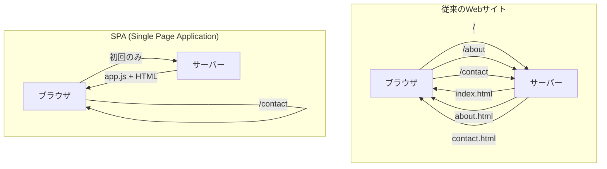
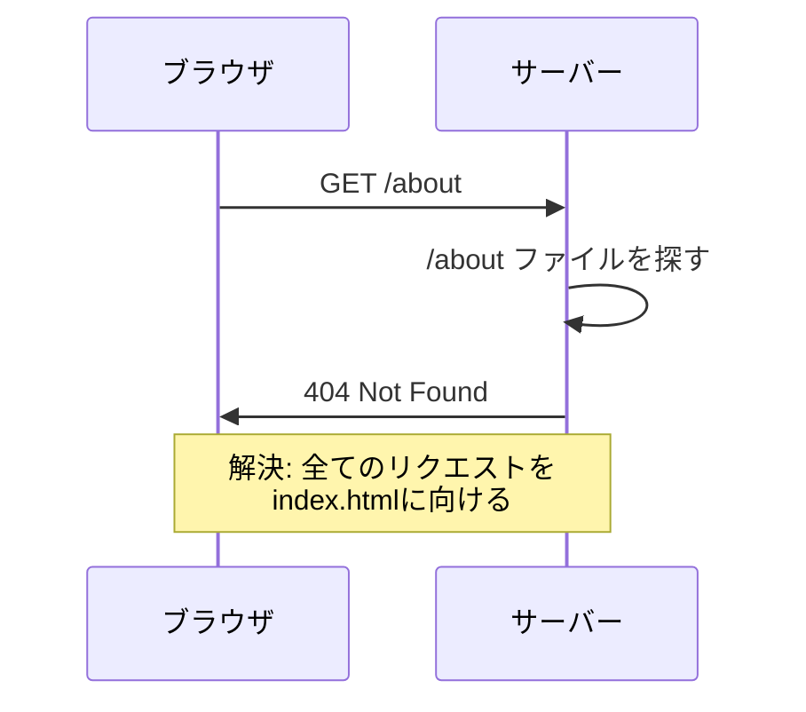

# 4-3. ルーティング

## 例え話：本の目次

ルーティングは「本の目次」のようなものです。

- **URL** = ページ番号（「42ページを開いて」）
- **ルーター** = 目次（「42ページは第3章です」）
- **コンポーネント** = 各章の内容

URLを見て、対応するページを表示する仕組みがルーティングです。

---

## 核心：SPAでのルーティング



<Tabs>
<TabItem value="traditional" label="従来のWebサイト">

### 従来のWebサイト

```
/          → index.html をサーバーから取得
/about     → about.html をサーバーから取得
/contact   → contact.html をサーバーから取得

毎回サーバーに問い合わせ、ページ全体を読み込み直す
```

**特徴**:
- ページ遷移のたびにサーバーとの通信が発生
- ページ全体がリロードされる
- 遷移時に画面が白くなる

</TabItem>
<TabItem value="spa" label="SPA">

### SPA（Single Page Application）

```
/          → 同じHTML + JavaScriptで表示を切り替え
/about     → 同じHTML + JavaScriptで表示を切り替え
/contact   → 同じHTML + JavaScriptで表示を切り替え

サーバーに問い合わせず、JavaScriptで画面を切り替える
```

**特徴**:
- 初回のみサーバーからアプリをダウンロード
- ページ遷移はJavaScriptで画面を書き換え
- スムーズな画面遷移

</TabItem>
</Tabs>

---

## History API

<WhyButton>
**なぜHistory APIが必要なのか？**

SPAではページ遷移せずに画面を切り替えますが、URLも変更しないとブラウザの戻るボタンが使えません。History APIを使えば、ページをリロードせずにURLを変更できます。
</WhyButton>

SPAルーティングの基盤となるブラウザAPI。

### pushState

```javascript
// URLを変更（ページ遷移なし）
history.pushState({ page: 'about' }, '', '/about');
// → URLバーが /about に変わるが、リロードは起きない

// 状態オブジェクト: 任意のデータを保存
// タイトル: 多くのブラウザで無視される
// URL: 新しいURL
```

### popstate イベント

```javascript
// ブラウザの戻る/進むボタンを押したとき
window.addEventListener('popstate', (event) => {
  console.log('移動先:', event.state);
  // event.state には pushState で保存したデータが入っている
});
```

### 自前ルーター（最小実装）

```javascript
// 超シンプルなルーター
const routes = {
  '/': () => '<h1>ホーム</h1>',
  '/about': () => '<h1>このサイトについて</h1>',
  '/contact': () => '<h1>お問い合わせ</h1>'
};

function navigate(path) {
  history.pushState(null, '', path);
  render();
}

function render() {
  const path = window.location.pathname;
  const content = routes[path] || (() => '<h1>404</h1>');
  document.getElementById('app').innerHTML = content();
}

// 戻る/進むボタン対応
window.addEventListener('popstate', render);

// 初回表示
render();
```

```html
<nav>
  <a href="/" onclick="event.preventDefault(); navigate('/')">ホーム</a>
  <a href="/about" onclick="event.preventDefault(); navigate('/about')">About</a>
</nav>
<div id="app"></div>
```

---

## React Router

Reactで最も使われるルーティングライブラリ。

### 基本的な使い方

```jsx
import { BrowserRouter, Routes, Route, Link, useParams } from 'react-router-dom';

function App() {
  return (
    <BrowserRouter>
      <nav>
        <Link to="/">ホーム</Link>
        <Link to="/about">About</Link>
        <Link to="/users">ユーザー</Link>
      </nav>

      <Routes>
        <Route path="/" element={<Home />} />
        <Route path="/about" element={<About />} />
        <Route path="/users" element={<UserList />} />
        <Route path="/users/:id" element={<UserDetail />} />
        <Route path="*" element={<NotFound />} />
      </Routes>
    </BrowserRouter>
  );
}

function Home() {
  return <h1>ホーム</h1>;
}

function About() {
  return <h1>このサイトについて</h1>;
}

// パラメータを取得
function UserDetail() {
  const { id } = useParams();
  return <h1>ユーザー {id} の詳細</h1>;
}

function NotFound() {
  return <h1>404 - ページが見つかりません</h1>;
}
```

### プログラムでの遷移

```jsx
import { useNavigate } from 'react-router-dom';

function LoginButton() {
  const navigate = useNavigate();

  const handleLogin = async () => {
    await login();
    navigate('/dashboard');  // ログイン後に遷移
  };

  return <button onClick={handleLogin}>ログイン</button>;
}
```

### ネストされたルート

```jsx
function App() {
  return (
    <Routes>
      <Route path="/" element={<Layout />}>
        <Route index element={<Home />} />
        <Route path="about" element={<About />} />
        <Route path="users" element={<Users />}>
          <Route index element={<UserList />} />
          <Route path=":id" element={<UserDetail />} />
        </Route>
      </Route>
    </Routes>
  );
}

function Layout() {
  return (
    <div>
      <Header />
      <main>
        <Outlet />  {/* 子ルートがここに表示される */}
      </main>
      <Footer />
    </div>
  );
}

function Users() {
  return (
    <div>
      <h1>ユーザー</h1>
      <Outlet />  {/* UserList か UserDetail が表示される */}
    </div>
  );
}
```

### 保護されたルート

```jsx
function ProtectedRoute({ children }) {
  const { user } = useAuth();
  const location = useLocation();

  if (!user) {
    // 未ログインならログインページへ
    return <Navigate to="/login" state={{ from: location }} replace />;
  }

  return children;
}

// 使用
<Route
  path="/dashboard"
  element={
    <ProtectedRoute>
      <Dashboard />
    </ProtectedRoute>
  }
/>
```

---

## Next.js のルーティング

<Callout type="info">
**ファイルベースルーティング**: Next.jsではファイル構造がそのままURLになります。React Routerのように設定ファイルを書く必要がありません。
</Callout>

ファイルベースルーティング。ファイル構造がそのままURLになる。

<Tabs>
<TabItem value="pages" label="Pages Router (旧)">

### Pages Router（従来）

```
pages/
├── index.js        → /
├── about.js        → /about
├── users/
│   ├── index.js    → /users
│   └── [id].js     → /users/123
└── api/
    └── users.js    → /api/users（APIエンドポイント）
```

```jsx
// pages/users/[id].js
import { useRouter } from 'next/router';

export default function UserDetail() {
  const router = useRouter();
  const { id } = router.query;

  return <h1>ユーザー {id}</h1>;
}
```

</TabItem>
<TabItem value="app" label="App Router (新)">

### App Router（新しい方式）

```
app/
├── page.js           → /
├── about/
│   └── page.js       → /about
├── users/
│   ├── page.js       → /users
│   └── [id]/
│       └── page.js   → /users/123
└── layout.js         → 全ページ共通のレイアウト
```

```jsx
// app/users/[id]/page.js
export default function UserDetail({ params }) {
  return <h1>ユーザー {params.id}</h1>;
}
```

</TabItem>
</Tabs>

<Callout type="tip">
**推奨**: 新規プロジェクトではApp Routerを使いましょう。Server Componentsなどの新機能が使えます。
</Callout>

---

## クエリパラメータ

```jsx
// URL: /search?q=react&page=2

import { useSearchParams } from 'react-router-dom';

function Search() {
  const [searchParams, setSearchParams] = useSearchParams();

  const query = searchParams.get('q');      // "react"
  const page = searchParams.get('page');    // "2"

  const handleSearch = (newQuery) => {
    setSearchParams({ q: newQuery, page: 1 });
  };

  return (
    <div>
      <input
        value={query || ''}
        onChange={(e) => handleSearch(e.target.value)}
      />
      <p>検索: {query}, ページ: {page}</p>
    </div>
  );
}
```

---

## よくある問題

<Callout type="warning">
**SPAの落とし穴**: リロードすると404エラーになることがあります。
</Callout>

### リロードすると404



<StepByStep>
1. ユーザーが /about にアクセス
2. サーバーは /about というファイルを探す
3. そんなファイルはない → 404エラー
4. **解決策**: 全てのリクエストを index.html に向ける設定
</StepByStep>

```nginx
# Nginx
location / {
  try_files $uri /index.html;
}
```

### スクロール位置

```jsx
// ページ遷移時に先頭にスクロール
import { useEffect } from 'react';
import { useLocation } from 'react-router-dom';

function ScrollToTop() {
  const { pathname } = useLocation();

  useEffect(() => {
    window.scrollTo(0, 0);
  }, [pathname]);

  return null;
}

// App内で使用
<BrowserRouter>
  <ScrollToTop />
  <Routes>...</Routes>
</BrowserRouter>
```

---

## よくある誤解

<Accordion title="「SPAは遷移が速い」は本当？">
**必ずしもそうではありません。**

```
SPA:
- 初回: 全JSを読み込み（遅い）
- 遷移: JSで切り替え（速い）

SSR/SSG:
- 初回: そのページだけ読み込み（速い）
- 遷移: 次のページを読み込み（まあまあ）
```

Next.jsなどは「プリフェッチ」で遷移も速くしています。
</Accordion>

<Accordion title="「ルーティングは難しい」は本当？">
**いいえ、基本はシンプルです。** 基本は「URLとコンポーネントの対応」です。React RouterやNext.jsなどのライブラリを使えばシンプルに書けます。
</Accordion>

---

## まとめ

- **ルーティング** = URLと表示内容の対応付け
- **History API** = ブラウザのURL操作API
- **SPAルーティング** = ページ遷移なしでURLと画面を変更
- **React Router** = Reactでの標準的なルーティングライブラリ
- **Next.js** = ファイルベースルーティング

---

## サンプルコード

この章の内容を実際に動かして試せるサンプルコードを用意しています。

- [ルーティングサンプル](/samples/client/05-routing) - 基本 / ネスト / 動的ルート / 認証保護 / ナビゲーション

