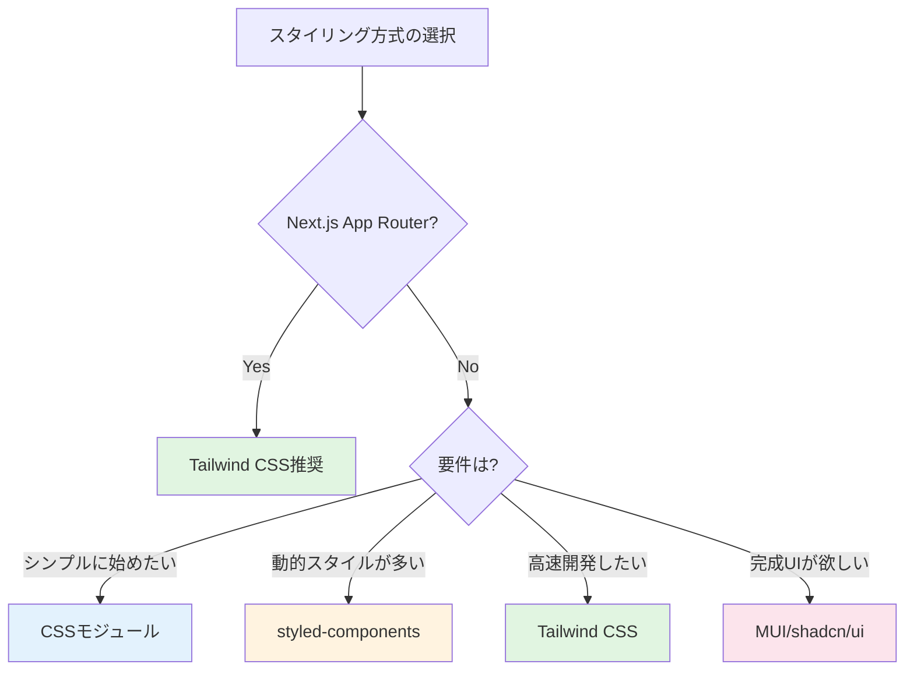

# 4-4. スタイリング

## 例え話：服のコーディネート

スタイリングの方法は、服の選び方に似ています。

- **素のCSS** = 自分で一から服を選ぶ。自由だが大変
- **CSSフレームワーク** = ユニクロ。シンプルで使いやすい
- **CSS-in-JS** = オーダーメイド。その場で作る
- **Tailwind CSS** = パーツを組み合わせる。レゴブロック的

---

## 方式の比較

| 方式 | 特徴 | 代表例 |
|------|------|--------|
| 素のCSS | シンプル、学習コスト低 | - |
| CSSモジュール | スコープ付きCSS | *.module.css |
| CSS-in-JS | JSでスタイル定義 | styled-components, Emotion |
| ユーティリティCSS | クラスを組み合わせ | Tailwind CSS |
| UIライブラリ | 完成済みコンポーネント | MUI, shadcn/ui |

---

## 同じボタンを4つの方式で作る

<Callout type="info">
**比較してみよう**: 同じボタンを4つの異なる方式で実装して、それぞれの特徴を理解しましょう。
</Callout>

<Tabs>
<TabItem value="vanilla" label="素のCSS">

### 素のCSS

```css
/* button.css */
.button {
  padding: 8px 16px;
  background-color: #3b82f6;
  color: white;
  border: none;
  border-radius: 4px;
  cursor: pointer;
}
.button:hover {
  background-color: #2563eb;
}
.button:disabled {
  opacity: 0.5;
  cursor: not-allowed;
}
.button-secondary {
  background-color: #6b7280;
}
.button-secondary:hover {
  background-color: #4b5563;
}
```

```jsx
import './button.css';

function Button({ variant = 'primary', disabled, children }) {
  const className = variant === 'secondary'
    ? 'button button-secondary'
    : 'button';
  return <button className={className} disabled={disabled}>{children}</button>;
}
```

**問題**: クラス名が衝突する可能性、ファイルを行き来する必要

</TabItem>
<TabItem value="modules" label="CSSモジュール">

### CSSモジュール

```css
/* Button.module.css */
.button {
  padding: 8px 16px;
  background-color: #3b82f6;
  color: white;
  border: none;
  border-radius: 4px;
}
.button:hover { background-color: #2563eb; }
.secondary { background-color: #6b7280; }
.secondary:hover { background-color: #4b5563; }
```

```jsx
import styles from './Button.module.css';
import clsx from 'clsx';

function Button({ variant = 'primary', disabled, children }) {
  return (
    <button
      className={clsx(styles.button, variant === 'secondary' && styles.secondary)}
      disabled={disabled}
    >
      {children}
    </button>
  );
}
```

**良い点**: クラス名の衝突なし、CSSの書き方そのまま

</TabItem>
<TabItem value="styled" label="CSS-in-JS">

### CSS-in-JS（styled-components）

```jsx
import styled from 'styled-components';

const StyledButton = styled.button`
  padding: 8px 16px;
  background-color: ${props => props.$secondary ? '#6b7280' : '#3b82f6'};
  color: white;
  border: none;
  border-radius: 4px;
  cursor: pointer;

  &:hover {
    background-color: ${props => props.$secondary ? '#4b5563' : '#2563eb'};
  }
  &:disabled {
    opacity: 0.5;
    cursor: not-allowed;
  }
`;

function Button({ variant = 'primary', disabled, children }) {
  return (
    <StyledButton $secondary={variant === 'secondary'} disabled={disabled}>
      {children}
    </StyledButton>
  );
}
```

**良い点**: propsで動的にスタイル変更、ファイル1つで完結

</TabItem>
<TabItem value="tailwind" label="Tailwind CSS">

### Tailwind CSS

```jsx
import clsx from 'clsx';

function Button({ variant = 'primary', disabled, children }) {
  return (
    <button
      className={clsx(
        'px-4 py-2 rounded text-white',
        variant === 'primary' && 'bg-blue-500 hover:bg-blue-600',
        variant === 'secondary' && 'bg-gray-500 hover:bg-gray-600',
        disabled && 'opacity-50 cursor-not-allowed'
      )}
      disabled={disabled}
    >
      {children}
    </button>
  );
}
```

**良い点**: CSSファイル不要、クラス名を見ればスタイルがわかる

</TabItem>
</Tabs>

---

## コード量の比較

| 方式 | JSファイル | CSSファイル | 合計行数 |
|------|-----------|------------|----------|
| 素のCSS | 5行 | 20行 | 25行 |
| CSSモジュール | 10行 | 10行 | 20行 |
| CSS-in-JS | 20行 | 0行 | 20行 |
| Tailwind | 15行 | 0行 | 15行 |

**結論**: どれが「正解」ではなく、チームやプロジェクトに合った方法を選ぶ

---

## 素のCSS

### グローバルCSS

```css
/* styles.css */
.button {
  padding: 10px 20px;
  background-color: blue;
  color: white;
  border: none;
  border-radius: 4px;
}

.button:hover {
  background-color: darkblue;
}
```

```jsx
import './styles.css';

function Button({ children }) {
  return <button className="button">{children}</button>;
}
```

### 問題点

```css
/* 別のファイルでも .button を定義 */
.button {
  background-color: red;  /* 競合！ */
}
```

グローバルなので、クラス名が衝突する可能性があります。

---

## CSSモジュール

クラス名を自動でユニークにしてくれる。

```css
/* Button.module.css */
.button {
  padding: 10px 20px;
  background-color: blue;
  color: white;
}

.primary {
  background-color: blue;
}

.secondary {
  background-color: gray;
}
```

```jsx
import styles from './Button.module.css';

function Button({ variant = 'primary', children }) {
  return (
    <button className={`${styles.button} ${styles[variant]}`}>
      {children}
    </button>
  );
}

// 実際に出力されるクラス名: "Button_button_x7d2s Button_primary_a3f1k"
// → 絶対に衝突しない
```

### clsx / classnames

複数クラスの条件付き結合を簡単に。

```jsx
import clsx from 'clsx';
import styles from './Button.module.css';

function Button({ variant, disabled, children }) {
  return (
    <button
      className={clsx(
        styles.button,
        styles[variant],
        { [styles.disabled]: disabled }
      )}
    >
      {children}
    </button>
  );
}
```

---

## CSS-in-JS

JavaScriptの中でスタイルを定義。

### styled-components

```jsx
import styled from 'styled-components';

// スタイル付きコンポーネントを作成
const Button = styled.button`
  padding: 10px 20px;
  background-color: ${props => props.$primary ? 'blue' : 'gray'};
  color: white;
  border: none;
  border-radius: 4px;

  &:hover {
    opacity: 0.8;
  }
`;

// 使用
function App() {
  return (
    <div>
      <Button $primary>Primary</Button>
      <Button>Secondary</Button>
    </div>
  );
}
```

### Emotion

```jsx
/** @jsxImportSource @emotion/react */
import { css } from '@emotion/react';

const buttonStyle = css`
  padding: 10px 20px;
  background-color: blue;
  color: white;
`;

function Button({ children }) {
  return <button css={buttonStyle}>{children}</button>;
}

// または styled API
import styled from '@emotion/styled';

const Button = styled.button`
  padding: 10px 20px;
`;
```

### メリット・デメリット

```
メリット:
- propsに応じた動的スタイル
- 自動でスコープが分離
- コンポーネントとスタイルが同じファイル

デメリット:
- ランタイムコスト（実行時にCSSを生成）
- バンドルサイズ増加
- SSRの設定が複雑なことも
```

---

## Tailwind CSS

ユーティリティクラスを組み合わせてスタイリング。

### 基本

```jsx
function Button({ children }) {
  return (
    <button className="px-4 py-2 bg-blue-500 text-white rounded hover:bg-blue-600">
      {children}
    </button>
  );
}

// px-4: padding-left/right: 1rem
// py-2: padding-top/bottom: 0.5rem
// bg-blue-500: background-color: #3b82f6
// text-white: color: white
// rounded: border-radius: 0.25rem
// hover:bg-blue-600: ホバー時の背景色
```

### 条件付きクラス

```jsx
import clsx from 'clsx';

function Button({ variant = 'primary', disabled, children }) {
  return (
    <button
      className={clsx(
        'px-4 py-2 rounded font-medium',
        {
          'bg-blue-500 text-white hover:bg-blue-600': variant === 'primary',
          'bg-gray-200 text-gray-800 hover:bg-gray-300': variant === 'secondary',
          'opacity-50 cursor-not-allowed': disabled,
        }
      )}
      disabled={disabled}
    >
      {children}
    </button>
  );
}
```

### カスタムクラスを作る

```css
/* globals.css */
@tailwind base;
@tailwind components;
@tailwind utilities;

@layer components {
  .btn {
    @apply px-4 py-2 rounded font-medium;
  }

  .btn-primary {
    @apply bg-blue-500 text-white hover:bg-blue-600;
  }
}
```

```jsx
<button className="btn btn-primary">Button</button>
```

### メリット・デメリット

```
メリット:
- HTMLだけで完結（CSSファイルを行き来しない）
- 一貫したデザインシステム
- ビルド時に未使用CSSを削除（小さいバンドル）
- 学習後は高速に開発

デメリット:
- クラス名が長くなりがち
- 最初は覚えることが多い
- デザイナーとの協業時に注意
```

---

## UIライブラリ

### MUI（Material UI）

```jsx
import { Button, TextField, Card } from '@mui/material';

function LoginForm() {
  return (
    <Card sx={{ p: 3, maxWidth: 400 }}>
      <TextField label="Email" fullWidth margin="normal" />
      <TextField label="Password" type="password" fullWidth margin="normal" />
      <Button variant="contained" fullWidth sx={{ mt: 2 }}>
        Login
      </Button>
    </Card>
  );
}
```

### shadcn/ui

```jsx
// コンポーネントをプロジェクトにコピーして使う
import { Button } from '@/components/ui/button';
import { Card, CardContent, CardHeader, CardTitle } from '@/components/ui/card';
import { Input } from '@/components/ui/input';

function LoginForm() {
  return (
    <Card className="w-[400px]">
      <CardHeader>
        <CardTitle>Login</CardTitle>
      </CardHeader>
      <CardContent className="space-y-4">
        <Input placeholder="Email" />
        <Input type="password" placeholder="Password" />
        <Button className="w-full">Login</Button>
      </CardContent>
    </Card>
  );
}
```

---

## 選び方



<Callout type="tip">
**選択のガイドライン**:

- **シンプルに始めたい・小規模** → CSSモジュール
- **動的なスタイルが多い・コンポーネント単位で管理** → styled-components / Emotion
- **高速に開発・デザインシステムを統一** → Tailwind CSS
- **すぐに使えるUIが欲しい・プロトタイプ** → MUI / shadcn/ui
- **Next.js App Router** → Tailwind CSS（CSS-in-JSはサーバーコンポーネントと相性が悪い）
</Callout>

---

## レスポンシブデザイン

### メディアクエリ（CSS）

```css
.container {
  padding: 10px;
}

@media (min-width: 768px) {
  .container {
    padding: 20px;
  }
}

@media (min-width: 1024px) {
  .container {
    padding: 40px;
  }
}
```

### Tailwind

```jsx
<div className="p-2 md:p-5 lg:p-10">
  {/*
    デフォルト: p-2 (padding: 0.5rem)
    768px以上: md:p-5 (padding: 1.25rem)
    1024px以上: lg:p-10 (padding: 2.5rem)
  */}
</div>
```

---

## よくある誤解

<Accordion title="「Tailwindはインラインスタイルと同じ」は本当？">
**いいえ、全く違います。**

```html
<!-- インラインスタイル -->
<div style="padding: 10px; margin: 20px;">
  再利用できない、メディアクエリ使えない、擬似クラス使えない
</div>

<!-- Tailwind -->
<div class="p-2 m-5 hover:bg-gray-100 md:p-4">
  設計されたシステム、hover対応、レスポンシブ対応
</div>
```
</Accordion>

<Accordion title="「CSS-in-JSは遅い」は本当？">
**昔は遅かったですが、最近のライブラリは改善されています。** 最近のライブラリはランタイムコストを最小化しています。ただし、パフォーマンスが非常に重要な場合はTailwindの方が有利です。
</Accordion>

---

## まとめ

- **CSSモジュール** = スコープ付きCSS。シンプルで堅実
- **CSS-in-JS** = JS内でスタイル定義。動的に強い
- **Tailwind** = ユーティリティクラス。高速開発
- **UIライブラリ** = 完成済みコンポーネント
- **選び方** = プロジェクトの規模と要件に合わせて

---

## サンプルコード

この章の内容を実際に動かして試せるサンプルコードを用意しています。

- [スタイリング比較サンプル](/samples/client/06-styling) - vanilla CSS / CSS Modules / styled-components / Tailwind CSS

