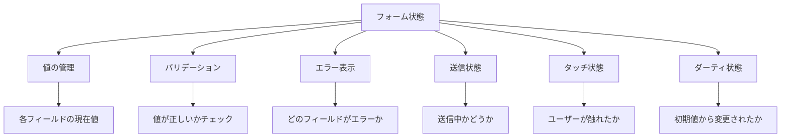
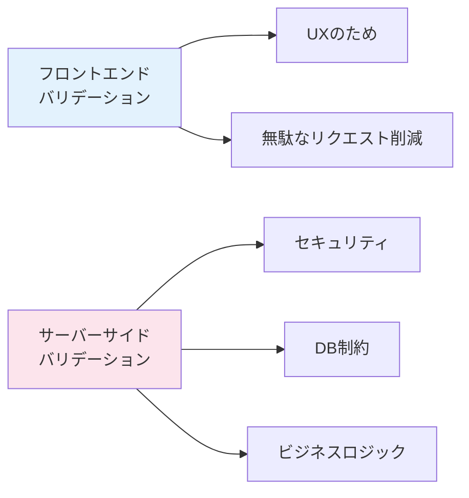

# 4-6. フォームとバリデーション

## 例え話：申込書の記入

フォームは「申込書」のようなものです。

- **入力フィールド**: 氏名欄、住所欄など
- **バリデーション**: 「必須項目です」「電話番号の形式が違います」
- **送信**: 記入が終わったら提出

紙の申込書と違い、Webフォームは「入力中にリアルタイムでチェック」できます。

---

## 核心：フォームの難しさ

### Reactでフォームが難しい理由

```jsx
// 素朴な実装
function LoginForm() {
  const [email, setEmail] = useState('');
  const [password, setPassword] = useState('');
  const [emailError, setEmailError] = useState('');
  const [passwordError, setPasswordError] = useState('');
  const [isSubmitting, setIsSubmitting] = useState(false);

  // フィールドが増えると...
  // - useStateが増える
  // - バリデーションロジックが散らばる
  // - 似たようなコードの繰り返し
}
```

### 管理すべきこと



<Callout type="warning">
**フォームの複雑さ**: 単純に見えるフォームでも、実は6種類以上の状態を管理する必要があります。
</Callout>

---

## バリデーションのタイミング

<WhyButton>
**なぜタイミングが重要なのか？**

早すぎるバリデーションはユーザーを苛立たせ、遅すぎるバリデーションは送信後にエラーが表示されてUXが悪くなります。適切なタイミングが重要です。
</WhyButton>

### いつチェックするか

<Tabs>
<TabItem value="submit" label="送信時 (submit)">
ユーザーが送信ボタンを押したとき、全フィールドを一括チェック

**メリット**: 入力中に邪魔しない
**デメリット**: エラーに気づくのが遅い
</TabItem>

<TabItem value="blur" label="フォーカスが外れたとき (blur)">
フィールドから離れたとき、そのフィールドだけチェック

**メリット**: 入力完了後すぐにフィードバック
**デメリット**: まだ入力途中でエラーが出ることも
</TabItem>

<TabItem value="change" label="入力中 (change)">
キーを打つたびにチェック

**メリット**: リアルタイムフィードバック
**デメリット**: 負荷が高い、入力中にエラーが表示される
</TabItem>
</Tabs>

### ベストプラクティス

<StepByStep>
1. **初回は submit 時にチェック** - ユーザーの入力を邪魔しない
2. **エラーになったフィールドは change でリアルタイムチェック** - 修正をすぐに確認できる
3. **エラーが解消されたら表示を消す** - 即座にフィードバック
</StepByStep>

---

## 素のReactでの実装

```jsx
function RegisterForm() {
  const [values, setValues] = useState({
    email: '',
    password: '',
    confirmPassword: '',
  });
  const [errors, setErrors] = useState({});
  const [touched, setTouched] = useState({});
  const [isSubmitting, setIsSubmitting] = useState(false);

  // バリデーションルール
  const validate = (name, value) => {
    switch (name) {
      case 'email':
        if (!value) return 'メールは必須です';
        if (!/\S+@\S+\.\S+/.test(value)) return 'メール形式が正しくありません';
        return '';
      case 'password':
        if (!value) return 'パスワードは必須です';
        if (value.length < 8) return 'パスワードは8文字以上';
        return '';
      case 'confirmPassword':
        if (value !== values.password) return 'パスワードが一致しません';
        return '';
      default:
        return '';
    }
  };

  // 入力時
  const handleChange = (e) => {
    const { name, value } = e.target;
    setValues(prev => ({ ...prev, [name]: value }));

    // 既にエラーがあればリアルタイムでチェック
    if (errors[name]) {
      setErrors(prev => ({ ...prev, [name]: validate(name, value) }));
    }
  };

  // フォーカスが外れたとき
  const handleBlur = (e) => {
    const { name, value } = e.target;
    setTouched(prev => ({ ...prev, [name]: true }));
    setErrors(prev => ({ ...prev, [name]: validate(name, value) }));
  };

  // 送信時
  const handleSubmit = async (e) => {
    e.preventDefault();

    // 全フィールドをチェック
    const newErrors = {};
    Object.keys(values).forEach(name => {
      const error = validate(name, values[name]);
      if (error) newErrors[name] = error;
    });

    setErrors(newErrors);
    setTouched({ email: true, password: true, confirmPassword: true });

    if (Object.keys(newErrors).length > 0) return;

    // 送信処理
    setIsSubmitting(true);
    try {
      await api.post('/register', values);
      alert('登録完了！');
    } catch (error) {
      setErrors({ submit: error.message });
    } finally {
      setIsSubmitting(false);
    }
  };

  return (
    <form onSubmit={handleSubmit}>
      <div>
        <input
          name="email"
          value={values.email}
          onChange={handleChange}
          onBlur={handleBlur}
          placeholder="メールアドレス"
        />
        {touched.email && errors.email && (
          <span className="error">{errors.email}</span>
        )}
      </div>

      <div>
        <input
          name="password"
          type="password"
          value={values.password}
          onChange={handleChange}
          onBlur={handleBlur}
          placeholder="パスワード"
        />
        {touched.password && errors.password && (
          <span className="error">{errors.password}</span>
        )}
      </div>

      <div>
        <input
          name="confirmPassword"
          type="password"
          value={values.confirmPassword}
          onChange={handleChange}
          onBlur={handleBlur}
          placeholder="パスワード（確認）"
        />
        {touched.confirmPassword && errors.confirmPassword && (
          <span className="error">{errors.confirmPassword}</span>
        )}
      </div>

      {errors.submit && <div className="error">{errors.submit}</div>}

      <button type="submit" disabled={isSubmitting}>
        {isSubmitting ? '送信中...' : '登録'}
      </button>
    </form>
  );
}
```

**問題点:**
- コードが長い
- フィールドが増えると管理が大変
- バリデーションロジックが分散

---

## Zod：スキーマバリデーション

### Zodとは

バリデーションルールを「スキーマ」として定義するライブラリ。

```bash
npm install zod
```

### 基本的な使い方

```typescript
import { z } from 'zod';

// スキーマ定義
const userSchema = z.object({
  email: z.string().email('メール形式が正しくありません'),
  password: z.string().min(8, '8文字以上必要です'),
  age: z.number().min(0).max(150),
});

// バリデーション
const result = userSchema.safeParse({
  email: 'test@example.com',
  password: '12345678',
  age: 25,
});

if (result.success) {
  console.log('OK:', result.data);
} else {
  console.log('エラー:', result.error.errors);
}
```

### よく使うバリデーション

```typescript
import { z } from 'zod';

// 文字列
z.string()
  .min(1, '必須です')
  .max(100, '100文字以内')
  .email('メール形式で入力')
  .url('URL形式で入力')
  .regex(/^[0-9]+$/, '数字のみ')

// 数値
z.number()
  .min(0, '0以上')
  .max(100, '100以下')
  .positive('正の数')
  .int('整数のみ')

// オプショナル
z.string().optional()  // undefined許可
z.string().nullable()  // null許可
z.string().nullish()   // undefined と null 許可

// 配列
z.array(z.string()).min(1, '1つ以上必要')

// Enum
z.enum(['draft', 'published', 'archived'])

// Union
z.union([z.string(), z.number()])

// 条件付きバリデーション
const schema = z.object({
  password: z.string().min(8),
  confirmPassword: z.string(),
}).refine(
  (data) => data.password === data.confirmPassword,
  {
    message: 'パスワードが一致しません',
    path: ['confirmPassword'],
  }
);
```

### 型の自動推論

```typescript
const userSchema = z.object({
  email: z.string().email(),
  age: z.number().optional(),
});

// スキーマから型を生成
type User = z.infer<typeof userSchema>;
// { email: string; age?: number }

// TypeScriptの型として使える
const user: User = {
  email: 'test@example.com',
};
```

---

## React Hook Form

### React Hook Formとは

フォーム状態管理のライブラリ。再レンダリングを最小限に抑える設計。

```bash
npm install react-hook-form @hookform/resolvers
```

### 基本的な使い方

```jsx
import { useForm } from 'react-hook-form';

function LoginForm() {
  const {
    register,
    handleSubmit,
    formState: { errors, isSubmitting },
  } = useForm();

  const onSubmit = (data) => {
    console.log(data);  // { email: '...', password: '...' }
  };

  return (
    <form onSubmit={handleSubmit(onSubmit)}>
      <input
        {...register('email', {
          required: 'メールは必須です',
          pattern: {
            value: /\S+@\S+\.\S+/,
            message: 'メール形式が正しくありません',
          },
        })}
        placeholder="メール"
      />
      {errors.email && <span>{errors.email.message}</span>}

      <input
        type="password"
        {...register('password', {
          required: 'パスワードは必須です',
          minLength: {
            value: 8,
            message: '8文字以上必要です',
          },
        })}
        placeholder="パスワード"
      />
      {errors.password && <span>{errors.password.message}</span>}

      <button type="submit" disabled={isSubmitting}>
        ログイン
      </button>
    </form>
  );
}
```

### register の仕組み

```jsx
// register('email') は以下を返す
{
  name: 'email',
  onChange: [Function],
  onBlur: [Function],
  ref: [Function],
}

// スプレッドすると input に必要な属性が設定される
<input {...register('email')} />
// ↓ 展開すると
<input
  name="email"
  onChange={...}
  onBlur={...}
  ref={...}
/>
```

---

## React Hook Form + Zod

<Callout type="success">
**推奨の組み合わせ**: React Hook FormとZodを組み合わせることで、型安全で宣言的なフォーム開発が可能になります。
</Callout>

Zodのスキーマを React Hook Form のバリデーションに使う。

```tsx
import { useForm } from 'react-hook-form';
import { zodResolver } from '@hookform/resolvers/zod';
import { z } from 'zod';

// スキーマ定義
const schema = z.object({
  email: z
    .string()
    .min(1, 'メールは必須です')
    .email('メール形式が正しくありません'),
  password: z
    .string()
    .min(1, 'パスワードは必須です')
    .min(8, '8文字以上必要です'),
  confirmPassword: z
    .string()
    .min(1, '確認用パスワードは必須です'),
}).refine((data) => data.password === data.confirmPassword, {
  message: 'パスワードが一致しません',
  path: ['confirmPassword'],
});

// スキーマから型を生成
type FormData = z.infer<typeof schema>;

function RegisterForm() {
  const {
    register,
    handleSubmit,
    formState: { errors, isSubmitting },
  } = useForm<FormData>({
    resolver: zodResolver(schema),
  });

  const onSubmit = async (data: FormData) => {
    // data は型安全
    console.log(data.email, data.password);
  };

  return (
    <form onSubmit={handleSubmit(onSubmit)}>
      <div>
        <input {...register('email')} placeholder="メール" />
        {errors.email && <span>{errors.email.message}</span>}
      </div>

      <div>
        <input
          type="password"
          {...register('password')}
          placeholder="パスワード"
        />
        {errors.password && <span>{errors.password.message}</span>}
      </div>

      <div>
        <input
          type="password"
          {...register('confirmPassword')}
          placeholder="パスワード（確認）"
        />
        {errors.confirmPassword && <span>{errors.confirmPassword.message}</span>}
      </div>

      <button type="submit" disabled={isSubmitting}>
        登録
      </button>
    </form>
  );
}
```

---

## よく使う機能

### デフォルト値

```jsx
const { register } = useForm({
  defaultValues: {
    email: '',
    country: 'Japan',
  },
});
```

### watch（値の監視）

```jsx
const { watch } = useForm();

// 特定のフィールドを監視
const email = watch('email');

// 条件付き表示
const paymentMethod = watch('paymentMethod');
return (
  <>
    {paymentMethod === 'card' && <CardFields />}
    {paymentMethod === 'bank' && <BankFields />}
  </>
);
```

### フィールド配列

```jsx
import { useFieldArray } from 'react-hook-form';

function TagsForm() {
  const { control, register } = useForm({
    defaultValues: {
      tags: [{ value: '' }],
    },
  });

  const { fields, append, remove } = useFieldArray({
    control,
    name: 'tags',
  });

  return (
    <form>
      {fields.map((field, index) => (
        <div key={field.id}>
          <input {...register(`tags.${index}.value`)} />
          <button type="button" onClick={() => remove(index)}>
            削除
          </button>
        </div>
      ))}
      <button type="button" onClick={() => append({ value: '' })}>
        タグを追加
      </button>
    </form>
  );
}
```

### 手動でエラーを設定

```jsx
const { setError, clearErrors } = useForm();

// サーバーからのエラーを設定
try {
  await api.post('/register', data);
} catch (error) {
  setError('email', {
    type: 'server',
    message: 'このメールは既に登録されています',
  });
}

// エラーをクリア
clearErrors('email');
```

---

## よくある誤解

<Accordion title="「バリデーションはフロントだけでいい」は本当？">
**いいえ、両方で必要です。**



**フロントエンドバリデーション**:
- UXのため（即座にフィードバック）
- サーバーへの無駄なリクエストを減らす

**サーバーサイドバリデーション**:
- セキュリティのため（フロントは改ざんできる）
- DBの制約に合わせる
- 複雑なビジネスロジック

<Callout type="danger">
**セキュリティ警告**: フロントエンドのバリデーションは簡単に回避できます。必ずサーバーサイドでも検証してください。
</Callout>
</Accordion>

<Accordion title="「Zodはフロントだけ」は本当？">
**いいえ、サーバーでも使えます。** Zodはサーバーサイドでも使えます。スキーマを共有することで、フロントとサーバーで同じバリデーションロジックを使えます。

```typescript
// 共通のスキーマ
// shared/schemas.ts
export const userSchema = z.object({
  email: z.string().email(),
  password: z.string().min(8),
});

// フロント
import { userSchema } from '@/shared/schemas';

// サーバー
import { userSchema } from '@/shared/schemas';
app.post('/users', (req, res) => {
  const result = userSchema.safeParse(req.body);
  if (!result.success) {
    return res.status(400).json({ errors: result.error.errors });
  }
  // ...
});
```

<Callout type="tip">
**DRYの原則**: スキーマを共有することで、バリデーションロジックの重複を避けられます。
</Callout>
</Accordion>

---

## まとめ

- **フォームの難しさ** = 値、エラー、状態の管理が煩雑
- **Zod** = スキーマでバリデーションルールを定義
- **React Hook Form** = フォーム状態を効率的に管理
- **両方を組み合わせる** = 型安全で宣言的なフォーム
- **フロントとサーバー両方でバリデーション**

---

## サンプルコード

この章の内容を実際に動かして試せるサンプルコードを用意しています。

- [フォーム比較サンプル](/samples/practice/03-form-comparison) - 素のuseState / React Hook Form / RHF+Zod の比較

