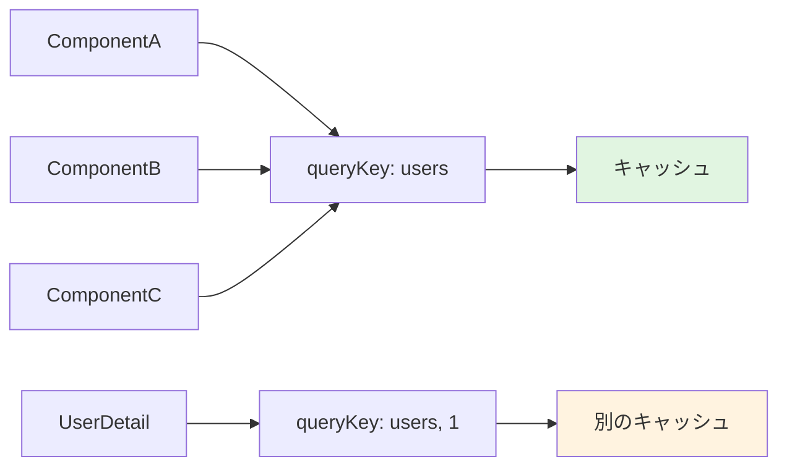
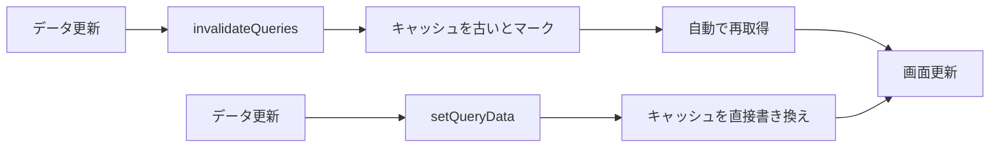

# 4-7. データフェッチング

## 例え話：図書館の本

データフェッチングは「図書館で本を借りる」ようなものです。

- **キャッシュ**: 一度借りた本を机に置いておく（また見たいとき楽）
- **再取得**: 本の内容が更新されていないか確認しに行く
- **バックグラウンド更新**: 読んでいる間に、司書が最新版を用意してくれる

---

## 核心：サーバー状態の特徴

### クライアント状態 vs サーバー状態

```
クライアント状態:
├── UIの状態（モーダル開閉、選択中のタブ）
├── フォームの入力値
└── 一時的なデータ
→ クライアントが「真実」を持つ

サーバー状態:
├── ユーザー一覧
├── 投稿データ
└── 設定情報
→ サーバーが「真実」を持つ
→ 非同期で取得する必要がある
→ 他のユーザーが変更する可能性がある
```

### サーバー状態の難しさ

```jsx
// useStateで管理しようとすると...
function UserList() {
  const [users, setUsers] = useState([]);
  const [isLoading, setIsLoading] = useState(false);
  const [error, setError] = useState(null);

  useEffect(() => {
    setIsLoading(true);
    fetch('/api/users')
      .then(res => res.json())
      .then(data => setUsers(data))
      .catch(err => setError(err))
      .finally(() => setIsLoading(false));
  }, []);

  // 問題点:
  // - キャッシュがない（毎回取得）
  // - 他のコンポーネントと共有できない
  // - 再取得のタイミングは？
  // - エラー時のリトライは？
  // - ローディング中に別の操作されたら？
}
```

---

## TanStack Query（React Query）

<Callout type="success">
**推奨ライブラリ**: TanStack Queryはサーバー状態管理のデファクトスタンダードです。キャッシュ、再取得、エラーハンドリングを自動で行ってくれます。
</Callout>

サーバー状態管理のためのライブラリ。

```bash
npm install @tanstack/react-query
```

### セットアップ

```jsx
// app/providers.jsx
'use client';
import { QueryClient, QueryClientProvider } from '@tanstack/react-query';
import { ReactQueryDevtools } from '@tanstack/react-query-devtools';

const queryClient = new QueryClient();

export function Providers({ children }) {
  return (
    <QueryClientProvider client={queryClient}>
      {children}
      <ReactQueryDevtools initialIsOpen={false} />
    </QueryClientProvider>
  );
}
```

```jsx
// app/layout.jsx
import { Providers } from './providers';

export default function RootLayout({ children }) {
  return (
    <html>
      <body>
        <Providers>{children}</Providers>
      </body>
    </html>
  );
}
```

---

## useQuery：データ取得

### 基本的な使い方

```jsx
import { useQuery } from '@tanstack/react-query';

function UserList() {
  const { data, isLoading, error } = useQuery({
    queryKey: ['users'],
    queryFn: async () => {
      const res = await fetch('/api/users');
      if (!res.ok) throw new Error('Failed to fetch');
      return res.json();
    },
  });

  if (isLoading) return <div>読み込み中...</div>;
  if (error) return <div>エラー: {error.message}</div>;

  return (
    <ul>
      {data.map(user => (
        <li key={user.id}>{user.name}</li>
      ))}
    </ul>
  );
}
```

### queryKey の役割



<WhyButton>
**なぜqueryKeyが重要なのか？**

queryKeyはキャッシュの識別子です。同じqueryKeyを使うコンポーネントは同じキャッシュを共有し、APIリクエストを節約できます。
</WhyButton>

```jsx
// queryKeyはキャッシュのキー
useQuery({ queryKey: ['users'], ... })          // 全ユーザー
useQuery({ queryKey: ['users', 1], ... })       // ID:1のユーザー
useQuery({ queryKey: ['users', { role: 'admin' }], ... })  // 管理者のみ

// 同じqueryKeyなら同じキャッシュを参照
function ComponentA() {
  const { data } = useQuery({ queryKey: ['users'], ... });
}

function ComponentB() {
  const { data } = useQuery({ queryKey: ['users'], ... });
  // → ComponentAと同じキャッシュ。APIは1回しか呼ばれない
}
```

### オプション

```jsx
useQuery({
  queryKey: ['users'],
  queryFn: fetchUsers,

  // キャッシュの有効期間
  staleTime: 5 * 60 * 1000,  // 5分間はキャッシュを「新鮮」とみなす

  // キャッシュの保持期間
  gcTime: 10 * 60 * 1000,    // 10分後にキャッシュを削除

  // 再取得のタイミング
  refetchOnWindowFocus: true,   // ウィンドウフォーカス時
  refetchOnReconnect: true,     // ネットワーク復帰時
  refetchInterval: 30000,       // 30秒ごと

  // リトライ
  retry: 3,                     // 3回まで自動リトライ
  retryDelay: attemptIndex => Math.min(1000 * 2 ** attemptIndex, 30000),

  // 条件付き実行
  enabled: !!userId,            // userIdがあるときだけ実行
});
```

---

## useMutation：データ更新

### 基本的な使い方

```jsx
import { useMutation, useQueryClient } from '@tanstack/react-query';

function CreateUserForm() {
  const queryClient = useQueryClient();

  const mutation = useMutation({
    mutationFn: async (newUser) => {
      const res = await fetch('/api/users', {
        method: 'POST',
        headers: { 'Content-Type': 'application/json' },
        body: JSON.stringify(newUser),
      });
      if (!res.ok) throw new Error('Failed to create user');
      return res.json();
    },
    onSuccess: () => {
      // 成功したらユーザー一覧のキャッシュを無効化
      queryClient.invalidateQueries({ queryKey: ['users'] });
    },
  });

  const handleSubmit = (e) => {
    e.preventDefault();
    mutation.mutate({ name: 'New User' });
  };

  return (
    <form onSubmit={handleSubmit}>
      <button type="submit" disabled={mutation.isPending}>
        {mutation.isPending ? '作成中...' : 'ユーザー作成'}
      </button>
      {mutation.isError && <p>エラー: {mutation.error.message}</p>}
      {mutation.isSuccess && <p>作成完了！</p>}
    </form>
  );
}
```

### コールバック

```jsx
useMutation({
  mutationFn: createUser,

  // 送信前
  onMutate: async (variables) => {
    // 楽観的更新のためにキャッシュを先に更新
    await queryClient.cancelQueries({ queryKey: ['users'] });
    const previousUsers = queryClient.getQueryData(['users']);

    queryClient.setQueryData(['users'], old => [
      ...old,
      { id: 'temp', ...variables }
    ]);

    return { previousUsers };
  },

  // 成功時
  onSuccess: (data, variables, context) => {
    console.log('成功:', data);
  },

  // エラー時
  onError: (error, variables, context) => {
    // 楽観的更新を元に戻す
    queryClient.setQueryData(['users'], context.previousUsers);
  },

  // 成功でもエラーでも
  onSettled: () => {
    queryClient.invalidateQueries({ queryKey: ['users'] });
  },
});
```

---

## キャッシュの制御



<Tabs>
<TabItem value="invalidate" label="invalidateQueries">

### invalidateQueries

キャッシュを「古い」とマークして再取得。

```jsx
const queryClient = useQueryClient();

// 特定のクエリ
queryClient.invalidateQueries({ queryKey: ['users'] });

// 部分マッチ
queryClient.invalidateQueries({ queryKey: ['users'] });
// → ['users'], ['users', 1], ['users', { role: 'admin' }] 全部無効化

// 完全マッチ
queryClient.invalidateQueries({ queryKey: ['users'], exact: true });
// → ['users'] のみ無効化
```

</TabItem>
<TabItem value="set" label="setQueryData">

### setQueryData

キャッシュを直接更新。

```jsx
// 追加
queryClient.setQueryData(['users'], old => [
  ...old,
  newUser,
]);

// 更新
queryClient.setQueryData(['users', userId], old => ({
  ...old,
  name: 'Updated Name',
}));

// 削除
queryClient.setQueryData(['users'], old =>
  old.filter(user => user.id !== deletedId)
);
```

</TabItem>
</Tabs>

<Callout type="tip">
**使い分け**: 通常は `invalidateQueries` を使い、楽観的更新など即座にUIを更新したい場合は `setQueryData` を使います。
</Callout>

---

## よくあるパターン

### カスタムフック化

```jsx
// hooks/useUsers.js
import { useQuery, useMutation, useQueryClient } from '@tanstack/react-query';
import { api } from '@/lib/api';

export function useUsers() {
  return useQuery({
    queryKey: ['users'],
    queryFn: () => api.get('/users'),
  });
}

export function useUser(id) {
  return useQuery({
    queryKey: ['users', id],
    queryFn: () => api.get(`/users/${id}`),
    enabled: !!id,
  });
}

export function useCreateUser() {
  const queryClient = useQueryClient();

  return useMutation({
    mutationFn: (data) => api.post('/users', data),
    onSuccess: () => {
      queryClient.invalidateQueries({ queryKey: ['users'] });
    },
  });
}

export function useUpdateUser() {
  const queryClient = useQueryClient();

  return useMutation({
    mutationFn: ({ id, data }) => api.put(`/users/${id}`, data),
    onSuccess: (_, { id }) => {
      queryClient.invalidateQueries({ queryKey: ['users'] });
      queryClient.invalidateQueries({ queryKey: ['users', id] });
    },
  });
}

export function useDeleteUser() {
  const queryClient = useQueryClient();

  return useMutation({
    mutationFn: (id) => api.delete(`/users/${id}`),
    onSuccess: () => {
      queryClient.invalidateQueries({ queryKey: ['users'] });
    },
  });
}
```

```jsx
// 使用側
function UserPage() {
  const { data: users, isLoading } = useUsers();
  const createUser = useCreateUser();
  const deleteUser = useDeleteUser();

  // シンプルに使える
}
```

### 無限スクロール

```jsx
import { useInfiniteQuery } from '@tanstack/react-query';

function PostList() {
  const {
    data,
    fetchNextPage,
    hasNextPage,
    isFetchingNextPage,
  } = useInfiniteQuery({
    queryKey: ['posts'],
    queryFn: async ({ pageParam = 1 }) => {
      const res = await fetch(`/api/posts?page=${pageParam}`);
      return res.json();
    },
    getNextPageParam: (lastPage) => lastPage.nextPage,
  });

  return (
    <div>
      {data?.pages.map((page, i) => (
        <div key={i}>
          {page.posts.map(post => (
            <PostCard key={post.id} post={post} />
          ))}
        </div>
      ))}

      <button
        onClick={() => fetchNextPage()}
        disabled={!hasNextPage || isFetchingNextPage}
      >
        {isFetchingNextPage
          ? '読み込み中...'
          : hasNextPage
          ? 'もっと見る'
          : 'これ以上ありません'}
      </button>
    </div>
  );
}
```

---

## DevToolsの使い方

```jsx
import { ReactQueryDevtools } from '@tanstack/react-query-devtools';

// Providerの中に配置
<QueryClientProvider client={queryClient}>
  {children}
  <ReactQueryDevtools initialIsOpen={false} />
</QueryClientProvider>

// 開発時に右下に表示される
// - キャッシュの状態を確認
// - 手動で再取得
// - キャッシュのクリア
```

---

## よくある誤解

### 「全部のAPIにTanStack Queryを使う」？

ケースバイケースです。

```
TanStack Queryが向いている:
- 一覧画面のデータ取得
- 詳細画面のデータ取得
- キャッシュしたいデータ

fetchで十分:
- ファイルアップロード
- 1回きりのAPI呼び出し
- サーバーアクション（Next.js）
```

### 「staleTimeを長くすれば速い」？

古いデータを見せることになります。

```jsx
// ユースケースに合わせる
staleTime: 0,           // 常に最新を取得（デフォルト）
staleTime: 30 * 1000,   // 30秒間はキャッシュを信用
staleTime: Infinity,    // 手動更新まで再取得しない
```

### 「useEffectでfetchすれば十分」？

シンプルなケースならOKですが、**実際のアプリでは不十分**です。

```jsx
// useEffectでやろうとすると...
useEffect(() => {
  let cancelled = false;
  setLoading(true);
  fetch('/api/users')
    .then(res => res.json())
    .then(data => {
      if (!cancelled) setUsers(data);
    })
    .catch(err => {
      if (!cancelled) setError(err);
    })
    .finally(() => {
      if (!cancelled) setLoading(false);
    });
  return () => { cancelled = true; };
}, []);

// 考慮すべきこと:
// - キャンセル処理
// - キャッシュ
// - 再取得のタイミング
// - エラーリトライ
// - 他コンポーネントとのデータ共有
// → 全部自分で書く？
```

### 「queryKeyは単純な文字列でいい」？

**配列やオブジェクトを活用**すると便利です。

```jsx
// 悪い例: 文字列連結
queryKey: [`users-${userId}`]  // 部分マッチが効かない

// 良い例: 配列で構造化
queryKey: ['users', userId]
queryKey: ['users', userId, 'posts']
queryKey: ['users', { status: 'active', page: 1 }]

// invalidateQueriesで部分マッチできる
queryClient.invalidateQueries({ queryKey: ['users'] })
// → ['users'], ['users', 1], ['users', 1, 'posts'] 全部無効化
```

### 「キャッシュは自分で管理すべき」？

TanStack Queryが**自動で管理**してくれます。

```jsx
// 自分で管理しようとすると...
const cache = new Map();  // グローバル変数
const CACHE_TIME = 5 * 60 * 1000;

function fetchWithCache(key, fetcher) {
  const cached = cache.get(key);
  if (cached && Date.now() - cached.timestamp < CACHE_TIME) {
    return cached.data;
  }
  // ... 複雑なロジック
}

// TanStack Queryなら
useQuery({
  queryKey: ['users'],
  queryFn: fetchUsers,
  staleTime: 5 * 60 * 1000,  // これだけ
});
```

### 「エラーハンドリングは毎回書く」？

**グローバル設定**が可能です。

```jsx
// QueryClientでデフォルト設定
const queryClient = new QueryClient({
  defaultOptions: {
    queries: {
      retry: 3,
      staleTime: 60 * 1000,
      // グローバルエラーハンドラ
      onError: (error) => {
        toast.error(`エラー: ${error.message}`);
      },
    },
    mutations: {
      onError: (error) => {
        toast.error(`保存に失敗: ${error.message}`);
      },
    },
  },
});

// 個別のuseQueryではエラーハンドリング不要になる
const { data } = useQuery({
  queryKey: ['users'],
  queryFn: fetchUsers,
  // onErrorを書かなくてもグローバルで処理される
});
```

### 「ローディング状態は1種類」？

TanStack Queryは**複数の状態**を提供します。

```jsx
const {
  isLoading,       // 初回読み込み中
  isFetching,      // 再取得中（キャッシュ表示しつつバックグラウンドで取得）
  isRefetching,    // 明示的な再取得中
  isPending,       // データがまだない
  isStale,         // キャッシュが古い
} = useQuery({ ... });

// 使い分け
if (isLoading) return <Spinner />;           // 初回のみ
if (isFetching) return <SmallIndicator />;   // バックグラウンド更新中
```

---

## まとめ

- **サーバー状態** = サーバーが真実を持つデータ
- **TanStack Query** = サーバー状態の管理に特化
- **useQuery** = データ取得
- **useMutation** = データ更新
- **キャッシュ** = 自動管理、必要に応じて無効化
- **DevTools** = デバッグに便利

---

## サンプルコード

この章の内容を実際に動かして試せるサンプルコードを用意しています。

- [データフェッチングサンプル](https://github.com/minaaaa3/study-memo/tree/main/samples/client/04-data-fetching) - 基本fetch / TanStack Query / Mutation / キャッシュ制御

