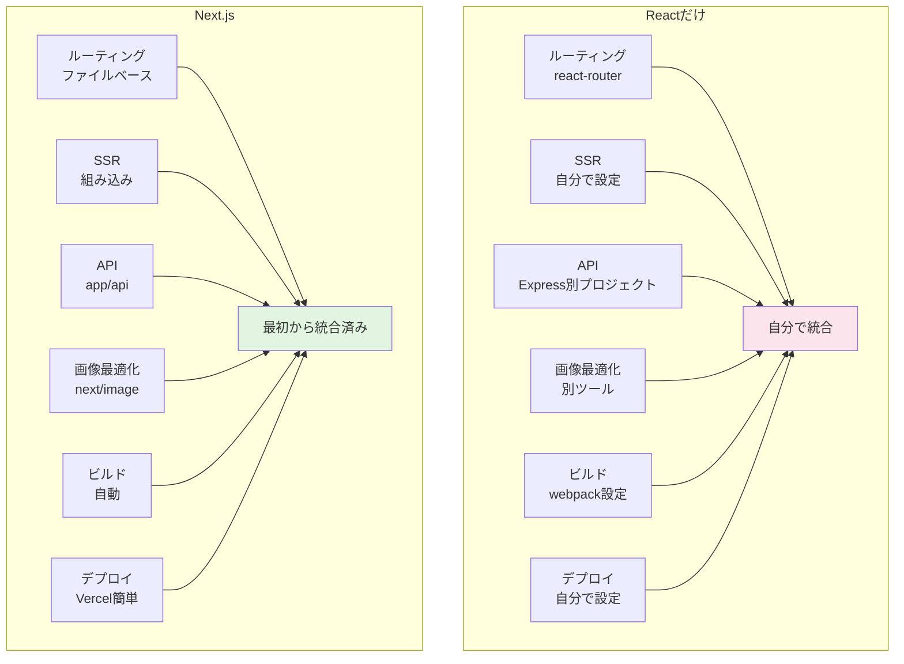
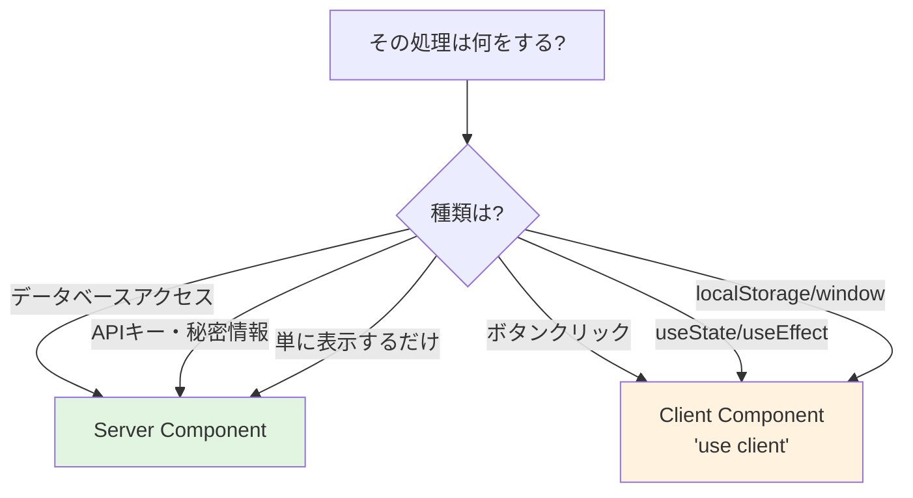
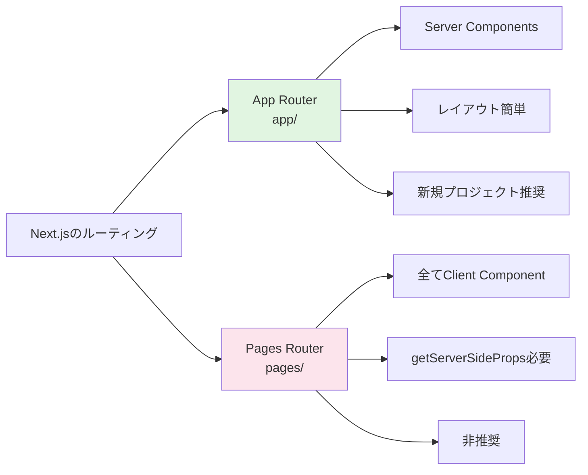

# 4-8. Next.jsの基礎

## 例え話：全部入りの弁当箱

Reactだけだと「ご飯だけ」のようなもの。おかず（ルーティング、API、最適化）を自分で用意する必要があります。

Next.jsは「全部入りの弁当箱」。必要なものが最初から揃っています。

---

## 核心：Next.jsが解決すること



<Callout type="success">
**Next.jsの利点**: 必要な機能が最初から揃っているため、設定に時間を取られず、開発に集中できます。
</Callout>

---

## プロジェクト作成

```bash
npx create-next-app@latest my-app

# 対話式の設問
# ✓ TypeScript? → Yes
# ✓ ESLint? → Yes
# ✓ Tailwind CSS? → Yes
# ✓ src/ directory? → Yes
# ✓ App Router? → Yes
# ✓ import alias? → @/*
```

### ディレクトリ構成

```
my-app/
├── src/
│   ├── app/              # App Router（ルーティング）
│   │   ├── layout.tsx    # 共通レイアウト
│   │   ├── page.tsx      # / のページ
│   │   ├── about/
│   │   │   └── page.tsx  # /about のページ
│   │   └── api/
│   │       └── hello/
│   │           └── route.ts  # APIエンドポイント
│   ├── components/       # コンポーネント
│   └── lib/              # ユーティリティ
├── public/               # 静的ファイル
├── next.config.js        # Next.js設定
└── package.json
```

---

## ルーティング（App Router）

### ファイルベースルーティング

```
src/app/
├── page.tsx              → /
├── about/
│   └── page.tsx          → /about
├── blog/
│   ├── page.tsx          → /blog
│   └── [slug]/
│       └── page.tsx      → /blog/hello-world
├── users/
│   └── [id]/
│       └── page.tsx      → /users/123
└── (auth)/               → URLに影響しないグループ
    ├── login/
    │   └── page.tsx      → /login
    └── register/
        └── page.tsx      → /register
```

### 特殊なファイル

```
page.tsx      → ページ本体
layout.tsx    → 共通レイアウト（ヘッダー、フッターなど）
loading.tsx   → ローディング中の表示
error.tsx     → エラー時の表示
not-found.tsx → 404ページ
```

### ページの書き方

```tsx
// src/app/page.tsx
export default function Home() {
  return (
    <main>
      <h1>ホームページ</h1>
    </main>
  );
}
```

```tsx
// src/app/about/page.tsx
export default function About() {
  return (
    <main>
      <h1>このサイトについて</h1>
    </main>
  );
}
```

### 動的ルート

URLの一部が変わるページを作りたいときは、ファイル名を `[パラメータ名]` にします。

```text
なぜ動的ルートが必要？

ブログ記事のページを考えてみましょう:
├── /blog/hello-world     → 記事「hello-world」を表示
├── /blog/my-first-post   → 記事「my-first-post」を表示
└── /blog/nextjs-tips     → 記事「nextjs-tips」を表示

毎回ファイルを作るのは大変...
→ [slug] という「変数」を使えば1ファイルで対応できる！
```

```tsx
// src/app/blog/[slug]/page.tsx
//              ↑ [slug] がURLの変わる部分を受け取る

interface Props {
  params: { slug: string };  // ← Next.jsが自動で渡してくれる
}

export default function BlogPost({ params }: Props) {
  // params.slug にURLの値が入っている
  return (
    <article>
      <h1>記事: {params.slug}</h1>
    </article>
  );
}
```

```text
paramsの仕組み:

ファイル: src/app/blog/[slug]/page.tsx
                        ↑ この部分が変数名になる

URL: /blog/hello-world
          └─────────┘
             ↓
params = { slug: "hello-world" }

URL: /blog/my-first-post
          └────────────┘
             ↓
params = { slug: "my-first-post" }
```

**複数のパラメータも使える**:

```tsx
// src/app/users/[userId]/posts/[postId]/page.tsx

interface Props {
  params: {
    userId: string;   // /users/の後ろ
    postId: string;   // /posts/の後ろ
  };
}

export default function UserPost({ params }: Props) {
  // URL: /users/123/posts/456
  // → params.userId = "123"
  // → params.postId = "456"
  return <div>ユーザー{params.userId}の投稿{params.postId}</div>;
}
```

### レイアウト

```tsx
// src/app/layout.tsx
// 全ページに適用されるレイアウト

export default function RootLayout({
  children,
}: {
  children: React.ReactNode;
}) {
  return (
    <html lang="ja">
      <body>
        <header>サイトヘッダー</header>
        <main>{children}</main>
        <footer>サイトフッター</footer>
      </body>
    </html>
  );
}
```

```tsx
// src/app/dashboard/layout.tsx
// /dashboard 以下だけに適用されるレイアウト

export default function DashboardLayout({
  children,
}: {
  children: React.ReactNode;
}) {
  return (
    <div className="dashboard">
      <aside>サイドバー</aside>
      <main>{children}</main>
    </div>
  );
}
```

---

## Server Components と Client Components

<Callout type="info">
**Next.jsの最重要概念**: Server ComponentsとClient Componentsの違いを理解することが、Next.js App Routerを使いこなす鍵です。
</Callout>

### 例え話：レストランの厨房とテーブル

レストランで料理を提供する2つの方法を考えてみましょう。

- **厨房で調理して出す（Server Component）**: シェフが厨房で料理を完成させ、お客さんには出来上がった料理だけを出す
- **テーブルで調理する（Client Component）**: 焼肉やしゃぶしゃぶのように、お客さんのテーブルで調理する

```text
Server Component（厨房 = サーバー）:
┌─────────────────────────────────────┐
│  1. データベースから材料を取得        │
│  2. HTMLという「料理」を完成させる    │
│  3. 完成品をブラウザに送る            │
└─────────────────────────────────────┘
        ↓ 完成したHTMLを送信
┌─────────────────────────────────────┐
│  ブラウザ: 受け取って表示するだけ     │
└─────────────────────────────────────┘

Client Component（テーブル = ブラウザ）:
┌─────────────────────────────────────┐
│  サーバー: JavaScriptコードを送る     │
└─────────────────────────────────────┘
        ↓ コードを送信
┌─────────────────────────────────────┐
│  ブラウザ:                           │
│  1. JavaScriptを実行                 │
│  2. ボタンクリックなどに反応         │
│  3. 画面を動的に更新                 │
└─────────────────────────────────────┘
```

### Server Components（デフォルト）

Next.jsでは、何も指定しなければ **Server Component** になります。サーバーで実行され、完成したHTMLがブラウザに送られます。

```tsx
// src/app/users/page.tsx
// デフォルトはServer Component（何も書かなくてOK）

async function getUsers() {
  // この処理はサーバーで実行される
  // → APIキーなどの秘密情報を安全に使える
  const res = await fetch('https://api.example.com/users');
  return res.json();
}

export default async function UsersPage() {
  const users = await getUsers();  // サーバーで実行される

  return (
    <ul>
      {users.map(user => (
        <li key={user.id}>{user.name}</li>
      ))}
    </ul>
  );
}
```

**Server Componentのメリット**:
- データベースに直接アクセスできる
- APIキーなどの秘密情報を安全に扱える
- ブラウザに送るJavaScriptが少なくて済む（ページ表示が速い）
- SEO（検索エンジン対策）に有利

### Client Components

ブラウザで動く処理が必要な場合は **Client Component** を使います。ファイルの先頭に `'use client'` と書くだけです。

```tsx
// src/components/Counter.tsx
'use client';  // ← この1行を追加するとClient Component

import { useState } from 'react';

export function Counter() {
  // useState はブラウザで動く機能なので 'use client' が必要
  const [count, setCount] = useState(0);

  return (
    <div>
      <p>カウント: {count}</p>
      {/* onClick もブラウザで動く */}
      <button onClick={() => setCount(count + 1)}>+1</button>
    </div>
  );
}
```

**Client Componentが必要な場面**:
- `useState`, `useEffect` などのReact Hooksを使う
- `onClick`, `onChange` などのイベント処理
- `localStorage`, `window` などのブラウザAPIを使う

### どちらを使うべき？判断フローチャート



<Callout type="tip">
**判断の基準**: デフォルトはServer Component。ユーザーのインタラクションが必要な場合のみClient Componentを使います。
</Callout>

### 組み合わせて使う

実際のアプリでは、Server ComponentとClient Componentを組み合わせて使います。

```tsx
// src/app/posts/page.tsx（Server Component）
import { LikeButton } from '@/components/LikeButton';

// このページ自体はServer Component
export default async function PostsPage() {
  // サーバーでデータ取得
  const posts = await fetch('https://api.example.com/posts').then(r => r.json());

  return (
    <ul>
      {posts.map(post => (
        <li key={post.id}>
          <h2>{post.title}</h2>
          {/* Client Componentを埋め込む */}
          <LikeButton postId={post.id} />
        </li>
      ))}
    </ul>
  );
}
```

```tsx
// src/components/LikeButton.tsx（Client Component）
'use client';

import { useState } from 'react';

export function LikeButton({ postId }: { postId: number }) {
  const [liked, setLiked] = useState(false);

  return (
    <button onClick={() => setLiked(!liked)}>
      {liked ? '❤️' : '🤍'}
    </button>
  );
}
```

```text
この構成のポイント:
├── ページ全体: Server Component（データ取得を担当）
└── いいねボタン: Client Component（クリック処理を担当）

→ 必要な部分だけClient Componentにすることで、
   ページ表示が速く、かつインタラクティブな機能も実現
```

---

## データ取得

### Server Componentでのデータ取得

```tsx
// src/app/posts/page.tsx
async function getPosts() {
  const res = await fetch('https://api.example.com/posts', {
    next: { revalidate: 3600 }  // 1時間ごとに再検証
  });
  return res.json();
}

export default async function PostsPage() {
  const posts = await getPosts();

  return (
    <ul>
      {posts.map(post => (
        <li key={post.id}>{post.title}</li>
      ))}
    </ul>
  );
}
```

### キャッシュ設定

```tsx
// 毎回取得
fetch(url, { cache: 'no-store' });

// 静的にキャッシュ（ビルド時のみ取得）
fetch(url, { cache: 'force-cache' });

// 時間ベースで再検証
fetch(url, { next: { revalidate: 60 } });  // 60秒ごと

// タグベースで再検証
fetch(url, { next: { tags: ['posts'] } });
// → revalidateTag('posts') で手動更新
```

---

## APIルート

### 基本

```tsx
// src/app/api/hello/route.ts
import { NextResponse } from 'next/server';

export async function GET() {
  return NextResponse.json({ message: 'Hello!' });
}
```

### CRUD

```tsx
// src/app/api/users/route.ts
import { NextRequest, NextResponse } from 'next/server';

// GET /api/users
export async function GET() {
  const users = await db.user.findMany();
  return NextResponse.json(users);
}

// POST /api/users
export async function POST(request: NextRequest) {
  const body = await request.json();
  const user = await db.user.create({ data: body });
  return NextResponse.json(user, { status: 201 });
}
```

```tsx
// src/app/api/users/[id]/route.ts
import { NextRequest, NextResponse } from 'next/server';

interface Params {
  params: { id: string };
}

// GET /api/users/123
export async function GET(request: NextRequest, { params }: Params) {
  const user = await db.user.findUnique({
    where: { id: parseInt(params.id) }
  });

  if (!user) {
    return NextResponse.json({ error: 'Not found' }, { status: 404 });
  }

  return NextResponse.json(user);
}

// PUT /api/users/123
export async function PUT(request: NextRequest, { params }: Params) {
  const body = await request.json();
  const user = await db.user.update({
    where: { id: parseInt(params.id) },
    data: body,
  });
  return NextResponse.json(user);
}

// DELETE /api/users/123
export async function DELETE(request: NextRequest, { params }: Params) {
  await db.user.delete({
    where: { id: parseInt(params.id) }
  });
  return new NextResponse(null, { status: 204 });
}
```

---

## ナビゲーション

### Link コンポーネント

```tsx
import Link from 'next/link';

export function Navigation() {
  return (
    <nav>
      <Link href="/">ホーム</Link>
      <Link href="/about">About</Link>
      <Link href="/blog/my-post">記事</Link>
    </nav>
  );
}
```

### プログラムでの遷移

```tsx
'use client';
import { useRouter } from 'next/navigation';

export function LoginButton() {
  const router = useRouter();

  const handleLogin = async () => {
    await login();
    router.push('/dashboard');  // 遷移
    // router.replace('/dashboard');  // 履歴を置き換え
    // router.back();  // 戻る
    // router.refresh();  // 現在のページを更新
  };

  return <button onClick={handleLogin}>ログイン</button>;
}
```

---

## よく使う機能

### 画像最適化

```tsx
import Image from 'next/image';

export function Avatar() {
  return (
    <Image
      src="/avatar.png"
      alt="アバター"
      width={100}
      height={100}
      // 自動で:
      // - WebP/AVIF変換
      // - 遅延読み込み
      // - サイズ最適化
    />
  );
}
```

### メタデータ

```tsx
// src/app/page.tsx
import { Metadata } from 'next';

export const metadata: Metadata = {
  title: 'ホーム | My Site',
  description: 'サイトの説明',
};

export default function Home() {
  return <h1>ホーム</h1>;
}
```

### 環境変数

```bash
# .env.local
DATABASE_URL=postgres://...
NEXT_PUBLIC_API_URL=https://api.example.com

# NEXT_PUBLIC_ で始まるものだけクライアントで使える
```

```tsx
// サーバーのみ
const dbUrl = process.env.DATABASE_URL;

// クライアントでも使える
const apiUrl = process.env.NEXT_PUBLIC_API_URL;
```

---

## よくある誤解

<Accordion title="「全部Client Componentにすればいい」は本当？">
**いいえ、間違いです。** Server Componentをできるだけ使いましょう。

| 項目 | Server Component | Client Component |
|------|-----------------|------------------|
| 初回表示速度 | 速い | 遅い |
| JavaScriptサイズ | 小さい | 大きい |
| SEO | 有利 | 不利 |
| 秘密情報 | 安全に扱える | 扱えない |

```text
正しい考え方:
├── 基本は Server Component（何も書かない）
└── useState や onClick が必要な部分だけ Client Component

× 「動くから全部 'use client' つけちゃえ」
○ 「本当に必要な部分だけ 'use client' をつける」
```

<Callout type="warning">
**パフォーマンス警告**: 全てをClient Componentにすると、大量のJavaScriptがブラウザに送られ、初回表示が遅くなります。
</Callout>
</Accordion>

<Accordion title="「'use client' をつけないと動かない」は本当？">
**いいえ、逆です。** デフォルトで動くのが Server Component です。

```tsx
// これは Server Component（'use client' 不要）
export default function AboutPage() {
  return <h1>このサイトについて</h1>;  // 普通に動く
}
```

`'use client'` が必要なのは、**ブラウザでしか動かない機能**を使うときだけです。

```tsx
// useState を使うので 'use client' が必要
'use client';
import { useState } from 'react';

export function Counter() {
  const [count, setCount] = useState(0);  // ← これがブラウザ機能
  return <button onClick={() => setCount(count + 1)}>{count}</button>;
}
```
</Accordion>

<Accordion title="「Server ComponentでuseStateが使えない → バグ？」は本当？">
**いいえ、仕様です。** `useState` はブラウザで動く機能なので、Server Component では使えません。

```tsx
// ❌ エラーになる
export default function Page() {
  const [count, setCount] = useState(0);  // Server Componentでは使えない
  return <div>{count}</div>;
}
```

```tsx
// ✅ 正しい方法1: Client Componentにする
'use client';

export default function Page() {
  const [count, setCount] = useState(0);  // OK
  return <div>{count}</div>;
}
```

```tsx
// ✅ 正しい方法2: useStateが必要な部分だけ分離
// page.tsx（Server Component）
import { Counter } from './Counter';

export default function Page() {
  return (
    <div>
      <h1>カウンター</h1>
      <Counter />  {/* Client Componentを埋め込む */}
    </div>
  );
}

// Counter.tsx（Client Component）
'use client';
import { useState } from 'react';

export function Counter() {
  const [count, setCount] = useState(0);
  return <button onClick={() => setCount(count + 1)}>{count}</button>;
}
```
</Accordion>

<Accordion title="「APIルートは必須」は本当？">
**いいえ、多くの場合不要です。** Server Componentから直接DBにアクセスできます。APIルートを作らなくていいケースが多いです。

```tsx
// ✅ APIルート不要のパターン
export default async function UsersPage() {
  // Server Componentなので、直接DBにアクセスできる
  const users = await db.user.findMany();
  return <UserList users={users} />;
}
```

**APIルートが必要なのは**:

| 場面 | 理由 |
|------|------|
| Client Componentからデータ取得 | Client Componentから直接DBにアクセスできないため |
| フォーム送信後の処理 | ボタンクリック後にサーバーで処理を実行したい |
| 外部サービスからのWebhook | Stripeの決済通知などを受け取るため |
| 他のアプリからの呼び出し | モバイルアプリなど別のクライアントからアクセスするため |
</Accordion>

<Accordion title="「app/ と pages/ どっちを使うべき？」">
**app/ を使ってください。** これが最新の方式（App Router）です。



古い記事やチュートリアルでは Pages Router の書き方が載っていることがあるので注意してください。

<Callout type="tip">
**新規プロジェクトはApp Routerで**: Next.js 13以降はApp Routerが標準です。Pages Routerは後方互換性のために残されています。
</Callout>
</Accordion>

<Accordion title="「fetch のキャッシュがよくわからない」">
Next.jsの `fetch` は自動でキャッシュされます。これを理解しておかないと「データが更新されない！」と困ることがあります。

```tsx
// 毎回最新データを取得（キャッシュしない）
const data = await fetch(url, { cache: 'no-store' });

// ビルド時だけ取得（ずっと同じデータ）
const data = await fetch(url, { cache: 'force-cache' });

// 60秒ごとに新しいデータを取得
const data = await fetch(url, { next: { revalidate: 60 } });
```

```text
どれを使う？

├─ ユーザー情報など常に最新が必要
│   └─→ { cache: 'no-store' }
│
├─ 会社概要など滅多に変わらない
│   └─→ { cache: 'force-cache' }（デフォルト）
│
└─ ニュースなど定期的に更新される
    └─→ { next: { revalidate: 60 } }（60秒ごと）
```
</Accordion>

---

## まとめ

- **Next.js** = Reactの全部入りフレームワーク
- **App Router** = ファイルベースのルーティング
- **Server Components** = サーバーで実行（デフォルト）
- **Client Components** = ブラウザで実行（'use client'）
- **APIルート** = app/api にファイルを作る
- **Image, Link** = 最適化された組み込みコンポーネント

---

## 初心者向けガイド

### 最初の一歩

1. **プロジェクトを作成する**
   ```bash
   npx create-next-app@latest my-first-app
   # 質問には全部 Yes で OK
   ```

2. **起動してブラウザで確認**
   ```bash
   cd my-first-app
   npm run dev
   # http://localhost:3000 を開く
   ```

3. **src/app/page.tsx を編集してみる**
   - 保存すると自動で画面が更新される

### 覚える優先順位

```text
最初に覚える（必須）:
├── ファイルベースルーティング（page.tsx を作る = ページができる）
├── Server Component（デフォルト、普通に書けばOK）
└── Client Component（'use client' + useState/onClick）

次に覚える:
├── layout.tsx（共通レイアウト）
├── 動的ルート（[id] を使ったURL）
└── Link コンポーネント（ページ遷移）

必要になったら覚える:
├── APIルート（app/api）
├── loading.tsx / error.tsx
├── メタデータ（SEO対策）
└── 画像最適化（next/image）
```

### 困ったときのチェックリスト

| 症状 | 原因 | 解決方法 |
|------|------|---------|
| useState が使えない | Server Component だから | `'use client'` を追加 |
| ページが表示されない | ファイル名が違う | `page.tsx` か確認 |
| データが更新されない | キャッシュされている | `{ cache: 'no-store' }` を追加 |
| 画像が表示されない | public/ にない | public/ フォルダに画像を置く |
| ビルドでエラー | 型エラーなど | `npm run build` のエラーを確認 |

### 学習リソース

```text
公式ドキュメント:
└── https://nextjs.org/docs

おすすめの学習順序:
1. 公式チュートリアル（https://nextjs.org/learn）
2. 簡単なブログを作ってみる
3. データベース連携（Prisma + Supabase）
4. 認証追加（NextAuth.js）
```

---

## サンプルコード

この章の内容を実際に動かして試せるサンプルコードを用意しています。

- [Next.js App Routerサンプル](https://github.com/minaaaa3/study-memo/tree/main/samples/client/07-nextjs-app-router) - レイアウト / Server Components / Client Components / API Routes
