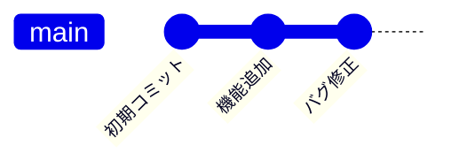
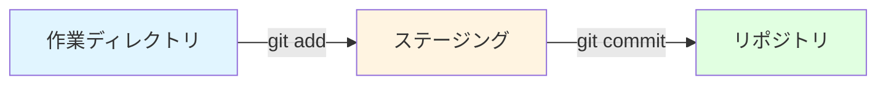
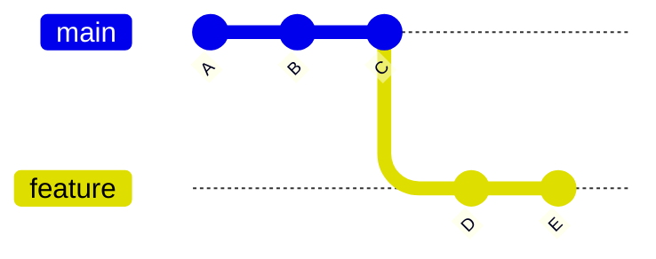
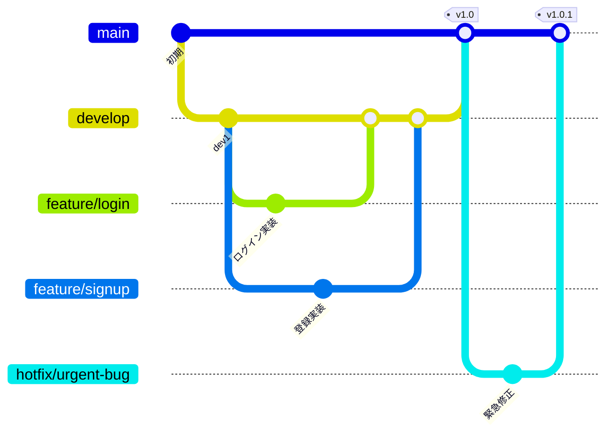

# 5-1. バージョン管理（Git）

## 例え話：セーブポイント

Gitは「ゲームのセーブポイント」のようなものです。

- **コミット** = セーブする
- **ブランチ** = 別ルートを試す（失敗してもメインルートに戻れる）
- **マージ** = 別ルートの成果をメインルートに合流
- **履歴** = いつでも過去のセーブに戻れる

---

## 核心：なぜバージョン管理が必要か

### バージョン管理なしの場合

```
project/
├── index.js
├── index_backup.js
├── index_old.js
├── index_final.js
├── index_final2.js
└── index_final_本当のfinal.js  ← どれが最新？
```

### Gitがあれば

```
project/
└── index.js  ← 常に最新
```



いつでも過去に戻れる

---

## 基本概念

### リポジトリ

```bash
# 新規作成
git init

# 既存をクローン
git clone https://github.com/user/repo.git
```

### ステージング → コミット



1. ファイルを編集（作業ディレクトリ）
2. git add で「コミット対象」に追加（ステージング）
3. git commit でスナップショットを保存（リポジトリ）

```bash
# 変更を確認
git status

# ステージングに追加
git add index.js        # 特定ファイル
git add .               # 全ファイル

# コミット
git commit -m "ログイン機能を追加"

# 履歴を確認
git log --oneline
```

---

## ブランチ

### 概念



- main: 本番用の安定したコード
- feature: 新機能を開発中

### 基本操作

```bash
# ブランチ一覧
git branch

# ブランチ作成 + 切り替え
git checkout -b feature/login

# ブランチ切り替え
git checkout main

# マージ（featureをmainに取り込む）
git checkout main
git merge feature/login

# ブランチ削除
git branch -d feature/login
```

### ブランチ戦略



<Callout type="tip">
よくあるブランチ戦略のルール:
- mainは常に動作する状態を保つ
- 新機能はfeatureブランチで開発
- 完成したらdevelop→mainにマージ
</Callout>

---

## リモートリポジトリ

### GitHub/GitLabとの連携

```bash
# リモートを追加
git remote add origin https://github.com/user/repo.git

# プッシュ（ローカル→リモート）
git push origin main

# プル（リモート→ローカル）
git pull origin main

# フェッチ（リモートの変更を取得、マージはしない）
git fetch origin
```

### よくあるワークフロー

<StepByStep>

<Step title="最新を取得">

```bash
git pull origin main
```

</Step>

<Step title="ブランチを作成">

```bash
git checkout -b feature/new-feature
```

</Step>

<Step title="作業してコミット">

```bash
git add .
git commit -m "新機能を実装"
```

</Step>

<Step title="プッシュ">

```bash
git push origin feature/new-feature
```

</Step>

<Step title="GitHubでPull Requestを作成">

GitHubのWebページから Pull Request を作成します。

</Step>

<Step title="レビュー後、マージ">

チームメンバーのレビューが完了したらマージします。

</Step>

</StepByStep>

---

## コンフリクト（衝突）の解決

### コンフリクトとは

```
Aさん: ファイルの3行目を「Hello」に変更
Bさん: ファイルの3行目を「Hi」に変更

→ どっちを採用する？ = コンフリクト
```

### 解決方法

```bash
# マージ時にコンフリクト発生
git merge feature/login
# CONFLICT (content): Merge conflict in index.js

# ファイルを開くと...
<<<<<<< HEAD
const greeting = 'Hello';
=======
const greeting = 'Hi';
>>>>>>> feature/login

# 正しい方を選ぶ（または両方活かす）
const greeting = 'Hello';

# 解決したらコミット
git add index.js
git commit -m "コンフリクトを解決"
```

---

## よく使うコマンド

```bash
# 状態確認
git status              # 現在の状態
git log --oneline       # 履歴（1行表示）
git diff                # 変更内容

# 変更を取り消す
git checkout -- file.js # ステージング前の変更を破棄
git reset HEAD file.js  # ステージングを取り消し
git reset --hard HEAD^  # 直前のコミットを取り消し（危険）

# スタッシュ（一時退避）
git stash               # 変更を一時退避
git stash pop           # 退避した変更を復元

# その他
git blame file.js       # 各行を誰がいつ変更したか
git rebase main         # mainの変更を取り込みつつ履歴を綺麗に
```

---

## コミットメッセージ

### 良いコミットメッセージ

```
feat: ユーザー認証機能を追加

- ログイン/ログアウトAPI実装
- JWTトークンによる認証
- セッション有効期限は24時間
```

### 悪いコミットメッセージ

```
fix
修正
asdf
とりあえずコミット
```

### プレフィックスの例

```
feat:     新機能
fix:      バグ修正
docs:     ドキュメント
style:    フォーマット（動作に影響なし）
refactor: リファクタリング
test:     テスト
chore:    その他（ビルド設定など）
```

---

## .gitignore

コミットしたくないファイルを指定。

```gitignore
# node_modules（パッケージは package.json から復元できる）
node_modules/

# ビルド成果物
dist/
build/

# 環境変数（秘密情報を含む）
.env
.env.local

# OS/エディタの設定
.DS_Store
.vscode/

# ログ
*.log
```

<Callout type="warning">
**重要：秘密情報はGitにコミットしない**

`.env`ファイルや認証情報を含むファイルは必ず`.gitignore`に追加してください。一度コミットすると履歴に残り、削除しても復元できてしまいます。
</Callout>

---

## よくある誤解

### 「コミットは完璧なタイミングで」？

小さく頻繁にコミットする方がいいです。

```
悪い例: 3日分の変更を1コミット
良い例: 機能ごと、または数時間ごとにコミット

理由:
- 何か壊れたときに戻りやすい
- 履歴が追いやすい
- レビューしやすい
```

### 「forceプッシュは絶対ダメ」？

個人ブランチなら問題ないこともあります。

```bash
# 自分だけのブランチなら
git push --force origin feature/my-feature

# mainや共有ブランチでは絶対ダメ
git push --force origin main  # 他の人の変更を消す可能性
```

<Callout type="warning">
**force push の危険性**

共有ブランチ（main、developなど）に対して`git push --force`を実行すると、他の人の変更が消えてしまう可能性があります。個人ブランチでのみ使用してください。
</Callout>

---

## まとめ

- **Git** = 変更履歴を管理するツール
- **コミット** = スナップショットを保存
- **ブランチ** = 別ルートで作業
- **マージ** = ブランチを統合
- **プル/プッシュ** = リモートと同期
- **コミットは小さく頻繁に**

