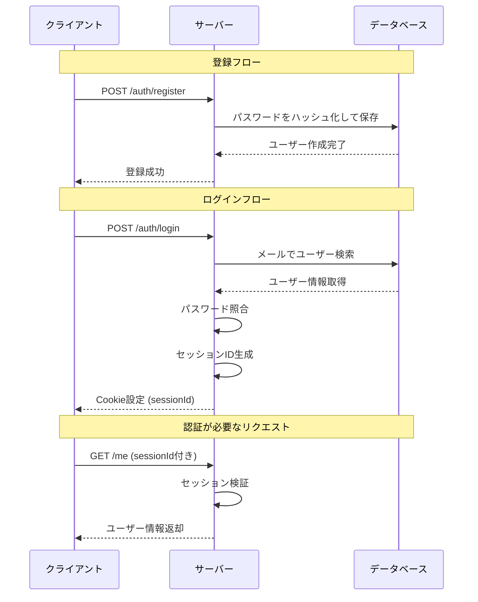
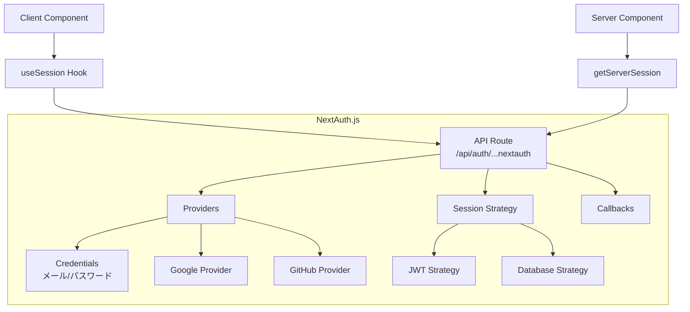

# 6-1. 認証システムを作る

## 目標

「自前で実装」と「ライブラリ使用」の両方を体験し、ライブラリが何を解決しているか理解する。

<Callout type="info">
認証システムは、セキュリティに直結する重要な機能です。本番環境では実績のあるライブラリの使用を強く推奨しますが、仕組みを理解することで適切な実装判断ができるようになります。
</Callout>

---

## 自前実装：セッションベース認証

### 認証フローの全体像



### ディレクトリ構成

```
auth-demo/
├── src/
│   ├── index.js          # エントリーポイント
│   ├── routes/
│   │   └── auth.js       # 認証ルート
│   ├── middleware/
│   │   └── auth.js       # 認証ミドルウェア
│   └── db.js             # 簡易DB（実際はDBを使う）
├── package.json
└── .env
```

### 実装

<StepByStep>

<Step title="データベース層の実装">

インメモリDBでユーザー管理とセッション管理を実装します。

<Callout type="warning">
この実装は学習用です。本番環境では必ずPostgreSQLやMongoDBなどの永続化DBを使用してください。
</Callout>

```javascript
// src/db.js
// 簡易的なインメモリDB（実際はPostgreSQLなどを使う）
const bcrypt = require('bcrypt');

const users = [];
const sessions = new Map();

module.exports = {
  async createUser(email, password) {
    const hashedPassword = await bcrypt.hash(password, 10);
    const user = { id: users.length + 1, email, password: hashedPassword };
    users.push(user);
    return { id: user.id, email: user.email };
  },

  findUserByEmail(email) {
    return users.find(u => u.email === email);
  },

  async verifyPassword(password, hash) {
    return bcrypt.compare(password, hash);
  },

  createSession(userId) {
    const sessionId = require('crypto').randomBytes(32).toString('hex');
    sessions.set(sessionId, { userId, createdAt: Date.now() });
    return sessionId;
  },

  getSession(sessionId) {
    return sessions.get(sessionId);
  },

  deleteSession(sessionId) {
    sessions.delete(sessionId);
  }
};
```

<WhyButton>
**なぜbcryptを使うのか？**

パスワードを平文で保存すると、データベースが漏洩した際に全ユーザーのパスワードが露出します。bcryptは：
- ハッシュ化により元のパスワードを復元不可能にする
- ソルトを自動生成し、レインボーテーブル攻撃を防ぐ
- コスト係数により計算コストを調整できる（ブルートフォース攻撃を遅延）
</WhyButton>

</Step>

<Step title="認証ミドルウェアの実装">

リクエストからセッションIDを取得し、ユーザー認証を行います。

```javascript
// src/middleware/auth.js
const db = require('../db');

module.exports = function authenticate(req, res, next) {
  const sessionId = req.cookies?.sessionId;

  if (!sessionId) {
    return res.status(401).json({ error: 'ログインが必要です' });
  }

  const session = db.getSession(sessionId);
  if (!session) {
    return res.status(401).json({ error: 'セッションが無効です' });
  }

  req.userId = session.userId;
  next();
};
```

<Callout type="tip">
ミドルウェアパターンを使うことで、認証が必要なルートに簡単に保護をかけられます。`app.get('/protected', authenticate, handler)` のように使用します。
</Callout>

</Step>

<Step title="認証ルートの実装">

登録、ログイン、ログアウトのエンドポイントを実装します。

```javascript
// src/routes/auth.js
const express = require('express');
const router = express.Router();
const db = require('../db');

// 登録
router.post('/register', async (req, res) => {
  try {
    const { email, password } = req.body;

    // バリデーション
    if (!email || !password) {
      return res.status(400).json({ error: 'メールとパスワードは必須です' });
    }

    if (db.findUserByEmail(email)) {
      return res.status(400).json({ error: 'このメールは既に登録されています' });
    }

    const user = await db.createUser(email, password);
    res.status(201).json({ user });
  } catch (error) {
    res.status(500).json({ error: 'サーバーエラー' });
  }
});

// ログイン
router.post('/login', async (req, res) => {
  try {
    const { email, password } = req.body;

    const user = db.findUserByEmail(email);
    if (!user) {
      return res.status(401).json({ error: 'メールまたはパスワードが違います' });
    }

    const isValid = await db.verifyPassword(password, user.password);
    if (!isValid) {
      return res.status(401).json({ error: 'メールまたはパスワードが違います' });
    }

    const sessionId = db.createSession(user.id);

    res.cookie('sessionId', sessionId, {
      httpOnly: true,
      secure: process.env.NODE_ENV === 'production',
      sameSite: 'strict',
      maxAge: 24 * 60 * 60 * 1000 // 24時間
    });

    res.json({ user: { id: user.id, email: user.email } });
  } catch (error) {
    res.status(500).json({ error: 'サーバーエラー' });
  }
});

// ログアウト
router.post('/logout', (req, res) => {
  const sessionId = req.cookies?.sessionId;
  if (sessionId) {
    db.deleteSession(sessionId);
  }
  res.clearCookie('sessionId');
  res.json({ success: true });
});

module.exports = router;
```

<Callout type="danger">
**セキュリティのベストプラクティス**
- Cookie設定で `httpOnly: true` を必ず指定（XSS攻撃対策）
- `secure: true` で HTTPS 通信のみに制限（本番環境）
- `sameSite: 'strict'` で CSRF 攻撃を防ぐ
- ログイン失敗時は「メールまたはパスワードが違います」と表示（アカウント列挙攻撃対策）
</Callout>

</Step>

<Step title="サーバーのエントリーポイント">

Express サーバーを起動し、ルートとミドルウェアを設定します。

```javascript
// src/index.js
require('dotenv').config();
const express = require('express');
const cookieParser = require('cookie-parser');
const authRoutes = require('./routes/auth');
const authenticate = require('./middleware/auth');

const app = express();

app.use(express.json());
app.use(cookieParser());

// 認証ルート
app.use('/auth', authRoutes);

// 保護されたルート
app.get('/me', authenticate, (req, res) => {
  res.json({ userId: req.userId });
});

app.listen(3000, () => {
  console.log('Server running on http://localhost:3000');
});
```

</Step>

</StepByStep>

### 自前実装で考慮すべきこと

<Accordion title="実装済みの機能">

```
✓ パスワードのハッシュ化（bcrypt）
✓ セッション管理（Map）
✓ Cookie設定（httpOnly, secure, sameSite）
✓ 基本的なバリデーション
```

</Accordion>

<Accordion title="本番環境で追加が必要な機能">

<Callout type="warning">
以下の機能がないと、本番環境では脆弱性やユーザビリティの問題が発生します。
</Callout>

```
□ セッションの有効期限切れ処理
  - セッションタイムアウト
  - リフレッシュトークン

□ CSRFトークン
  - クロスサイトリクエストフォージェリ対策

□ レート制限（ブルートフォース対策）
  - IPベースの制限
  - アカウントロック機能

□ パスワードリセット
  - メール送信
  - 一時トークン管理

□ メール確認
  - 確認メール送信
  - トークン検証

□ OAuth（Google, GitHubログイン）
  - OAuth 2.0 フロー実装

□ 2要素認証（2FA）
  - TOTP（Google Authenticator）
  - SMSコード
```

<WhyButton>
**なぜこれほど多くの機能が必要なのか？**

認証システムは攻撃者の主要なターゲットです。一つの脆弱性でもシステム全体が危険に晒されます。そのため、業界のベストプラクティスに従った多層防御が必須です。これらの機能を全て自前で実装・メンテナンスするのは非常に困難なため、NextAuth.jsなどのライブラリの使用が推奨されます。
</WhyButton>

</Accordion>

---

## NextAuth.js を使う場合

<Callout type="success">
NextAuth.jsを使うと、上記の複雑な実装の大部分が自動化されます。特にOAuth認証は設定だけで利用可能になります。
</Callout>

### NextAuth.js の構造



### 実装コード

```javascript
// app/api/auth/[...nextauth]/route.js
import NextAuth from 'next-auth';
import CredentialsProvider from 'next-auth/providers/credentials';
import GoogleProvider from 'next-auth/providers/google';
import { PrismaAdapter } from '@auth/prisma-adapter';
import { prisma } from '@/lib/prisma';
import bcrypt from 'bcrypt';

export const authOptions = {
  adapter: PrismaAdapter(prisma),
  providers: [
    // メール/パスワード認証
    CredentialsProvider({
      name: 'credentials',
      credentials: {
        email: { label: 'Email', type: 'email' },
        password: { label: 'Password', type: 'password' }
      },
      async authorize(credentials) {
        const user = await prisma.user.findUnique({
          where: { email: credentials.email }
        });

        if (!user || !await bcrypt.compare(credentials.password, user.password)) {
          return null;
        }

        return { id: user.id, email: user.email, name: user.name };
      }
    }),

    // Googleログイン
    GoogleProvider({
      clientId: process.env.GOOGLE_CLIENT_ID,
      clientSecret: process.env.GOOGLE_CLIENT_SECRET,
    }),
  ],
  session: {
    strategy: 'jwt',
  },
  pages: {
    signIn: '/login',
  },
};

const handler = NextAuth(authOptions);
export { handler as GET, handler as POST };
```

```jsx
// コンポーネントでの使用
'use client';
import { signIn, signOut, useSession } from 'next-auth/react';

export function LoginButton() {
  const { data: session } = useSession();

  if (session) {
    return (
      <div>
        <p>ようこそ、{session.user.name}さん</p>
        <button onClick={() => signOut()}>ログアウト</button>
      </div>
    );
  }

  return (
    <div>
      <button onClick={() => signIn('google')}>Googleでログイン</button>
      <button onClick={() => signIn('credentials')}>メールでログイン</button>
    </div>
  );
}
```

---

## 比較

<Tabs>
<Tab title="機能比較">

| 観点 | 自前実装 | NextAuth.js |
|------|---------|-------------|
| 学習 | 仕組みを深く理解 | ブラックボックス |
| 開発速度 | 遅い（数日〜週） | 速い（数時間） |
| セキュリティ | 自己責任 | ベストプラクティス |
| カスタマイズ | 完全に自由 | 制約あり |
| OAuth | 自前で実装 | 設定だけ |
| メンテナンス | 自分で対応 | ライブラリ更新で対応 |
| 2FA | 自前で実装 | サポートあり |
| セッション管理 | 手動実装 | 自動管理 |

</Tab>

<Tab title="コード量比較">

**自前実装**
- データベース層: 約80行
- ミドルウェア: 約20行
- 認証ルート: 約100行
- 追加機能（CSRF、レート制限等）: 約200行
- **合計: 約400行以上**

**NextAuth.js**
- 設定ファイル: 約50行
- クライアントコード: 約10行
- **合計: 約60行**

<Callout type="info">
コード量が少ないということは、バグの発生確率も低く、メンテナンスも容易になります。
</Callout>

</Tab>

<Tab title="セキュリティ比較">

**自前実装で必要な対策**
- パスワードハッシュ化
- セッション管理
- CSRF対策
- XSS対策
- SQLインジェクション対策
- レート制限
- セッション固定攻撃対策
- タイミング攻撃対策

**NextAuth.jsで自動対応**
- 上記すべて + 追加のベストプラクティス
- 定期的なセキュリティアップデート
- コミュニティによる監査

</Tab>
</Tabs>

### 選び方

<Callout type="tip" title="判断基準">

**自前実装を選ぶべき場合**
- 仕組みを深く理解したい（学習目的）
- 極めて特殊な認証要件がある
- 既存システムとの統合が必要

**NextAuth.js を選ぶべき場合**
- 早く安全に実装したい（推奨）
- 標準的な認証で十分
- OAuth認証が必要
- 本番プロダクト

**本番環境での推奨**
NextAuth.jsまたはAuth0、Clerk などの実績あるライブラリ・サービスを強く推奨します。

</Callout>

---

## 演習

<StepByStep>

<Step title="自前実装を動かす">

1. プロジェクトをセットアップ
```bash
mkdir auth-demo && cd auth-demo
npm init -y
npm install express bcrypt cookie-parser dotenv
```

2. 上記のコードをファイルに配置

3. サーバーを起動して動作確認
```bash
node src/index.js
```

</Step>

<Step title="NextAuth.jsでGoogleログインを実装">

1. Next.jsプロジェクトを作成
```bash
npx create-next-app@latest auth-nextauth
cd auth-nextauth
npm install next-auth
```

2. Google Cloud Consoleでクライアント IDを取得

3. `.env.local` に認証情報を設定

4. 上記のNextAuth.jsコードを実装

</Step>

<Step title="Cookie の中身を比較">

開発者ツール（Application > Cookies）で両方のCookieを確認し、以下を比較：
- セッションIDの形式
- セキュリティ設定（httpOnly、secure、sameSite）
- 有効期限
- JWTの構造（NextAuth.jsの場合）

<Callout type="info">
NextAuth.jsのJWTは暗号化されており、中身を確認するには jwt.io などのツールを使用します。
</Callout>

</Step>

</StepByStep>

