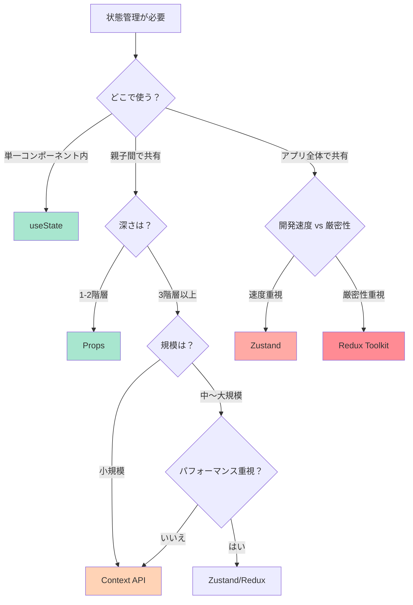
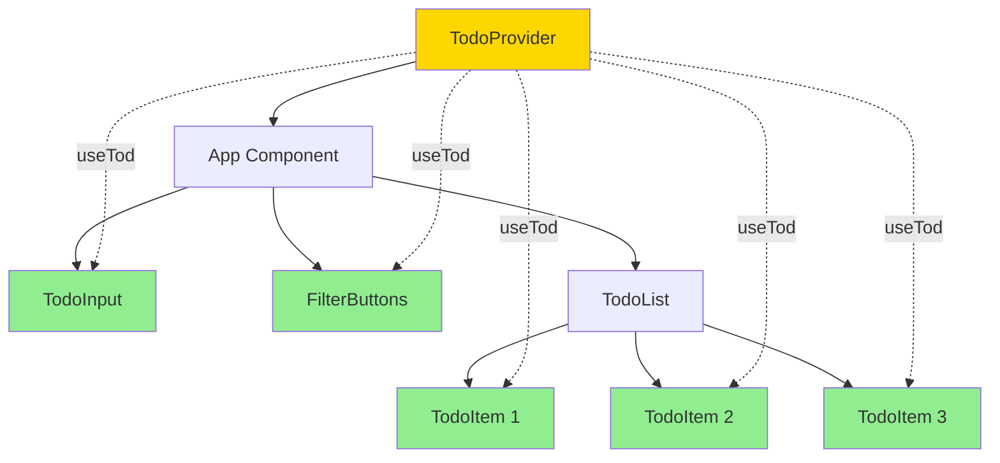
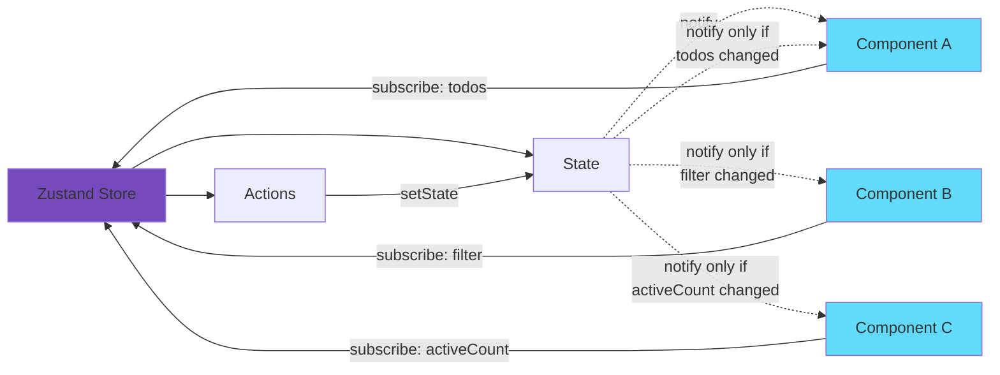
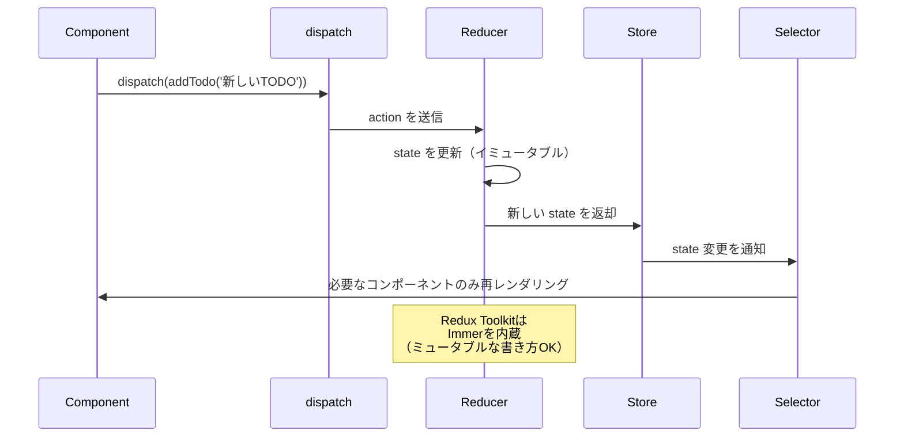

# 6-2. 状態管理を実装する

## 目標

TODOアプリを題材に、状態管理の各アプローチを比較する。

<Callout type="info">
状態管理は、アプリの規模や複雑さによって最適な手法が異なります。小規模なアプリで過剰な状態管理を導入すると、逆に複雑になってしまいます。
</Callout>

---

## 要件

```
TODOアプリ:
- TODOの追加、完了、削除
- フィルター（全部/未完了/完了）
- 件数表示
```

### 状態管理の選択フロー



---

## 1. useState のみ（小規模向け）

```jsx
// App.jsx
import { useState } from 'react';

export default function App() {
  const [todos, setTodos] = useState([]);
  const [filter, setFilter] = useState('all');
  const [inputValue, setInputValue] = useState('');

  const addTodo = () => {
    if (!inputValue.trim()) return;
    setTodos([...todos, { id: Date.now(), text: inputValue, done: false }]);
    setInputValue('');
  };

  const toggleTodo = (id) => {
    setTodos(todos.map(todo =>
      todo.id === id ? { ...todo, done: !todo.done } : todo
    ));
  };

  const deleteTodo = (id) => {
    setTodos(todos.filter(todo => todo.id !== id));
  };

  const filteredTodos = todos.filter(todo => {
    if (filter === 'active') return !todo.done;
    if (filter === 'completed') return todo.done;
    return true;
  });

  return (
    <div>
      <h1>TODO</h1>

      <input
        value={inputValue}
        onChange={(e) => setInputValue(e.target.value)}
        onKeyPress={(e) => e.key === 'Enter' && addTodo()}
      />
      <button onClick={addTodo}>追加</button>

      <div>
        <button onClick={() => setFilter('all')}>全部</button>
        <button onClick={() => setFilter('active')}>未完了</button>
        <button onClick={() => setFilter('completed')}>完了</button>
      </div>

      <p>{todos.filter(t => !t.done).length}件未完了</p>

      <ul>
        {filteredTodos.map(todo => (
          <li key={todo.id}>
            <input
              type="checkbox"
              checked={todo.done}
              onChange={() => toggleTodo(todo.id)}
            />
            <span style={{ textDecoration: todo.done ? 'line-through' : 'none' }}>
              {todo.text}
            </span>
            <button onClick={() => deleteTodo(todo.id)}>削除</button>
          </li>
        ))}
      </ul>
    </div>
  );
}
```

<Callout type="warning" title="問題点">
コンポーネントを分割すると、複数の状態をpropsで渡す必要があります（Props Drilling）。階層が深くなると管理が困難になります。
</Callout>

<WhyButton>
**なぜuseStateだけで問題が起きるのか？**

コンポーネント階層が深くなると、状態を子コンポーネントに渡すために中間コンポーネント全てに props を追加する必要があります（Props Drilling）。これにより：
- コードの可読性が低下
- リファクタリングが困難
- 中間コンポーネントの不要な再レンダリング

が発生します。
</WhyButton>

---

## 2. Context API（Props drilling回避）

### Context API の構造



```jsx
// TodoContext.jsx
import { createContext, useContext, useState } from 'react';

const TodoContext = createContext(null);

export function TodoProvider({ children }) {
  const [todos, setTodos] = useState([]);
  const [filter, setFilter] = useState('all');

  const addTodo = (text) => {
    setTodos([...todos, { id: Date.now(), text, done: false }]);
  };

  const toggleTodo = (id) => {
    setTodos(todos.map(todo =>
      todo.id === id ? { ...todo, done: !todo.done } : todo
    ));
  };

  const deleteTodo = (id) => {
    setTodos(todos.filter(todo => todo.id !== id));
  };

  const filteredTodos = todos.filter(todo => {
    if (filter === 'active') return !todo.done;
    if (filter === 'completed') return todo.done;
    return true;
  });

  const activeCount = todos.filter(t => !t.done).length;

  return (
    <TodoContext.Provider value={{
      todos: filteredTodos,
      activeCount,
      filter,
      setFilter,
      addTodo,
      toggleTodo,
      deleteTodo,
    }}>
      {children}
    </TodoContext.Provider>
  );
}

export const useTodo = () => useContext(TodoContext);
```

```jsx
// コンポーネント（どこからでもアクセス可能）
import { useTodo } from './TodoContext';

function TodoList() {
  const { todos, toggleTodo, deleteTodo } = useTodo();

  return (
    <ul>
      {todos.map(todo => (
        <TodoItem key={todo.id} todo={todo} />
      ))}
    </ul>
  );
}

function TodoItem({ todo }) {
  const { toggleTodo, deleteTodo } = useTodo();

  return (
    <li>
      <input
        type="checkbox"
        checked={todo.done}
        onChange={() => toggleTodo(todo.id)}
      />
      {todo.text}
      <button onClick={() => deleteTodo(todo.id)}>削除</button>
    </li>
  );
}
```

<Callout type="danger" title="パフォーマンスの問題">
Context の値が変わると、Provider 配下の**全てのコンポーネント**が再レンダリングされます。大規模なアプリではパフォーマンス問題の原因になります。
</Callout>

<Accordion title="Context API のパフォーマンス問題を詳しく見る">

**問題の原因**
```jsx
// Contextの値が変わると...
<TodoContext.Provider value={{ todos, filter, addTodo, ... }}>
  {children}  // この中の全コンポーネントが再レンダリング
</TodoContext.Provider>
```

**対策方法**
1. Context を分割（状態ごとに別のContext）
2. `useMemo` でコンテキスト値をメモ化
3. Zustand や Redux などの最適化されたライブラリを使用

<WhyButton>
**なぜ全部再レンダリングされるのか？**

React の Context は「値が変わったかどうか」しか検知できません。どの部分が変わったかは分からないため、安全のために全てのコンシューマーを再レンダリングします。Zustand や Redux はセレクター機能により、必要な部分だけを監視できます。
</WhyButton>

</Accordion>

---

## 3. Zustand（シンプルで高性能）

### Zustand の動作原理



```jsx
// store.js
import { create } from 'zustand';

const useTodoStore = create((set, get) => ({
  todos: [],
  filter: 'all',

  addTodo: (text) => set((state) => ({
    todos: [...state.todos, { id: Date.now(), text, done: false }]
  })),

  toggleTodo: (id) => set((state) => ({
    todos: state.todos.map(todo =>
      todo.id === id ? { ...todo, done: !todo.done } : todo
    )
  })),

  deleteTodo: (id) => set((state) => ({
    todos: state.todos.filter(todo => todo.id !== id)
  })),

  setFilter: (filter) => set({ filter }),

  // セレクター（派生状態）
  getFilteredTodos: () => {
    const { todos, filter } = get();
    if (filter === 'active') return todos.filter(t => !t.done);
    if (filter === 'completed') return todos.filter(t => t.done);
    return todos;
  },

  getActiveCount: () => get().todos.filter(t => !t.done).length,
}));

export default useTodoStore;
```

```jsx
// コンポーネント
import useTodoStore from './store';

function TodoList() {
  // 必要な部分だけsubscribe（他が変わっても再レンダリングされない）
  const todos = useTodoStore(state => state.getFilteredTodos());

  return (
    <ul>
      {todos.map(todo => <TodoItem key={todo.id} todo={todo} />)}
    </ul>
  );
}

function TodoItem({ todo }) {
  const toggleTodo = useTodoStore(state => state.toggleTodo);
  const deleteTodo = useTodoStore(state => state.deleteTodo);

  return (
    <li>
      <input
        type="checkbox"
        checked={todo.done}
        onChange={() => toggleTodo(todo.id)}
      />
      {todo.text}
      <button onClick={() => deleteTodo(todo.id)}>削除</button>
    </li>
  );
}

function ActiveCount() {
  // activeCountが変わったときだけ再レンダリング
  const count = useTodoStore(state => state.getActiveCount());
  return <p>{count}件未完了</p>;
}
```

<Callout type="success" title="Zustand の利点">
- セレクター機能により、必要な状態だけを監視
- 変更された部分のみ再レンダリング
- ボイラープレートが少ない
- TypeScript との相性が良い
</Callout>

---

## 4. Redux Toolkit（大規模向け）

### Redux の データフロー



```jsx
// todosSlice.js
import { createSlice } from '@reduxjs/toolkit';

const todosSlice = createSlice({
  name: 'todos',
  initialState: {
    items: [],
    filter: 'all',
  },
  reducers: {
    addTodo: (state, action) => {
      state.items.push({
        id: Date.now(),
        text: action.payload,
        done: false,
      });
    },
    toggleTodo: (state, action) => {
      const todo = state.items.find(t => t.id === action.payload);
      if (todo) todo.done = !todo.done;
    },
    deleteTodo: (state, action) => {
      state.items = state.items.filter(t => t.id !== action.payload);
    },
    setFilter: (state, action) => {
      state.filter = action.payload;
    },
  },
});

export const { addTodo, toggleTodo, deleteTodo, setFilter } = todosSlice.actions;

// セレクター
export const selectFilteredTodos = (state) => {
  const { items, filter } = state.todos;
  if (filter === 'active') return items.filter(t => !t.done);
  if (filter === 'completed') return items.filter(t => t.done);
  return items;
};

export const selectActiveCount = (state) =>
  state.todos.items.filter(t => !t.done).length;

export default todosSlice.reducer;
```

```jsx
// store.js
import { configureStore } from '@reduxjs/toolkit';
import todosReducer from './todosSlice';

export const store = configureStore({
  reducer: {
    todos: todosReducer,
  },
});
```

```jsx
// コンポーネント
import { useSelector, useDispatch } from 'react-redux';
import { toggleTodo, deleteTodo, selectFilteredTodos } from './todosSlice';

function TodoList() {
  const todos = useSelector(selectFilteredTodos);
  const dispatch = useDispatch();

  return (
    <ul>
      {todos.map(todo => (
        <li key={todo.id}>
          <input
            type="checkbox"
            checked={todo.done}
            onChange={() => dispatch(toggleTodo(todo.id))}
          />
          {todo.text}
          <button onClick={() => dispatch(deleteTodo(todo.id))}>削除</button>
        </li>
      ))}
    </ul>
  );
}
```

---

## 比較

<Tabs>
<Tab title="機能比較">

| 観点 | useState | Context | Zustand | Redux Toolkit |
|------|----------|---------|---------|---------------|
| 学習コスト | 低 | 低 | 低 | 中 |
| ボイラープレート | 少 | 中 | 少 | 多 |
| パフォーマンス | - | 低 | 高 | 高 |
| DevTools | - | - | あり | 強力 |
| 適したサイズ | 小 | 小〜中 | 小〜大 | 中〜大 |
| TypeScript | 普通 | 普通 | 良 | 良 |
| ミドルウェア | - | - | あり | 豊富 |
| 時間旅行デバッグ | - | - | 可能 | 標準 |

</Tab>

<Tab title="コード量比較">

同じTODOアプリを実装した場合のコード量：

**useState のみ**
```
App.jsx: 約90行
問題: コンポーネント分割が困難
```

**Context API**
```
Context: 約45行
Components: 約50行
合計: 約95行
```

**Zustand**
```
Store: 約30行
Components: 約40行
合計: 約70行（最もシンプル）
```

**Redux Toolkit**
```
Slice: 約50行
Store: 約10行
Components: 約45行
合計: 約105行
```

<Callout type="info">
Zustand が最もコード量が少なく、シンプルです。Redux は機能が豊富な分、コード量が多くなります。
</Callout>

</Tab>

<Tab title="再レンダリング比較">

1つのTODOを追加した場合：

**useState / Context**
- 全コンポーネントが再レンダリング
- 10コンポーネント = 10回再レンダリング

**Zustand / Redux**
- 必要なコンポーネントのみ再レンダリング
- 10コンポーネント中 2-3個のみ再レンダリング

<Callout type="success">
適切なセレクターを使うことで、パフォーマンスが大幅に向上します。
</Callout>

</Tab>
</Tabs>

---

## 選び方

<Callout type="tip" title="状態管理の選択ガイド">

**useState を選ぶ場合**
- 単一コンポーネント内で完結
- 状態が2-3個程度
- コンポーネント分割の予定なし

**Context API を選ぶ場合**
- 数コンポーネントで共有（3-5個程度）
- パフォーマンスが重要でない
- テーマやロケールなど、変更頻度が低い状態

**Zustand を選ぶ場合**（推奨）
- アプリ全体で共有する状態
- パフォーマンスが重要
- シンプルに実装したい
- 中規模〜大規模アプリ

**Redux Toolkit を選ぶ場合**
- 超大規模アプリ
- 厳密な状態管理が必要
- 強力なDevToolsが必要
- ミドルウェア（logger、saga等）が必要

</Callout>

<WhyButton>
**なぜZustandが推奨されるのか？**

Zustand は「シンプルさ」と「パフォーマンス」のバランスが最も優れています：
- Redux Toolkit と同等のパフォーマンス
- Context API より少ないコード量
- 学習コストが低い
- TypeScript サポートが優秀

小規模から大規模まで幅広く対応でき、必要に応じて Redux に移行することも容易です。
</WhyButton>

---

## 演習

<StepByStep>

<Step title="useStateだけでTODOアプリを作る">

1. 上記のコードを実装
2. 実際に動かしてみる
3. コンポーネント分割を試みる
4. Props Drilling の問題を体感する

</Step>

<Step title="Zustandに書き換える">

1. Zustandをインストール
```bash
npm install zustand
```

2. ストアを作成
3. コンポーネントを書き換え
4. セレクター機能を活用

</Step>

<Step title="どちらが管理しやすいか比較する">

以下の観点で比較してみましょう：
- コード量
- 可読性
- メンテナンス性
- パフォーマンス（React DevToolsで確認）

<Callout type="tip">
React DevTools の Profiler を使うと、どのコンポーネントが再レンダリングされたか確認できます。
</Callout>

</Step>

</StepByStep>

---

## サンプルコード

この章の内容を実際に動かして試せるサンプルコードを用意しています。

- [状態管理比較サンプル](/samples/practice/01-state-comparison) - useState / useReducer / Context / Zustand の比較

