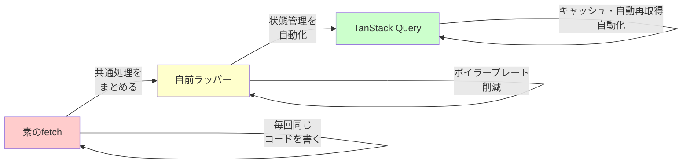
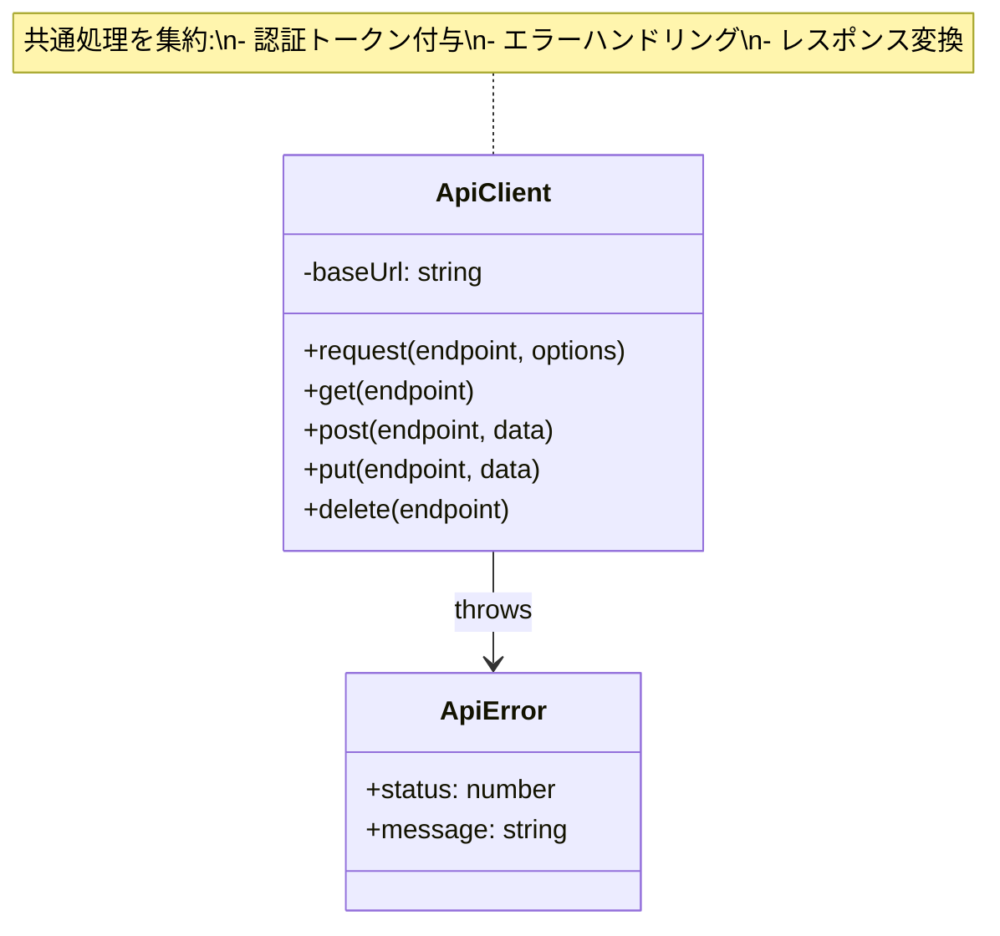
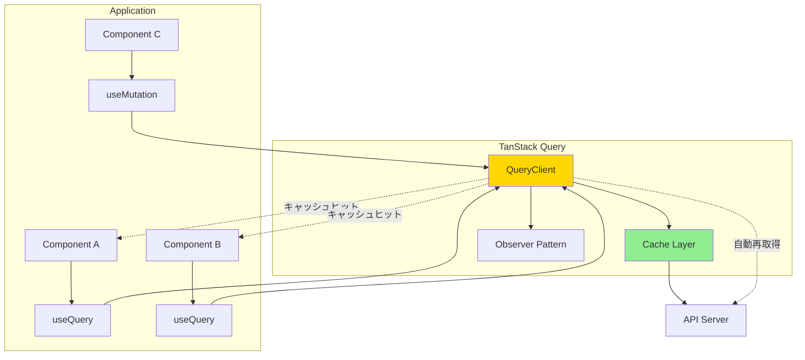
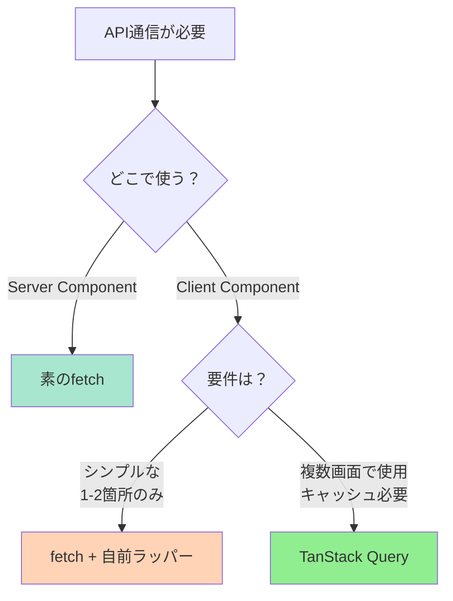

# 6-3. APIクライアントを作る

## 目標

fetchの自前ラッパーと、ライブラリの違いを理解する。

<Callout type="info">
API通信は、エラーハンドリング、ローディング状態、キャッシュなど考慮すべき点が多数あります。適切なツールを選ぶことで開発効率が大幅に向上します。
</Callout>

### APIクライアントの進化



---

## 1. 素のfetch

```javascript
// 毎回書くのは面倒
async function getUsers() {
  const response = await fetch('/api/users', {
    headers: {
      'Content-Type': 'application/json',
      'Authorization': `Bearer ${getToken()}`,
    },
  });

  if (!response.ok) {
    throw new Error(`HTTP error! status: ${response.status}`);
  }

  return response.json();
}
```

<Callout type="warning" title="素のfetchの問題点">
- ヘッダーやエラーハンドリングを毎回書く必要がある
- 認証トークンの付与を忘れやすい
- ローディング・エラー状態の管理が煩雑
- 同じデータを複数回取得してしまう（キャッシュなし）
</Callout>

---

## 2. 自前ラッパー

### APIクライアントの構造



```javascript
// lib/api.js
const BASE_URL = process.env.NEXT_PUBLIC_API_URL || '';

class ApiClient {
  constructor(baseUrl) {
    this.baseUrl = baseUrl;
  }

  async request(endpoint, options = {}) {
    const url = `${this.baseUrl}${endpoint}`;

    const config = {
      headers: {
        'Content-Type': 'application/json',
        ...options.headers,
      },
      ...options,
    };

    // 認証トークンを自動付与
    const token = localStorage.getItem('token');
    if (token) {
      config.headers.Authorization = `Bearer ${token}`;
    }

    const response = await fetch(url, config);

    // エラーハンドリング
    if (!response.ok) {
      const error = await response.json().catch(() => ({}));
      throw new ApiError(response.status, error.message || 'API Error');
    }

    // 204 No Content の場合
    if (response.status === 204) {
      return null;
    }

    return response.json();
  }

  get(endpoint, options) {
    return this.request(endpoint, { ...options, method: 'GET' });
  }

  post(endpoint, data, options) {
    return this.request(endpoint, {
      ...options,
      method: 'POST',
      body: JSON.stringify(data),
    });
  }

  put(endpoint, data, options) {
    return this.request(endpoint, {
      ...options,
      method: 'PUT',
      body: JSON.stringify(data),
    });
  }

  delete(endpoint, options) {
    return this.request(endpoint, { ...options, method: 'DELETE' });
  }
}

class ApiError extends Error {
  constructor(status, message) {
    super(message);
    this.status = status;
  }
}

export const api = new ApiClient(BASE_URL);
```

```javascript
// 使用例
import { api } from '@/lib/api';

// シンプルに書ける
const users = await api.get('/api/users');
const newUser = await api.post('/api/users', { name: '田中' });
await api.delete('/api/users/1');
```

<Callout type="success" title="自前ラッパーの利点">
- 共通処理を1箇所にまとめられる
- コードの重複を削減
- メンテナンスが容易
- 独自の要件に柔軟に対応可能
</Callout>

<WhyButton>
**なぜクラスで実装するのか？**

クラスを使うことで：
- インスタンスごとに異なる設定（baseUrl等）を持てる
- 内部状態（トークン等）をカプセル化できる
- メソッドの再利用が容易

関数ベースでも実装可能ですが、複数の API エンドポイントを扱う場合はクラスの方が管理しやすいです。
</WhyButton>

---

## 3. TanStack Query（サーバー状態管理）

### TanStack Query のアーキテクチャ



```jsx
// hooks/useUsers.js
import { useQuery, useMutation, useQueryClient } from '@tanstack/react-query';
import { api } from '@/lib/api';

// ユーザー一覧取得
export function useUsers() {
  return useQuery({
    queryKey: ['users'],
    queryFn: () => api.get('/api/users'),
  });
}

// ユーザー詳細取得
export function useUser(id) {
  return useQuery({
    queryKey: ['users', id],
    queryFn: () => api.get(`/api/users/${id}`),
    enabled: !!id,  // idがあるときだけ実行
  });
}

// ユーザー作成
export function useCreateUser() {
  const queryClient = useQueryClient();

  return useMutation({
    mutationFn: (data) => api.post('/api/users', data),
    onSuccess: () => {
      // 成功したらキャッシュを更新
      queryClient.invalidateQueries({ queryKey: ['users'] });
    },
  });
}

// ユーザー削除
export function useDeleteUser() {
  const queryClient = useQueryClient();

  return useMutation({
    mutationFn: (id) => api.delete(`/api/users/${id}`),
    onSuccess: () => {
      queryClient.invalidateQueries({ queryKey: ['users'] });
    },
  });
}
```

```jsx
// コンポーネント
function UserList() {
  const { data: users, isLoading, error } = useUsers();
  const deleteUser = useDeleteUser();

  if (isLoading) return <div>読み込み中...</div>;
  if (error) return <div>エラー: {error.message}</div>;

  return (
    <ul>
      {users.map(user => (
        <li key={user.id}>
          {user.name}
          <button
            onClick={() => deleteUser.mutate(user.id)}
            disabled={deleteUser.isPending}
          >
            {deleteUser.isPending ? '削除中...' : '削除'}
          </button>
        </li>
      ))}
    </ul>
  );
}
```

---

## TanStack Query の嬉しいポイント

<Tabs>
<Tab title="キャッシュ">

### 自動キャッシュ機能

```jsx
// ページAで取得
const { data } = useUsers();  // APIリクエスト

// ページBに移動してまた取得
const { data } = useUsers();  // キャッシュから即座に表示
                              // バックグラウンドで最新を取得
```

<Callout type="success">
同じ queryKey を持つクエリは自動的にキャッシュされ、複数のコンポーネントで共有されます。
</Callout>

</Tab>

<Tab title="自動再取得">

### 様々な再取得トリガー

```jsx
useQuery({
  queryKey: ['users'],
  queryFn: fetchUsers,
  staleTime: 5 * 60 * 1000,    // 5分間はキャッシュを新鮮とみなす
  refetchOnWindowFocus: true,  // ウィンドウフォーカスで再取得
  refetchInterval: 30000,      // 30秒ごとに再取得
});
```

<Callout type="info">
データの鮮度を保つための自動再取得機能により、常に最新のデータを表示できます。
</Callout>

</Tab>

<Tab title="エラーリトライ">

### 自動リトライ機能

```jsx
useQuery({
  queryKey: ['users'],
  queryFn: fetchUsers,
  retry: 3,           // 3回まで自動リトライ
  retryDelay: 1000,   // 1秒後にリトライ
});
```

<Callout type="tip">
ネットワークの一時的な問題に自動的に対応し、ユーザーエクスペリエンスを向上させます。
</Callout>

</Tab>

<Tab title="楽観的更新">

### Optimistic Updates

```jsx
const queryClient = useQueryClient();

const mutation = useMutation({
  mutationFn: updateUser,
  // 送信前にUIを更新
  onMutate: async (newUser) => {
    await queryClient.cancelQueries({ queryKey: ['users', newUser.id] });
    const previousUser = queryClient.getQueryData(['users', newUser.id]);
    queryClient.setQueryData(['users', newUser.id], newUser);
    return { previousUser };
  },
  // エラー時にロールバック
  onError: (err, newUser, context) => {
    queryClient.setQueryData(['users', newUser.id], context.previousUser);
  },
});
```

<Callout type="success">
サーバーのレスポンスを待たずにUIを更新することで、高速で快適なUXを実現できます。
</Callout>

<WhyButton>
**なぜ楽観的更新が重要なのか？**

通常、APIレスポンスを待ってからUIを更新すると、ユーザーは数百ミリ秒〜数秒待つ必要があります。楽観的更新では：
1. ユーザーの操作に即座に反応
2. バックグラウンドでAPI送信
3. エラー時のみロールバック

これにより、ネイティブアプリのような高速な体験を提供できます。
</WhyButton>

</Tab>
</Tabs>

---

## 比較

| 観点 | 素のfetch | 自前ラッパー | TanStack Query |
|------|-----------|-------------|----------------|
| ボイラープレート | 多い | 少ない | 最小 |
| キャッシュ | なし | 自前実装 | 自動 |
| ローディング状態 | 手動 | 手動 | 自動 |
| エラーハンドリング | 手動 | 共通化可能 | 自動 |
| 再取得 | 手動 | 手動 | 自動 |
| 学習コスト | 低 | 低 | 中 |

---

## 選び方

<Callout type="tip" title="APIクライアントの選択ガイド">

**素のfetch を使う場合**
- 超シンプルなAPI呼び出し（1-2箇所のみ）
- サーバーコンポーネント（Next.js App Router）
- 状態管理が不要

**自前ラッパー を使う場合**
- 共通処理をまとめたい
- 独自の認証方式が必要
- TanStack Query を使うほどではない

**TanStack Query を使う場合**（推奨）
- 一覧・詳細画面がある
- リアルタイム性が必要
- キャッシュが必要
- ローディング・エラー状態の管理が必要
- クライアントコンポーネント

</Callout>

### 実際の使い分け例



---

## よくある誤解

<Accordion title="「全部TanStack Queryで書けばいい」？">

TanStack Queryは**サーバー状態の管理**に特化しています。

```javascript
// 良い使い方：サーバーからのデータ
const { data: users } = useQuery({ queryKey: ['users'], queryFn: fetchUsers });

// 不要な使い方：ローカルの状態
// → useStateやZustandの方が適切
const { data: isModalOpen } = useQuery({ ... }); // ❌
const [isModalOpen, setIsModalOpen] = useState(false); // ✅
```

<Callout type="warning">
**サーバー状態**と**クライアント状態**を混同しないようにしましょう。

- サーバー状態：API から取得したデータ → TanStack Query
- クライアント状態：UI の状態（モーダル開閉等） → useState / Zustand
</Callout>

</Accordion>

<Accordion title="「fetchで十分」？">

小規模なら十分ですが、以下の場合はTanStack Queryの恩恵が大きい：

- 同じデータを複数コンポーネントで使う（キャッシュ）
- ローディング/エラー状態の管理が面倒
- データの自動更新が必要
- 楽観的更新をしたい

<Callout type="info">
アプリの規模が大きくなるにつれて、手動で実装する部分が増え、結果的に TanStack Query と同じことを自前で実装することになります。最初から TanStack Query を使う方が効率的です。
</Callout>

</Accordion>

<Accordion title="「Axiosは必須」？">

fetchでほとんどのケースは対応できます。Axiosが必要なのは：

- リクエスト/レスポンスのインターセプター
- タイムアウト設定
- ブラウザ互換性（古いブラウザ対応）

<Tabs>
<Tab title="fetch で十分な場合">

```javascript
// モダンブラウザのみ対応
// シンプルなAPI呼び出し
const response = await fetch('/api/users');
const data = await response.json();
```

</Tab>

<Tab title="Axios が必要な場合">

```javascript
// インターセプターで共通処理
axios.interceptors.request.use(config => {
  config.headers.Authorization = `Bearer ${getToken()}`;
  return config;
});

// タイムアウト設定
axios.get('/api/users', { timeout: 5000 });
```

</Tab>
</Tabs>

<WhyButton>
**fetch と Axios の違い**

fetch は標準APIですが：
- タイムアウトがない
- インターセプターがない
- 古いブラウザ非対応

Axios は：
- 上記の機能を全て提供
- ただし追加のライブラリが必要（約13KB）

モダンな開発では fetch + 必要に応じて Polyfill で十分な場合が多いです。
</WhyButton>

</Accordion>

---

## まとめ

- **素のfetch**: 単純だが毎回同じコードを書く必要がある
- **自前ラッパー**: 共通処理をまとめて再利用可能に
- **TanStack Query**: キャッシュ、自動再取得、状態管理を自動化
- **使い分け**: 規模と要件に応じて選択

---

## サンプルコード

この章の内容を実際に動かして試せるサンプルコードを用意しています。

- [APIクライアント比較サンプル](https://github.com/minaaaa3/study-memo/tree/main/samples/practice/02-api-client-comparison) - 素のfetch / Axios / TanStack Query の比較

---

## セットアップ

```bash
# TanStack Queryのインストール
npm install @tanstack/react-query

# 開発ツール（オプション）
npm install @tanstack/react-query-devtools
```

```jsx
// app/providers.jsx
'use client';
import { QueryClient, QueryClientProvider } from '@tanstack/react-query';
import { ReactQueryDevtools } from '@tanstack/react-query-devtools';

const queryClient = new QueryClient();

export function Providers({ children }) {
  return (
    <QueryClientProvider client={queryClient}>
      {children}
      <ReactQueryDevtools />
    </QueryClientProvider>
  );
}
```

---

## 演習

<StepByStep>

<Step title="自前ラッパーでCRUD APIを実装">

1. APIクライアントクラスを作成
2. GET、POST、PUT、DELETE メソッドを実装
3. エラーハンドリングを追加
4. 認証トークンの自動付与を実装

```bash
# 必要なパッケージ
npm install
```

</Step>

<Step title="TanStack Queryに書き換える">

1. TanStack Queryをインストール
```bash
npm install @tanstack/react-query
```

2. QueryClientProvider をセットアップ
3. useQuery で GET を実装
4. useMutation で POST/PUT/DELETE を実装

</Step>

<Step title="キャッシュの動作を確認">

DevTools を使って以下を確認：

1. React Query DevTools をインストール
```bash
npm install @tanstack/react-query-devtools
```

2. 確認項目：
   - キャッシュの状態（fresh / stale）
   - 自動再取得のタイミング
   - Mutation 後のキャッシュ無効化

<Callout type="tip">
DevTools の画面下部に表示されるパネルで、クエリの状態をリアルタイムで確認できます。
</Callout>

</Step>

</StepByStep>

---

## サンプルコード

この章の内容を実際に動かして試せるサンプルコードを用意しています。

- [CRUD APIサーバー](https://github.com/minaaaa3/study-memo/tree/main/samples/server/03-crud-api) - APIクライアントのテスト用サーバー

