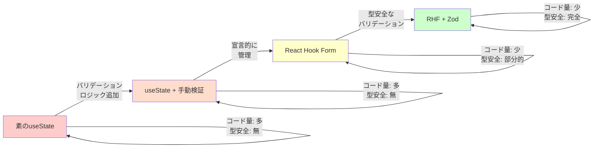
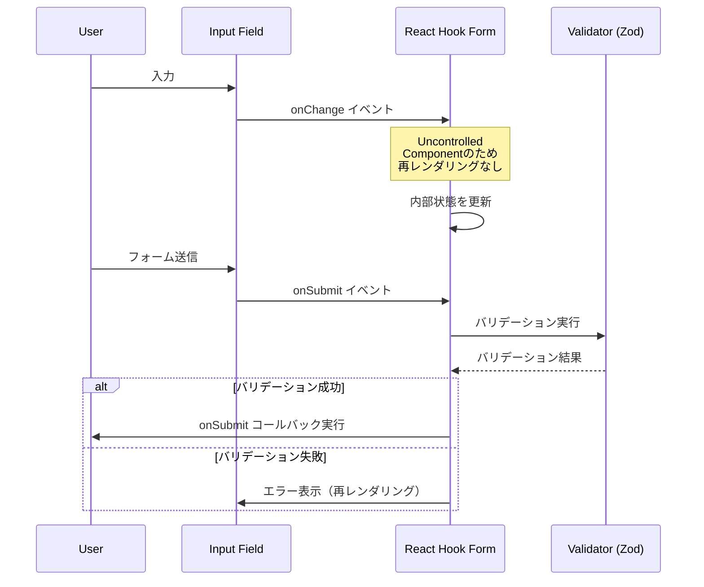
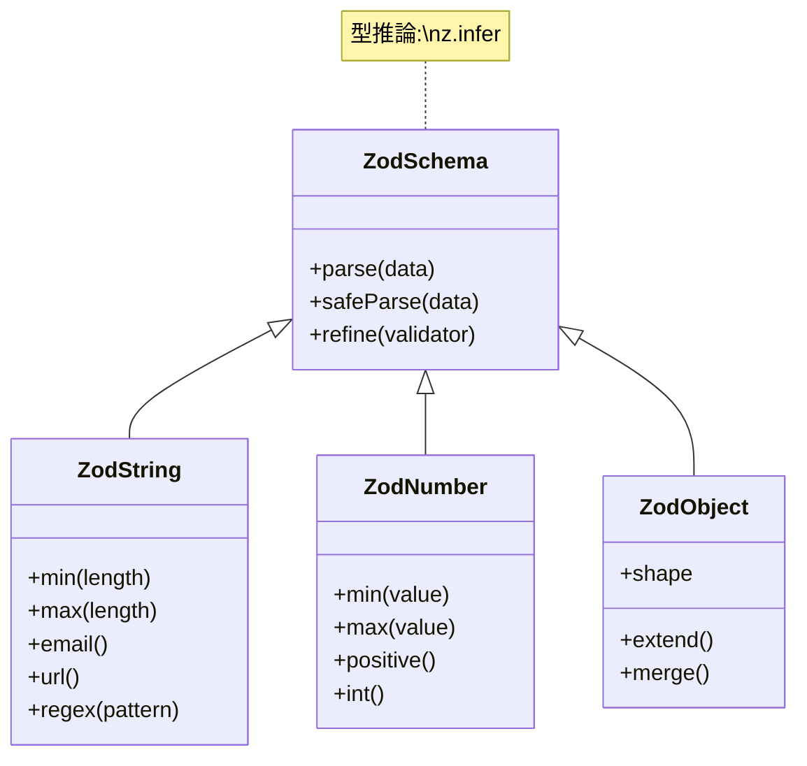
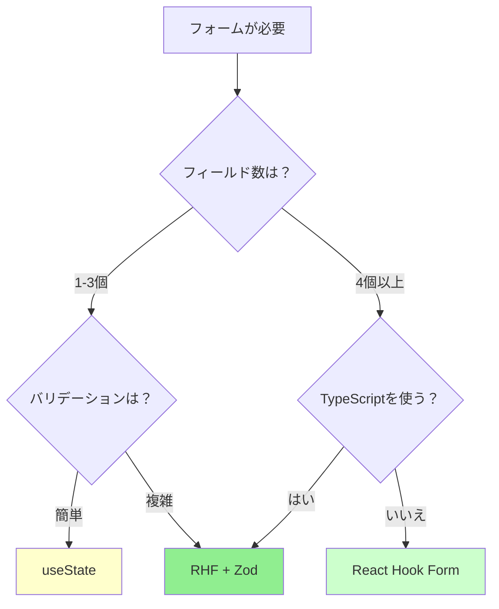
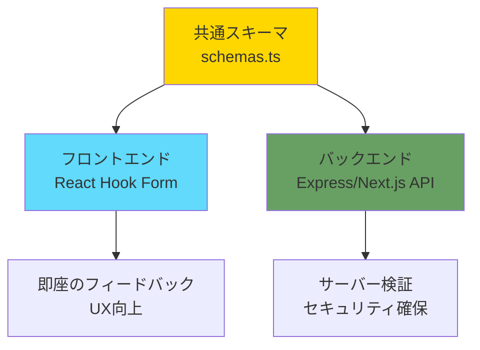

# 6-4. フォームを作る

## 目標

フォームのバリデーションを自前とライブラリで比較する。

<Callout type="info">
フォームは、バリデーション、エラー表示、状態管理など、実装すべき要素が多い機能です。React Hook Form + Zod の組み合わせにより、これらを宣言的かつ型安全に実装できます。
</Callout>

### フォーム実装の進化



---

## 1. 素のuseState

```jsx
function RegisterForm() {
  const [values, setValues] = useState({
    email: '',
    password: '',
    confirmPassword: '',
  });
  const [errors, setErrors] = useState({});
  const [isSubmitting, setIsSubmitting] = useState(false);

  const handleChange = (e) => {
    const { name, value } = e.target;
    setValues(prev => ({ ...prev, [name]: value }));
    // 入力時にエラーをクリア
    if (errors[name]) {
      setErrors(prev => ({ ...prev, [name]: '' }));
    }
  };

  const validate = () => {
    const newErrors = {};

    if (!values.email) {
      newErrors.email = 'メールは必須です';
    } else if (!/\S+@\S+\.\S+/.test(values.email)) {
      newErrors.email = 'メール形式が正しくありません';
    }

    if (!values.password) {
      newErrors.password = 'パスワードは必須です';
    } else if (values.password.length < 8) {
      newErrors.password = 'パスワードは8文字以上必要です';
    }

    if (values.password !== values.confirmPassword) {
      newErrors.confirmPassword = 'パスワードが一致しません';
    }

    setErrors(newErrors);
    return Object.keys(newErrors).length === 0;
  };

  const handleSubmit = async (e) => {
    e.preventDefault();
    if (!validate()) return;

    setIsSubmitting(true);
    try {
      await api.post('/api/register', values);
      alert('登録完了！');
    } catch (error) {
      setErrors({ submit: error.message });
    } finally {
      setIsSubmitting(false);
    }
  };

  return (
    <form onSubmit={handleSubmit}>
      <div>
        <input
          name="email"
          type="email"
          value={values.email}
          onChange={handleChange}
          placeholder="メールアドレス"
        />
        {errors.email && <span className="error">{errors.email}</span>}
      </div>

      <div>
        <input
          name="password"
          type="password"
          value={values.password}
          onChange={handleChange}
          placeholder="パスワード"
        />
        {errors.password && <span className="error">{errors.password}</span>}
      </div>

      <div>
        <input
          name="confirmPassword"
          type="password"
          value={values.confirmPassword}
          onChange={handleChange}
          placeholder="パスワード（確認）"
        />
        {errors.confirmPassword && <span className="error">{errors.confirmPassword}</span>}
      </div>

      {errors.submit && <div className="error">{errors.submit}</div>}

      <button type="submit" disabled={isSubmitting}>
        {isSubmitting ? '送信中...' : '登録'}
      </button>
    </form>
  );
}
```

<Callout type="danger" title="問題点">
**フィールドが増えると管理が大変**
- 状態管理が複雑化（values、errors、touched、isSubmitting...）
- バリデーションロジックが散らばる
- 再レンダリングが頻繁に発生
- TypeScript の型推論が効かない
</Callout>

<Accordion title="useState でフォームを実装する問題を詳しく見る">

**1. 状態管理の複雑化**
```jsx
const [values, setValues] = useState({});      // 値
const [errors, setErrors] = useState({});      // エラー
const [touched, setTouched] = useState({});    // タッチ状態
const [isSubmitting, setIsSubmitting] = useState(false);  // 送信状態
```

フィールドが10個あると、それぞれに対して4つの状態を管理する必要があります。

**2. バリデーションロジックの散在**
```jsx
// 入力時のバリデーション
const handleChange = (e) => { /* バリデーション */ };
// フォーカス時のバリデーション
const handleBlur = (e) => { /* バリデーション */ };
// 送信時のバリデーション
const validate = () => { /* バリデーション */ };
```

同じルールを複数箇所で管理する必要があり、メンテナンスが困難です。

**3. 再レンダリングの問題**
```jsx
// 1文字入力するたびに全体が再レンダリング
const handleChange = (e) => {
  setValues(prev => ({ ...prev, [name]: value }));
  // ↑ これで全フィールドが再レンダリング
};
```

<WhyButton>
**なぜ再レンダリングが頻繁に起きるのか？**

useState で管理すると、フォーム全体が1つのオブジェクトとして管理されます。1つのフィールドが変更されても、React は「オブジェクト全体が変更された」と判断し、全てのフィールドを再レンダリングします。React Hook Form は Uncontrolled Components を使うことで、この問題を回避します。
</WhyButton>

</Accordion>

---

## 2. React Hook Form + Zod

### React Hook Form の動作原理



```jsx
import { useForm } from 'react-hook-form';
import { zodResolver } from '@hookform/resolvers/zod';
import { z } from 'zod';

// スキーマでバリデーションルールを定義
const schema = z.object({
  email: z
    .string()
    .min(1, 'メールは必須です')
    .email('メール形式が正しくありません'),
  password: z
    .string()
    .min(1, 'パスワードは必須です')
    .min(8, 'パスワードは8文字以上必要です'),
  confirmPassword: z
    .string()
    .min(1, 'パスワード（確認）は必須です'),
}).refine((data) => data.password === data.confirmPassword, {
  message: 'パスワードが一致しません',
  path: ['confirmPassword'],
});

type FormData = z.infer<typeof schema>;

function RegisterForm() {
  const {
    register,
    handleSubmit,
    formState: { errors, isSubmitting },
    setError,
  } = useForm<FormData>({
    resolver: zodResolver(schema),
  });

  const onSubmit = async (data: FormData) => {
    try {
      await api.post('/api/register', data);
      alert('登録完了！');
    } catch (error) {
      setError('root', { message: error.message });
    }
  };

  return (
    <form onSubmit={handleSubmit(onSubmit)}>
      <div>
        <input
          {...register('email')}
          type="email"
          placeholder="メールアドレス"
        />
        {errors.email && <span className="error">{errors.email.message}</span>}
      </div>

      <div>
        <input
          {...register('password')}
          type="password"
          placeholder="パスワード"
        />
        {errors.password && <span className="error">{errors.password.message}</span>}
      </div>

      <div>
        <input
          {...register('confirmPassword')}
          type="password"
          placeholder="パスワード（確認）"
        />
        {errors.confirmPassword && <span className="error">{errors.confirmPassword.message}</span>}
      </div>

      {errors.root && <div className="error">{errors.root.message}</div>}

      <button type="submit" disabled={isSubmitting}>
        {isSubmitting ? '送信中...' : '登録'}
      </button>
    </form>
  );
}
```

<Callout type="success" title="React Hook Form + Zod の利点">
- コード量が大幅に削減（約50%減）
- バリデーションルールを1箇所で管理
- 型推論が自動で効く
- 再レンダリングが最小限
- エラーハンドリングが自動化
</Callout>

---

## Zodスキーマの例

### Zod の構造



```typescript
import { z } from 'zod';

// 基本
const userSchema = z.object({
  name: z.string().min(1, '名前は必須'),
  age: z.number().min(0).max(150),
  email: z.string().email(),
});

// オプショナル
const profileSchema = z.object({
  bio: z.string().optional(),
  website: z.string().url().optional(),
});

// 配列
const tagsSchema = z.array(z.string()).min(1, '1つ以上のタグが必要');

// Union
const statusSchema = z.enum(['draft', 'published', 'archived']);

// 条件付きバリデーション
const paymentSchema = z.object({
  method: z.enum(['card', 'bank']),
  cardNumber: z.string().optional(),
  bankAccount: z.string().optional(),
}).refine((data) => {
  if (data.method === 'card') return !!data.cardNumber;
  if (data.method === 'bank') return !!data.bankAccount;
  return true;
}, {
  message: '支払い情報を入力してください',
});

// 型の推論
type User = z.infer<typeof userSchema>;
// { name: string; age: number; email: string; }
```

<WhyButton>
**なぜZodを使うのか？**

従来のバリデーションライブラリ（Yup等）と比べて：
- TypeScript のファーストクラスサポート
- バンドルサイズが小さい（約8KB）
- サーバーサイドでも同じスキーマを使える
- エラーメッセージのカスタマイズが簡単
- パフォーマンスが高い

特に「フロント・バック共通のバリデーション」を実現できる点が大きな利点です。
</WhyButton>

---

## React Hook Form の便利機能

<Tabs>
<Tab title="フィールド配列">

### 動的なフィールド管理

```jsx
import { useFieldArray } from 'react-hook-form';

function DynamicForm() {
  const { control, register } = useForm({
    defaultValues: {
      items: [{ name: '' }],
    },
  });

  const { fields, append, remove } = useFieldArray({
    control,
    name: 'items',
  });

  return (
    <form>
      {fields.map((field, index) => (
        <div key={field.id}>
          <input {...register(`items.${index}.name`)} />
          <button type="button" onClick={() => remove(index)}>削除</button>
        </div>
      ))}
      <button type="button" onClick={() => append({ name: '' })}>
        追加
      </button>
    </form>
  );
}
```

<Callout type="tip">
useFieldArray を使うと、配列形式のフィールドを簡単に管理できます。TODO リストや商品一覧など、動的に増減するフィールドに最適です。
</Callout>

</Tab>

<Tab title="ウォッチ">

### フィールド値の監視

```jsx
const { watch } = useForm();

// 特定のフィールドを監視
const email = watch('email');

// 全フィールドを監視
const allValues = watch();

// 条件付き表示
const method = watch('paymentMethod');
return (
  <>
    {method === 'card' && <CardFields />}
    {method === 'bank' && <BankFields />}
  </>
);
```

<Callout type="info">
watch を使うことで、フィールドの値に応じて条件付きで表示するフィールドを変更できます。
</Callout>

</Tab>
</Tabs>

---

## 比較

| 観点 | useState | React Hook Form + Zod |
|------|----------|----------------------|
| コード量 | 多い | 少ない |
| 再レンダリング | 多い | 最小限 |
| バリデーション | 手動 | 宣言的 |
| 型安全 | 手動 | 自動 |
| エラー管理 | 手動 | 自動 |
| フィールド配列 | 大変 | 簡単 |

---

## 選び方

<Callout type="tip" title="フォームライブラリの選択ガイド">

**useState を使う場合**
- 2-3フィールドの単純なフォーム
- バリデーションがほぼ不要
- プロトタイプや検証用

**React Hook Form を使う場合**
- 5個以上のフィールド
- 複雑なバリデーション
- パフォーマンスが重要

**React Hook Form + Zod を使う場合**（推奨）
- TypeScript を使用している
- フロント・バック共通のバリデーション
- 型安全性が重要
- 本番環境のアプリケーション

</Callout>

### 判断フロー



---

## よくある誤解

<Accordion title="「React Hook Formは複雑」？">

実際は**素のuseStateより簡単**です。

```jsx
// useState版: 10行以上のボイラープレート
const [values, setValues] = useState({});
const [errors, setErrors] = useState({});
const [touched, setTouched] = useState({});
const handleChange = (e) => { ... };
const handleBlur = (e) => { ... };
const validate = () => { ... };

// RHF版: 3行
const { register, handleSubmit, formState: { errors } } = useForm();
```

<Callout type="success">
学習コストは低く、一度覚えればどんなフォームでも同じパターンで実装できます。
</Callout>

</Accordion>

<Accordion title="「バリデーションはフロントだけでいい」？">

**絶対にサーバーでもバリデーションが必要**です。

```javascript
// フロントのバリデーションは簡単に回避できる
// DevToolsで直接APIを叩けばスキップされる

// サーバー側でも必ずチェック
app.post('/api/users', (req, res) => {
  const result = userSchema.safeParse(req.body);
  if (!result.success) {
    return res.status(400).json({ errors: result.error.errors });
  }
  // ...
});
```

<Callout type="danger" title="セキュリティ上の重要なポイント">
**フロントエンドのバリデーションは、UX向上が目的です。セキュリティ対策ではありません。**

攻撃者は：
- ブラウザの開発者ツールでバリデーションをスキップ
- 直接 API にリクエストを送信
- 悪意のあるデータを送信

必ずサーバーサイドでバリデーションを実装してください。
</Callout>

</Accordion>

<Accordion title="「Zodはフロントエンド専用」？">

Zodは**サーバーでも使える**ので、スキーマを共通化できます。

```typescript
// shared/schemas.ts（フロント/バック共通）
export const userSchema = z.object({
  email: z.string().email(),
  password: z.string().min(8),
});
```

### フロント・バック共通化のメリット



<Callout type="success">
スキーマを1箇所で管理することで：
- メンテナンスが容易
- フロント・バックで齟齬がない
- TypeScript の型も自動生成
</Callout>

</Accordion>

---

## まとめ

- **useState**: シンプルだがフィールド増加で破綻
- **React Hook Form**: 再レンダリング最小、状態管理自動化
- **Zod**: 宣言的バリデーション、型推論
- **RHF + Zod**: 最強の組み合わせ（推奨）
- **フロント・サーバー両方でバリデーション**

---

## セットアップ

```bash
# React Hook Form + Zod
npm install react-hook-form zod @hookform/resolvers
```

---

## 演習

<StepByStep>

<Step title="useStateで登録フォームを作る">

基本的なフォームを実装し、問題点を把握します。

1. useState で values、errors、isSubmitting を管理
2. handleChange、handleSubmit を実装
3. バリデーション関数を作成
4. エラー表示を実装

<Callout type="warning">
フィールドが増えるたびに管理が複雑になることを体感してください。
</Callout>

</Step>

<Step title="React Hook Form + Zodに書き換える">

1. ライブラリをインストール
```bash
npm install react-hook-form zod @hookform/resolvers
```

2. Zod スキーマを定義
3. useForm を使ってフォームを実装
4. register でフィールドを登録

</Step>

<Step title="コード量と機能を比較する">

以下の観点で比較してみましょう：

**コード量**
- useState版 vs RHF+Zod版 の行数を比較

**機能**
- バリデーションの網羅性
- エラーメッセージの表示
- 型安全性

**パフォーマンス**
- React DevTools Profiler で再レンダリング回数を確認

</Step>

<Step title="サーバーサイドでも同じスキーマを使用">

1. スキーマを共通ファイルに移動
```typescript
// shared/schemas.ts
export const userSchema = z.object({ ... });
```

2. フロントエンドで使用
```typescript
import { userSchema } from '@/shared/schemas';
```

3. バックエンドで使用
```typescript
import { userSchema } from './shared/schemas';
app.post('/api/users', (req, res) => {
  const result = userSchema.safeParse(req.body);
  // ...
});
```

<Callout type="success">
フロント・バック共通でバリデーションを実装できました！
</Callout>

</Step>

</StepByStep>

---

## サンプルコード

この章の内容を実際に動かして試せるサンプルコードを用意しています。

- [フォーム比較サンプル](/samples/practice/03-form-comparison) - 素のuseState / React Hook Form / RHF+Zod の比較

