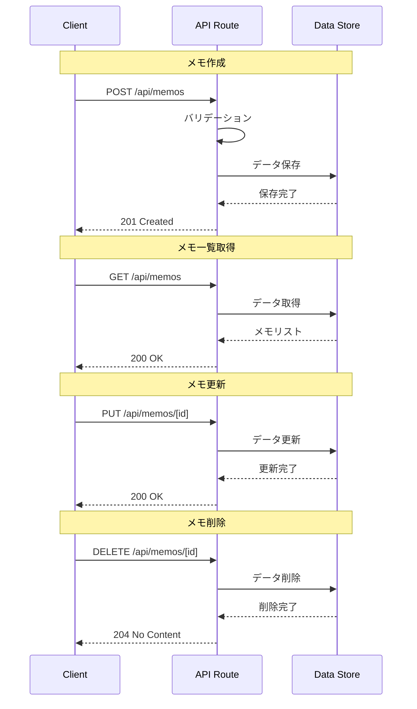
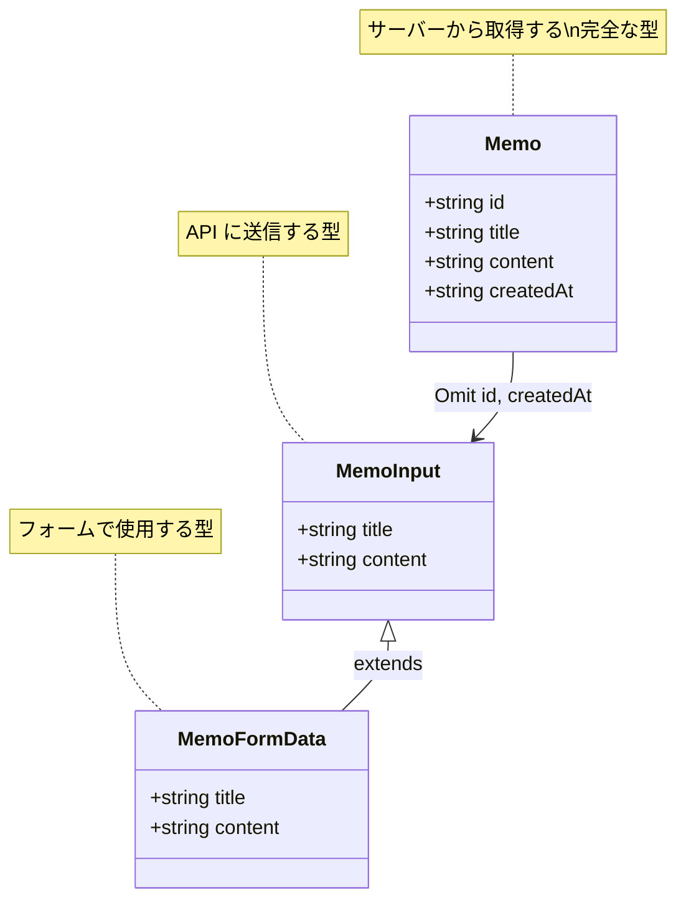
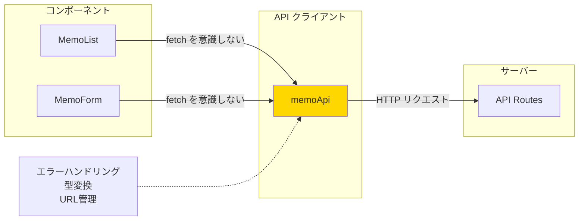
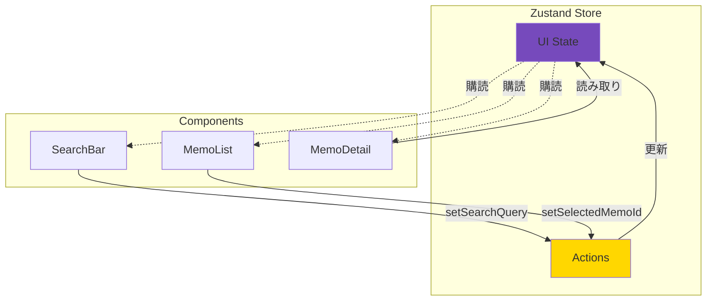
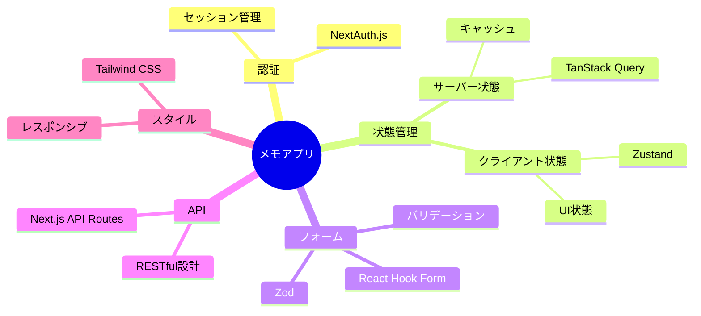

# 6-5. ミニアプリを作る

## 目標

学んだ内容を組み合わせて、実際に動くアプリを作る。

<Callout type="success">
これまで学んだ技術を統合し、実践的なアプリケーションを構築します。段階的に機能を追加していくことで、実装のコツを掴みましょう。
</Callout>

---

## お題：メモアプリ

### アプリケーション概要

```mermaid
graph TB
    subgraph "フロントエンド"
        UI[UI Components]
        Form[メモフォーム<br/>RHF + Zod]
        List[メモ一覧<br/>検索/フィルター]
    end

    subgraph "状態管理"
        Server[サーバー状態<br/>TanStack Query]
        Client[クライアント状態<br/>Zustand]
    end

    subgraph "バックエンド"
        API[Next.js API Routes]
        DB[(データストア<br/>※仮実装)]
    end

    UI --> Form
    UI --> List
    Form --> Server
    List --> Server
    List --> Client
    Server --> API
    API --> DB

    style UI fill:#61dafb
    style Server fill:#ff4154
    style Client fill:#764abc
    style API fill:#000
    style DB fill:#336791
```



### 機能要件

```
必須機能:
✓ メモの作成、編集、削除
✓ メモ一覧の表示
✓ 検索/フィルター
✓ 永続化（リロードしても消えない）

使用技術:
✓ React（Next.js App Router）
✓ Zustand（UI状態管理）
✓ TanStack Query（サーバー状態）
✓ React Hook Form + Zod（フォーム）
✓ Tailwind CSS（スタイル）
```

<WhyButton>
**なぜこの技術スタックなのか？**

このスタックは現代的な React 開発のベストプラクティスを反映しています：
- **Next.js**: フルスタック開発が可能
- **Zustand**: シンプルで高性能な状態管理
- **TanStack Query**: API 通信の自動化
- **RHF + Zod**: 型安全なフォーム
- **Tailwind**: 高速なスタイリング

全て学習コストが低く、実務で頻繁に使われる技術です。
</WhyButton>

---

## ステップ1：プロジェクト作成

<StepByStep>

<Step title="Next.js プロジェクトのセットアップ">

```bash
npx create-next-app@latest memo-app --typescript --tailwind --app --src-dir
cd memo-app
npm install zustand @tanstack/react-query zod @hookform/resolvers react-hook-form
```

<Callout type="info">
プロジェクト作成時の質問には以下のように答えてください：
- TypeScript: Yes
- ESLint: Yes
- Tailwind CSS: Yes
- src/ directory: Yes
- App Router: Yes
- Import alias: デフォルト (@/*)
</Callout>

</Step>

</StepByStep>

---

## ステップ2：API（仮実装）

### API層の設計



<Callout type="warning">
この実装はインメモリストレージを使用しています。本番環境では PostgreSQL、MongoDB などの永続化DBを使用してください。
</Callout>

<StepByStep>

<Step title="API Routes の実装">

```typescript
// src/app/api/memos/route.ts
import { NextResponse } from 'next/server';

// 仮のDB（実際はDBを使う）
let memos = [
  { id: '1', title: 'はじめてのメモ', content: 'Hello World!', createdAt: new Date().toISOString() },
];

export async function GET() {
  return NextResponse.json(memos);
}

export async function POST(request: Request) {
  const body = await request.json();
  const memo = {
    id: crypto.randomUUID(),
    ...body,
    createdAt: new Date().toISOString(),
  };
  memos.push(memo);
  return NextResponse.json(memo, { status: 201 });
}
```

```typescript
// src/app/api/memos/[id]/route.ts
import { NextResponse } from 'next/server';

export async function PUT(request: Request, { params }: { params: { id: string } }) {
  const body = await request.json();
  const index = memos.findIndex(m => m.id === params.id);
  if (index === -1) {
    return NextResponse.json({ error: 'Not found' }, { status: 404 });
  }
  memos[index] = { ...memos[index], ...body };
  return NextResponse.json(memos[index]);
}

export async function DELETE(request: Request, { params }: { params: { id: string } }) {
  const index = memos.findIndex(m => m.id === params.id);
  if (index === -1) {
    return NextResponse.json({ error: 'Not found' }, { status: 404 });
  }
  memos.splice(index, 1);
  return new NextResponse(null, { status: 204 });
}
```

</Step>

</StepByStep>

---

## ステップ3：型定義

### 型システムの構造



<Callout type="tip">
TypeScript の型定義を最初に行うことで、開発中の補完やエラー検出が効率的になります。
</Callout>

<StepByStep>

<Step title="型定義ファイルの作成">

```typescript
// src/types/memo.ts
export interface Memo {
  id: string;
  title: string;
  content: string;
  createdAt: string;
}

export type MemoInput = Omit<Memo, 'id' | 'createdAt'>;
```

</Step>

</StepByStep>

---

## ステップ4：API クライアント

### API クライアント層の責務



<Callout type="info">
API クライアント層を設けることで、fetch の実装詳細をコンポーネントから隠蔽し、メンテナンス性を向上させます。
</Callout>

<StepByStep>

<Step title="API クライアントの実装">

```typescript
// src/lib/api.ts
import { Memo, MemoInput } from '@/types/memo';

const BASE_URL = '';

export const memoApi = {
  getAll: async (): Promise<Memo[]> => {
    const res = await fetch(`${BASE_URL}/api/memos`);
    if (!res.ok) throw new Error('Failed to fetch memos');
    return res.json();
  },

  create: async (data: MemoInput): Promise<Memo> => {
    const res = await fetch(`${BASE_URL}/api/memos`, {
      method: 'POST',
      headers: { 'Content-Type': 'application/json' },
      body: JSON.stringify(data),
    });
    if (!res.ok) throw new Error('Failed to create memo');
    return res.json();
  },

  update: async (id: string, data: MemoInput): Promise<Memo> => {
    const res = await fetch(`${BASE_URL}/api/memos/${id}`, {
      method: 'PUT',
      headers: { 'Content-Type': 'application/json' },
      body: JSON.stringify(data),
    });
    if (!res.ok) throw new Error('Failed to update memo');
    return res.json();
  },

  delete: async (id: string): Promise<void> => {
    const res = await fetch(`${BASE_URL}/api/memos/${id}`, {
      method: 'DELETE',
    });
    if (!res.ok) throw new Error('Failed to delete memo');
  },
};
```

</Step>

</StepByStep>

---

## ステップ5：React Queryフック

### TanStack Query の統合

```mermaid
graph TB
    subgraph "React Query Hooks"
        UQ[useMemos<br/>データ取得]
        UC[useCreateMemo<br/>作成]
        UU[useUpdateMemo<br/>更新]
        UD[useDeleteMemo<br/>削除]
    end

    subgraph "QueryClient"
        QC[Query Cache]
    end

    subgraph "API"
        API[memoApi]
    end

    UQ -->|queryFn| API
    UC -->|mutationFn| API
    UU -->|mutationFn| API
    UD -->|mutationFn| API

    UQ -.キャッシュ.-> QC
    UC -.invalidate.-> QC
    UU -.invalidate.-> QC
    UD -.invalidate.-> QC

    style QC fill:#ff4154
    style UQ fill:#90ee90
    style UC fill:#ffd700
    style UU fill:#ffd700
    style UD fill:#ffd700
```

<Callout type="success">
React Query を使うことで、キャッシュ管理やローディング状態の管理が自動化されます。
</Callout>

<StepByStep>

<Step title="カスタムフックの実装">

```typescript
// src/hooks/useMemos.ts
import { useQuery, useMutation, useQueryClient } from '@tanstack/react-query';
import { memoApi } from '@/lib/api';
import { MemoInput } from '@/types/memo';

export function useMemos() {
  return useQuery({
    queryKey: ['memos'],
    queryFn: memoApi.getAll,
  });
}

export function useCreateMemo() {
  const queryClient = useQueryClient();
  return useMutation({
    mutationFn: (data: MemoInput) => memoApi.create(data),
    onSuccess: () => {
      queryClient.invalidateQueries({ queryKey: ['memos'] });
    },
  });
}

export function useUpdateMemo() {
  const queryClient = useQueryClient();
  return useMutation({
    mutationFn: ({ id, data }: { id: string; data: MemoInput }) =>
      memoApi.update(id, data),
    onSuccess: () => {
      queryClient.invalidateQueries({ queryKey: ['memos'] });
    },
  });
}

export function useDeleteMemo() {
  const queryClient = useQueryClient();
  return useMutation({
    mutationFn: memoApi.delete,
    onSuccess: () => {
      queryClient.invalidateQueries({ queryKey: ['memos'] });
    },
  });
}
```

<WhyButton>
**なぜ Mutation 後に invalidateQueries するのか？**

Mutation（作成・更新・削除）が成功したら、キャッシュを無効化して最新データを再取得する必要があります。これにより：
- 常に最新のデータを表示
- サーバーとクライアントの状態を同期
- 他のコンポーネントも自動更新

invalidateQueries は該当するクエリを「古い」とマークし、次回のレンダリング時に自動再取得します。
</WhyButton>

</Step>

</StepByStep>

---

## ステップ6：UIストア（検索/選択状態）

### Zustand による UI 状態管理



<Callout type="info">
検索クエリや選択状態などのUI状態は Zustand で管理します。サーバー状態（メモデータ）は TanStack Query で管理し、責務を明確に分離します。
</Callout>

<StepByStep>

<Step title="UI ストアの実装">

```typescript
// src/store/uiStore.ts
import { create } from 'zustand';

interface UIState {
  searchQuery: string;
  selectedMemoId: string | null;
  setSearchQuery: (query: string) => void;
  setSelectedMemoId: (id: string | null) => void;
}

export const useUIStore = create<UIState>((set) => ({
  searchQuery: '',
  selectedMemoId: null,
  setSearchQuery: (query) => set({ searchQuery: query }),
  setSelectedMemoId: (id) => set({ selectedMemoId: id }),
}));
```

---

## ステップ7：コンポーネント

```tsx
// src/components/MemoList.tsx
'use client';

import { useMemos, useDeleteMemo } from '@/hooks/useMemos';
import { useUIStore } from '@/store/uiStore';

export function MemoList() {
  const { data: memos, isLoading, error } = useMemos();
  const deleteMemo = useDeleteMemo();
  const { searchQuery, selectedMemoId, setSelectedMemoId } = useUIStore();

  if (isLoading) return <div className="p-4">読み込み中...</div>;
  if (error) return <div className="p-4 text-red-500">エラー</div>;

  const filteredMemos = memos?.filter(memo =>
    memo.title.toLowerCase().includes(searchQuery.toLowerCase()) ||
    memo.content.toLowerCase().includes(searchQuery.toLowerCase())
  );

  return (
    <div className="divide-y">
      {filteredMemos?.map(memo => (
        <div
          key={memo.id}
          className={`p-4 cursor-pointer hover:bg-gray-50 ${
            selectedMemoId === memo.id ? 'bg-blue-50' : ''
          }`}
          onClick={() => setSelectedMemoId(memo.id)}
        >
          <h3 className="font-medium">{memo.title}</h3>
          <p className="text-sm text-gray-500 truncate">{memo.content}</p>
          <button
            className="text-red-500 text-sm mt-2"
            onClick={(e) => {
              e.stopPropagation();
              deleteMemo.mutate(memo.id);
            }}
          >
            削除
          </button>
        </div>
      ))}
    </div>
  );
}
```

```tsx
// src/components/MemoForm.tsx
'use client';

import { useForm } from 'react-hook-form';
import { zodResolver } from '@hookform/resolvers/zod';
import { z } from 'zod';
import { useCreateMemo } from '@/hooks/useMemos';

const schema = z.object({
  title: z.string().min(1, 'タイトルは必須です'),
  content: z.string().min(1, '内容は必須です'),
});

type FormData = z.infer<typeof schema>;

export function MemoForm() {
  const createMemo = useCreateMemo();
  const { register, handleSubmit, reset, formState: { errors } } = useForm<FormData>({
    resolver: zodResolver(schema),
  });

  const onSubmit = (data: FormData) => {
    createMemo.mutate(data, {
      onSuccess: () => reset(),
    });
  };

  return (
    <form onSubmit={handleSubmit(onSubmit)} className="p-4 space-y-4">
      <div>
        <input
          {...register('title')}
          placeholder="タイトル"
          className="w-full p-2 border rounded"
        />
        {errors.title && <span className="text-red-500 text-sm">{errors.title.message}</span>}
      </div>
      <div>
        <textarea
          {...register('content')}
          placeholder="内容"
          className="w-full p-2 border rounded h-32"
        />
        {errors.content && <span className="text-red-500 text-sm">{errors.content.message}</span>}
      </div>
      <button
        type="submit"
        disabled={createMemo.isPending}
        className="w-full p-2 bg-blue-500 text-white rounded disabled:opacity-50"
      >
        {createMemo.isPending ? '作成中...' : '作成'}
      </button>
    </form>
  );
}
```

---

## ステップ8：メインページ

```tsx
// src/app/page.tsx
'use client';

import { QueryClient, QueryClientProvider } from '@tanstack/react-query';
import { MemoList } from '@/components/MemoList';
import { MemoForm } from '@/components/MemoForm';
import { useUIStore } from '@/store/uiStore';

const queryClient = new QueryClient();

function SearchBar() {
  const { searchQuery, setSearchQuery } = useUIStore();
  return (
    <input
      type="text"
      value={searchQuery}
      onChange={(e) => setSearchQuery(e.target.value)}
      placeholder="検索..."
      className="w-full p-2 border-b"
    />
  );
}

function App() {
  return (
    <div className="max-w-4xl mx-auto">
      <h1 className="text-2xl font-bold p-4">メモアプリ</h1>
      <div className="grid grid-cols-2 gap-4">
        <div className="border rounded">
          <SearchBar />
          <MemoList />
        </div>
        <div className="border rounded">
          <MemoForm />
        </div>
      </div>
    </div>
  );
}

export default function Page() {
  return (
    <QueryClientProvider client={queryClient}>
      <App />
    </QueryClientProvider>
  );
}
```

---

## 発展課題

1. **編集機能**: 選択したメモを編集できるように
2. **永続化**: LocalStorageまたはDBに保存
3. **認証**: ユーザーごとのメモ管理
4. **Markdown対応**: メモ内容をMarkdownで記述
5. **タグ機能**: メモにタグを付けて分類

---

## このアプリで学べること

```
✓ React コンポーネント設計
✓ 状態管理（ローカル/グローバル/サーバー）
✓ API設計と通信
✓ フォームバリデーション
✓ TypeScript の型定義
✓ Tailwind CSS でのスタイリング
```

---

## よくある誤解

<Accordion title="「最初から完璧に作らないといけない」？">

**段階的に作るのが正解**です。

```
良い進め方:
1. 最小限の機能で動くものを作る（MVP）
2. 実際に使ってみる
3. 問題点を発見する
4. 改善する
5. 2-4を繰り返す

悪い進め方:
1. 完璧な設計を目指す
2. 全機能を一度に実装しようとする
3. 複雑になりすぎて挫折
```

<Callout type="tip" title="MVP（Minimum Viable Product）の考え方">
最小限の機能で動くものを作り、フィードバックを得ながら改善していくアプローチが効率的です。
</Callout>

</Accordion>

<Accordion title="「ライブラリをたくさん使えば良いアプリになる」？">

**必要なものだけ使う**のが正解です。

```javascript
// 過剰な例（小規模アプリには不要）
- Redux + Redux Saga + Reselect + Immer
- Axios + React Query + SWR
- Formik + Yup + React Hook Form

// 適切な例（このメモアプリの場合）
- Zustand（シンプルな状態管理）
- TanStack Query（サーバー状態）
- React Hook Form + Zod（フォーム）
```

<Callout type="warning">
過剰なライブラリ導入は、バンドルサイズの増加、学習コストの増加、メンテナンスの複雑化を招きます。
</Callout>

</Accordion>

<Accordion title="「コンポーネントは細かく分けるほど良い」？">

**適度な粒度**が大切です。

```jsx
// 細かすぎる例
<MemoCard>
  <MemoCardHeader>
    <MemoCardTitle />
    <MemoCardDate />
  </MemoCardHeader>
  <MemoCardBody>
    <MemoCardContent />
  </MemoCardBody>
  <MemoCardFooter>
    <MemoCardDeleteButton />
  </MemoCardFooter>
</MemoCard>

// 適切な例
<MemoCard memo={memo} onDelete={handleDelete} />
```

<WhyButton>
**適切なコンポーネント分割の基準**

分割すべき場合：
- 再利用する可能性がある
- 独立した責務を持つ
- 100行を超える

分割しない方が良い場合：
- 1箇所でしか使わない
- 密結合している
- 分割しても数行しか削減されない

重要なのは「読みやすさ」と「メンテナンス性」です。
</WhyButton>

</Accordion>

<Accordion title="「型定義は面倒だから後回し」？">

**最初から定義する**方が結果的に早いです。

```typescript
// 型を先に定義すると...
interface Memo {
  id: string;
  title: string;
  content: string;
}

// エディタが補完してくれる
// 間違った使い方をすると即座にエラー
// リファクタリングも安全
```

<Callout type="success">
TypeScript の型定義により：
- 開発中のバグを早期発見
- IDE の補完で開発速度向上
- リファクタリングが安全に
- ドキュメントとしても機能

初期コストは小さく、メリットは大きいです。
</Callout>

</Accordion>

---

## まとめ

### 学んだ技術の統合



<Callout type="success" title="このアプリで学べたこと">

✓ **React コンポーネント設計** - 責務の分離と再利用性
✓ **状態管理の使い分け** - サーバー状態とクライアント状態
✓ **API設計と通信** - RESTful API とエラーハンドリング
✓ **フォームバリデーション** - 型安全なバリデーション
✓ **TypeScript の活用** - 型定義と型推論
✓ **段階的な開発** - MVP から機能追加へ

</Callout>

- **段階的に作る**: MVP → 改善の繰り返し
- **技術選定**: 規模に合ったライブラリを選ぶ
- **状態の分類**: UI状態（Zustand）とサーバー状態（TanStack Query）を分ける
- **型定義**: 最初から定義して開発効率を上げる
- **コンポーネント設計**: 適度な粒度で分割

---

## おわりに

<Callout type="info">
このメモアプリは「最小限の実装」です。実際のプロダクトでは、エラーハンドリング、ローディング状態、アクセシビリティなど、さらに多くの考慮が必要です。
</Callout>

### 次のステップ

<StepByStep>

<Step title="エラーハンドリングを強化">

- ネットワークエラーの処理
- ユーザーフレンドリーなエラーメッセージ
- リトライ機能の実装

</Step>

<Step title="ローディング状態の改善">

- スケルトンスクリーンの実装
- 楽観的更新（Optimistic Updates）
- サスペンス境界の活用

</Step>

<Step title="アクセシビリティ対応">

- キーボードナビゲーション
- ARIA 属性の追加
- スクリーンリーダー対応

</Step>

<Step title="パフォーマンス最適化">

- コード分割（Code Splitting）
- 画像の最適化
- メモ化（useMemo、useCallback）

</Step>

<Step title="テストの追加">

- ユニットテスト（Vitest）
- コンポーネントテスト（Testing Library）
- E2Eテスト（Playwright）

</Step>

</StepByStep>

<Callout type="success" title="おめでとうございます！">
ここまでの学習で、モダンな React 開発の基礎を身につけました。「何が起きているか」を理解できるようになっているはずです。

わからないことがあれば、各章に戻って復習してください。実際に手を動かして、試行錯誤することが最も効果的な学習方法です。
</Callout>

---

## サンプルコード

この章の内容を実際に動かして試せるサンプルコードを用意しています。

- [ミニアプリサンプル](https://github.com/minaaaa3/study-memo/tree/main/samples/practice/04-mini-app) - Express + React + TanStack Query の統合例（Todoアプリ）
