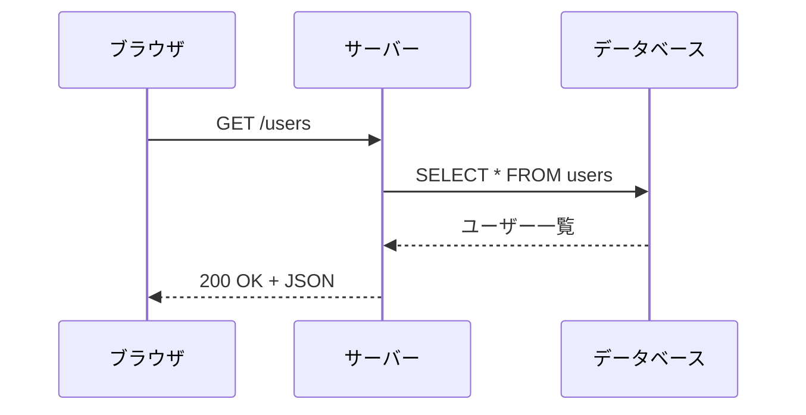

# 学習アプリ設計の提案

このドキュメントでは、/docs の内容を「より学習しやすくする」ためのアプリ設計を提案します。

---

## 1. インタラクティブなコード実行環境

### 提案

各章に埋め込まれたコードを「その場で実行」できる環境を提供する。

### 実装案

```
方式A: Sandpack（CodeSandbox製）
- Reactベースのコードエディタ
- ブラウザ内でNode.js/Reactが動く
- npm パッケージも使える

方式B: StackBlitz WebContainers
- 完全なNode.js環境がブラウザで動く
- より本格的な環境

方式C: Monaco Editor + API実行
- エディタだけ埋め込み
- バックエンドのAPIでコード実行
```

### 効果

```
Before: 「このコードをコピーして、ターミナルで実行してね」
After:  「このボタンを押して実行結果を見てみよう」
```

---

## 2. 進捗管理システム

### 提案

ユーザーが「どこまで読んだか」「どの演習を完了したか」を記録・可視化。

### 実装案

```typescript
// 進捗データの構造
interface Progress {
  userId: string;
  chapters: {
    [chapterId: string]: {
      status: 'not_started' | 'in_progress' | 'completed';
      lastVisited: Date;
      quizScore?: number;
      exerciseCompleted?: boolean;
    };
  };
  overallProgress: number;  // 0-100%
}
```

### UI案

```
ダッシュボード:
┌──────────────────────────────────┐
│ 全体進捗: ████████░░░░ 67%       │
├──────────────────────────────────┤
│ 第1部: Webの基礎        ✓ 完了   │
│ 第2部: サーバーの世界   ▶ 進行中 │
│ 第3部: サーバーサイド   ○ 未着手 │
│ ...                              │
└──────────────────────────────────┘
```

---

## 3. 理解度チェッククイズ

### 提案

各章の終わりに簡単なクイズを設置。「読んだつもり」を防ぐ。

### 実装案

```typescript
interface Quiz {
  chapterId: string;
  questions: {
    id: string;
    question: string;
    options: string[];
    correctIndex: number;
    explanation: string;  // なぜその答えが正しいか
  }[];
}
```

### 例

```
Q: HTTPステータスコード「403」の意味は？

○ サーバーが見つからない
○ リクエストが不正
● 権限がない
○ サーバーエラー

正解！「403 Forbidden」は認可エラー（権限がない）を意味します。
認証エラー（401）との違いを覚えておきましょう。
```

---

## 4. 用語集・検索機能

### 提案

全章を横断して「この用語の意味は？」を検索できる機能。

### 実装案

```typescript
interface Term {
  term: string;
  definition: string;
  relatedChapters: string[];
  relatedTerms: string[];
}

// 例
const terms: Term[] = [
  {
    term: 'JWT',
    definition: 'JSON Web Token。署名付きのトークンで...',
    relatedChapters: ['3-3'],
    relatedTerms: ['セッション', '認証', 'トークン'],
  },
];
```

### UI案

```
🔍 [検索: JWT________________]

検索結果:
┌──────────────────────────────────┐
│ JWT（JSON Web Token）            │
│ 署名付きのトークンで、サーバー   │
│ がステートレスに認証を行える     │
│                                  │
│ 📖 関連章: 3-3. JWT             │
│ 🔗 関連語: セッション, 認証      │
└──────────────────────────────────┘
```

---

## 5. ビジュアル図解

### 提案

文章だけでなく、図解やアニメーションで概念を視覚化。

### 実装案

```
方式A: Mermaid.js
- Markdownに埋め込める
- シーケンス図、フローチャートなど

方式B: Excalidraw
- 手書き風の図解
- リアルタイム編集も可能

方式C: React Flow
- インタラクティブなノード図
- ユーザーが操作できる
```

### 例：リクエスト/レスポンスの流れ



---

## 6. 「なぜ？」ボタン

### 提案

各トピックに「なぜこれが必要？」ボタンを設置。
背景や動機を深掘りできるようにする。

### 実装案

```jsx
<Concept title="ハッシュ化">
  パスワードは平文で保存せず、ハッシュ化して保存します。

  <WhyButton>
    <h4>なぜハッシュ化が必要？</h4>
    <p>DBが漏洩した場合、平文で保存していると...</p>

    <h4>なぜ暗号化ではなくハッシュ化？</h4>
    <p>暗号化は復号できてしまうから...</p>
  </WhyButton>
</Concept>
```

---

## 7. 比較表ジェネレーター

### 提案

「AとBの違いは？」をインタラクティブに比較できる機能。

### 実装案

```jsx
<ComparisonTable
  items={['セッション', 'JWT']}
  criteria={['保存場所', 'スケーラビリティ', '無効化', 'セキュリティ']}
/>
```

### UI

```
┌──────────────────┬──────────────┬──────────────┐
│                  │  セッション   │     JWT      │
├──────────────────┼──────────────┼──────────────┤
│ 保存場所         │ サーバー     │ クライアント │
│ スケーラビリティ │ △           │ ◎           │
│ 無効化           │ ◎           │ △           │
│ セキュリティ     │ ◎           │ ○           │
└──────────────────┴──────────────┴──────────────┘
```

---

## 8. モバイル対応

### 提案

スマホでも読みやすいレスポンシブデザイン。
通勤・通学中に読めるように。

### 実装ポイント

- コードブロックは横スクロール
- 目次はハンバーガーメニュー
- フォントサイズ調整機能
- オフライン対応（PWA）

---

## 採用する機能

| # | 機能 | 優先度 | 説明 |
|---|------|--------|------|
| 1 | コード実行環境 | 高 | Sandpackでその場実行 |
| 2 | 進捗管理 | 高 | 学習進捗の記録・可視化 |
| 3 | クイズ | 中 | 章末の理解度チェック |
| 4 | 用語集・検索 | 中 | 横断的な用語検索 |
| 5 | ビジュアル図解 | 中 | Mermaid.jsで視覚化 |
| 6 | 「なぜ？」ボタン | 低 | 背景・動機の深掘り |
| 7 | 比較表 | 低 | 技術比較の可視化 |
| 8 | モバイル対応 | 高 | レスポンシブ + PWA |

---

## 推奨技術スタック

```
フレームワーク: Next.js (App Router)
スタイル: Tailwind CSS
状態管理: Zustand
コンテンツ: MDX（Markdownに React コンポーネントを埋め込み）
コード実行: Sandpack
図解: Mermaid.js
検索: 自前実装（小規模のため）
認証: NextAuth.js（進捗保存用）
DB: Neon（PostgreSQL サーバーレス）
ホスティング: Vercel
```

### なぜ Neon？

```
Neon の特徴:
├── PostgreSQL（フル機能のRDB）
├── サーバーレス環境に最適化
├── Vercel との公式連携
├── 無料枠が充分（0.5GB、コンピュート時間191h/月）
├── ブランチ機能（dev/prod を簡単に分離）
└── 接続プーリング組み込み
```

---

## 開発の優先順位

1. **MVP（最小限）**: 静的なMarkdown表示 + コード実行
2. **Phase 2**: 進捗管理 + クイズ
3. **Phase 3**: 検索 + 用語集
4. **Phase 4**: AI統合 + モバイル対応

---

## まとめ

これらの機能を組み合わせることで、
「読むだけ」から「理解して実践できる」学習体験に進化させられます。

全部を一度に作る必要はありません。
まずはMDXで静的サイトを作り、段階的に機能を追加していくのがおすすめです。
